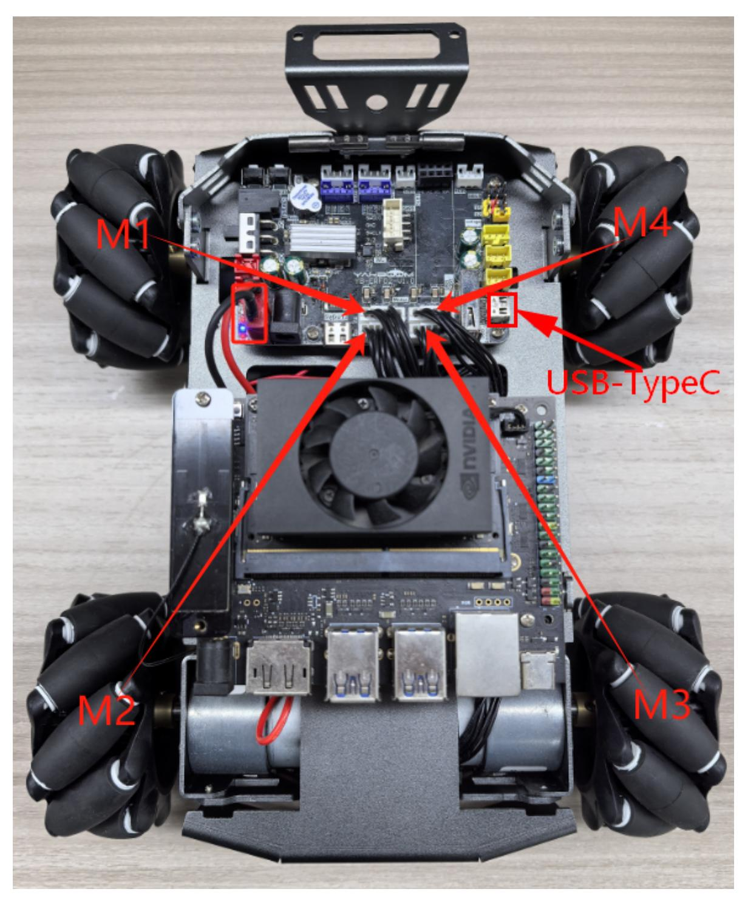
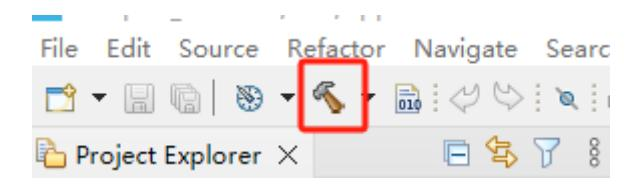

# Subscribe to the speed control topic

Subscribe to the speed control topic

- 1. Experimental Purpose
- 2. Hardware Connection
- 3. Core code analysis
- 4. Compile, download and burn firmware
- 5. Experimental Results

#### 1. Experimental Purpose

Learn about the STM32-microROS component, access the ROS2 environment, and subscribe to topics about controlling the car's speed.

#### 2. Hardware Connection

As shown in the figure below, the STM32 control board integrates four encoder motor drivers and interfaces, connecting the four motors to the motor interfaces. The corresponding names of the four motor interfaces are: left front wheel -> M1, left rear wheel -> M2, right front wheel -> M3, and right rear wheel -> M4.

Since the encoder motor requires high voltage and high current, it must be powered by a battery.

Use a Type-C data cable to connect the USB port of the main control board and the USB Connect port of the STM32 control board.



Note: There are many types of main control boards. Here we take the Jetson Orin series main control board as an example, with the default factory image burned.

### 3. Core code analysis

The virtual machine path corresponding to the program source code is:

Board_Samples/Microros_Samples/Subscriber_twist

Create a subscriber named "cmd_vel" and specify the ROS topic type as geometry_msgs/msg/Twist.

```
RCCHECK(rclc_subscription_init_default(
        &twist_subscriber,
        &node,
        ROSIDL_GET_MSG_TYPE_SUPPORT(geometry_msgs, msg, Twist),
        "cmd_vel"));
```

Add a cmd_vel topic subscriber to the executor.

```
RCCHECK(rclc_executor_add_subscription(
        &executor,
        &twist_subscriber,
        &twist_msg,
        &twist_Callback,
        ON_NEW_DATA));
```

When the microros subscriber receives the cmd_vel topic data, the twist_Callback callback function is triggered to control the movement of the robot according to the received value.

```
void twist_Callback(const void *msgin)
{
    const geometry_msgs__msg__Twist* msg = (const geometry_msgs__msg__Twist
*)msgin;
    printf("cmd_vel:%.2f, %.2f, %.2f\n", msg->linear.x, msg->linear.y, msg-
>angular.z);
    Motion_Ctrl_Car(msg->linear.x, msg->linear.y, msg->angular.z);
}
```

Call rclc_executor_spin_some in a loop to make microros work properly.

```
while (ros_error < 3)
    {
        rclc_executor_spin_some(&executor, RCL_MS_TO_NS(ROS2_SPIN_TIMEOUT_MS));
        if (ping_microros_agent() != RMW_RET_OK) break;
        vTaskDelayUntil(&lastWakeTime, 10);
        // vTaskDelay(pdMS_TO_TICKS(100));
    }
```

## 4. Compile, download and burn firmware

Select the project to be compiled in the file management interface of STM32CUBEIDE and click the compile button on the toolbar to start compiling.



If there are no errors or warnings, the compilation is complete.

Since the Type-C communication serial port used by the microros agent is multiplexed with the burning serial port, it is recommended to use the STlink tool to burn the firmware.

If you are using the serial port to burn, you need to first plug the Type-C data cable into the computer's USB port, enter the serial port download mode, burn the firmware, and then plug it back into the USB port of the main control board.

## 5. Experimental Results

Note: When using ROS2 to control the car's motor, it will rotate. Please place the car in the air first to prevent it from moving around on the table.

The MCU_LED light flashes every 200 milliseconds.

If the proxy is not enabled on the main control board terminal, enter the following command to enable it. If the proxy is already enabled, disable it and then re-enable it.

```
sh ~/start_agent.sh
```

After the connection is successful, a node and a subscriber are created.

Open another terminal and view the /YB_Example_Node node.

```
ros2 node list
ros2 node info /YB_Example_Node
```

Publish data to the /cmd_vel topic to control the robot car to move forward at 0.5m/s.

```
ros2 topic pub --once /cmd_vel geometry_msgs/msg/Twist "{linear: {x: 0.5, y: 0.0,
z: 0.0}, angular: {x: 0.0, y: 0.0, z: 0.0}}"
```

Publish data to the /cmd_vel topic to control the robot car to rotate at 1.5 rad/s.

```
ros2 topic pub --once /cmd_vel geometry_msgs/msg/Twist "{linear: {x: 0.0, y: 0.0,
z: 0.0}, angular: {x: 0.0, y: 0.0, z: 1.5}}"
```

Publish data to the /cmd_vel topic to control the robot car to stop.

```
ros2 topic pub --once /cmd_vel geometry_msgs/msg/Twist "{linear: {x: 0.0, y: 0.0,
z: 0.0}, angular: {x: 0.0, y: 0.0, z: 0.0}}"
```
