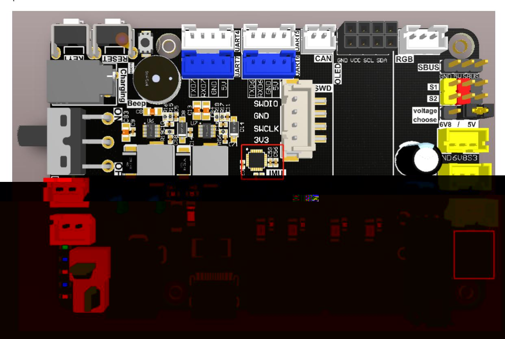

# Publish IMU data topic

Publish IMU data topic

- 1. Experimental Purpose
- 2. Hardware Connection
- 3. Core code analysis
- 4. Compile, download and burn firmware
- 5. Experimental Results

#### 1. Experimental Purpose

Learn about STM32-microROS components, access the ROS2 environment, and publish IMU data topics.

### 2. Hardware Connection

As shown in the figure below, the STM32 control board integrates a nine-axis IMU attitude sensor.

Use a Type-C data cable to connect the USB port of the main control board and the USB Connect port of the STM32 control board.



Note: There are many types of main control boards. Here we take the Jetson Orin series main control board as an example, with the default factory image burned.

#### 3. Core code analysis

The virtual machine path corresponding to the program source code is:

```
Board_Samples/Microros_Samples/Publisher_imu
```

Initialize imu topic information.

```
void imu_init(void)
{
    imu_msg.orientation.x = 0;
    imu_msg.orientation.y = 0;
    imu_msg.orientation.z = 0;
    imu_msg.orientation.w = 1;
    imu_msg.angular_velocity.x = 0;
    imu_msg.angular_velocity.y = 0;
    imu_msg.angular_velocity.z = 0;
    imu_msg.linear_acceleration.x = 0;
    imu_msg.linear_acceleration.y = 0;
    imu_msg.linear_acceleration.z = 0;
    imu_msg.header.frame_id =
micro_ros_string_utilities_set(imu_msg.header.frame_id, "imu_frame");
}
```

Create the node "imu_publisher". The ROS_NAMESPACE is empty by default and can be modified in the IDF configuration tool according to actual needs.

```
rcl_node_t node;
    RCCHECK(rclc_node_init_default(&node, "imu_publisher", ROS_NAMESPACE,
&support));
```

Create the publisher "imu/data_raw" and specify the publisher's message type as sensor_msgs/msg/Imu.

```
RCCHECK(rclc_publisher_init_default(
        &imu_publisher,
        &node,
        ROSIDL_GET_MSG_TYPE_SUPPORT(sensor_msgs, msg, Imu),
        "imu/data_raw"));
```

To create the publisher "imu/mag", you need to specify that the publisher's information is of the sensor_msgs/msg/MagneticField type.

```
RCCHECK(rclc_publisher_init_default(
        &mag_publisher,
        &node,
        ROSIDL_GET_MSG_TYPE_SUPPORT(sensor_msgs, msg, MagneticField),
        "imu/mag"));
```

Create a publisher timer with a publishing frequency of 25HZ.

```
#define IMU_PUBLISHER_TIMEOUT (40)
RCCHECK(rclc_timer_init_default(
        &imu_publisher_timer,
        &support,
        RCL_MS_TO_NS(IMU_PUBLISHER_TIMEOUT),
        imu_publisher_callback));
```

Add the publisher's timer to the executor

```
RCCHECK(rclc_executor_add_timer(&executor, &imu_publisher_timer));
```

Update the imu information data regularly.

```
static void imu_msg_update(void)
{
    imu_msg.orientation.x = g_icm_data.orientation[0];
    imu_msg.orientation.y = g_icm_data.orientation[1];
    imu_msg.orientation.z = g_icm_data.orientation[2];
    imu_msg.orientation.w = 1;
    imu_msg.angular_velocity.x = g_icm_data.gyro_float[0];
    imu_msg.angular_velocity.y = g_icm_data.gyro_float[1];
    imu_msg.angular_velocity.z = g_icm_data.gyro_float[2];
    imu_msg.linear_acceleration.x = g_icm_data.accel_float[0];
    imu_msg.linear_acceleration.y = g_icm_data.accel_float[1];
    imu_msg.linear_acceleration.z = -g_icm_data.accel_float[2];
}
```

Update mag information data regularly.

```
static void mag_msg_update(void)
{
    mag_msg.magnetic_field.x = g_icm_data.compass_float[0];
    mag_msg.magnetic_field.y = g_icm_data.compass_float[1];
    mag_msg.magnetic_field.z = g_icm_data.compass_float[2];
}
```

The main function of the IMU timer callback function is to send the IMU data.

```
void imu_publisher_callback(rcl_timer_t *timer, int64_t last_call_time)
{
    RCLC_UNUSED(last_call_time);
    if (timer != NULL)
    {
        publish_imu_data();
        publish_mag_data();
    }
}
void publish_imu_data(void)
{
    imu_msg_update();
    timespec_t time_stamp = get_ros2_timestamp();
```

```
imu_msg.header.stamp.sec = time_stamp.tv_sec;
    imu_msg.header.stamp.nanosec = time_stamp.tv_nsec;
    RCSOFTCHECK(rcl_publish(&imu_publisher, &imu_msg, NULL));
}
void publish_mag_data(void)
{
    mag_msg_update();
    timespec_t time_stamp = get_ros2_timestamp();
    mag_msg.header.stamp.sec = time_stamp.tv_sec;
    mag_msg.header.stamp.nanosec = time_stamp.tv_nsec;
    RCSOFTCHECK(rcl_publish(&mag_publisher, &mag_msg, NULL));
}
```

Call rclc_executor_spin_some in a loop to make microros work properly.

```
while (ros_error < 3)
    {
        rclc_executor_spin_some(&executor, RCL_MS_TO_NS(ROS2_SPIN_TIMEOUT_MS));
        // if (ping_microros_agent() != RMW_RET_OK) break;
        vTaskDelayUntil(&lastWakeTime, 10);
        // vTaskDelay(pdMS_TO_TICKS(100));
    }
```

## 4. Compile, download and burn firmware

Select the project to be compiled in the file management interface of STM32CUBEIDE and click the compile button on the toolbar to start compiling.


If there are no errors or warnings, the compilation is complete.

Since the Type-C communication serial port used by the microros agent is multiplexed with the burning serial port, it is recommended to use the STlink tool to burn the firmware.

If you are using the serial port to burn, you need to first plug the Type-C data cable into the computer's USB port, enter the serial port download mode, burn the firmware, and then plug it back into the USB port of the main control board.

#### 5. Experimental Results

The MCU_LED light flashes every 200 milliseconds.

If the proxy is not enabled on the main control board terminal, enter the following command to enable it. If the proxy is already enabled, disable it and then re-enable it.

```
sh ~/start_agent.sh
```

After the connection is successful, a node and a publisher are created.

Open another terminal and view the /YB_Example_Node node.

```
ros2 node list
ros2 node info /YB_Example_Node
```

Subscribe to data from the /imu/data_raw topic

```
ros2 topic echo /imu/data_raw
```

Press Ctrl+C to end the command.

Check the frequency of the /imu/data_raw topic. A frequency of about 25 Hz is normal.

```
ros2 topic hz /imu/data_raw
```

Press Ctrl+C to end the command.

Subscribe to data on the /imu/mag topic

```
ros2 topic echo /imu/mag
```

Press Ctrl+C to end the command.

Check the frequency of the /imu/mag topic. A frequency of about 25 Hz is normal.

```
ros2 topic hz /imu/mag
```

Press Ctrl+C to end the command.
