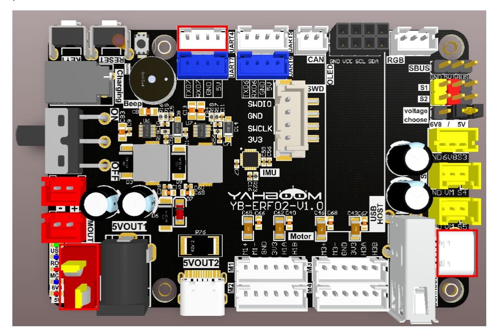
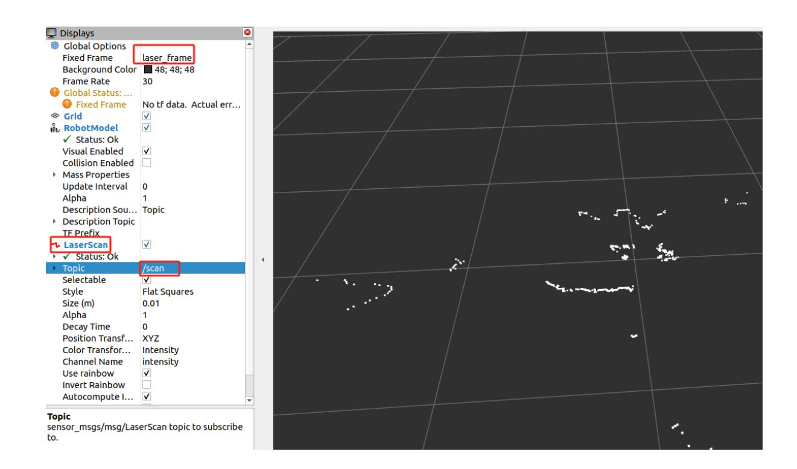

# Publish radar data topic

Publish radar data topic

- 1. Experimental Purpose
- 2. Hardware Connection
- 3. Core code analysis
- 4. Compile, download and burn firmware
- 5. Experimental Results

#### 1. Experimental Purpose

Learn about STM32-microROS components, access the ROS2 environment, and publish radar data topics.

# 2. Hardware Connection

As shown in the figure below, the STM32 control board integrates the Tmini-Plus LiDAR serial port interface, and an external Tmini-Plus LiDAR is required to complete the experiment.

Since the LiDAR requires a large current, it is recommended to use a battery for power supply.

Use a Type-C data cable to connect the USB port of the main control board and the USB Connect port of the STM32 control board.



Note: There are many types of main control boards. Here we take the Jetson Orin series main control board as an example, with the default factory image burned.

Note: The M3 Pro series car products come with a Tmini-Plus serial port adapter cable. The adapter cable has an anti-misinsertion function and can be inserted into the left radar port.

### 3. Core code analysis

The virtual machine path corresponding to the program source code is:

```
Board_Samples/Microros_Samples/Publisher_lidar
```

Initialize and publish the lidar information, set the lidar angle to 0 ~ 360, the angle interval to 0.54 degrees, the ranging range to 0.05~12.0 meters, set the frame_id to "laser_frame", and then decide whether to add the ROS_NAMESPACE prefix based on whether ROS_NAMESPACE is empty.

```
#define LIDAR_DATA_LEN 666
#define LIDAR_INTERVAL_POINTS (0.541f)
void lidar_init(void)
{
    int i = 0;
    lidar_msg.angle_min = 0*M_PI/180.0;
    lidar_msg.angle_max = 360*M_PI/180.0;
    lidar_msg.angle_increment = -LIDAR_INTERVAL_POINTS*M_PI/180.0;
    lidar_msg.range_min = 0.05;
    lidar_msg.range_max = 12.0;
    lidar_msg.ranges.data = (float *)malloc(LIDAR_DATA_LEN * sizeof(float));
    lidar_msg.ranges.size = LIDAR_DATA_LEN;
    for (i = 0; i < lidar_msg.ranges.size; i++)
    {
        lidar_msg.ranges.data[i] = 0;
    }
    lidar_msg.header.frame_id =
micro_ros_string_utilities_set(lidar_msg.header.frame_id, "laser_frame");
}
```

To create a publisher named "scan", you need to specify the publisher's message type as sensor_msgs/msg/LaserScan.

```
RCCHECK(rclc_publisher_init_default(
        &lidar_publisher,
        &node,
        ROSIDL_GET_MSG_TYPE_SUPPORT(sensor_msgs, msg, LaserScan),
        "scan"));
```

Create a publisher timer with a publishing frequency of 7 Hz.

```
#define LIDAR_PUBLISHER_TIMEOUT (140)
RCCHECK(rclc_timer_init_default(
        &lidar_publisher_timer,
        &support,
        RCL_MS_TO_NS(LIDAR_PUBLISHER_TIMEOUT),
        lidar_publisher_callback));
```

```
RCCHECK(rclc_executor_add_timer(&executor, &lidar_publisher_timer));
```

The main function of the laser radar timer callback function is to send LaserScan data.

```
void lidar_publisher_callback(rcl_timer_t *timer, int64_t last_call_time)
{
    RCLC_UNUSED(last_call_time);
    if (timer != NULL)
    {
        publish_lidar_data();
    }
}
void publish_lidar_data(void)
{
    int index = 0;
    for (int i = 0; i < lidar_msg.ranges.size; i++)
    {
        // index = (lidar_msg.ranges.size - i) % lidar_msg.ranges.size;
        index = i;
        lidar_msg.ranges.data[i] = Lidar_Ranges[index]/1000.0;
    }
    timespec_t time_stamp = get_ros2_timestamp();
    lidar_msg.header.stamp.sec = time_stamp.tv_sec;
    lidar_msg.header.stamp.nanosec = time_stamp.tv_nsec;
    RCSOFTCHECK(rcl_publish(&lidar_publisher, &lidar_msg, NULL));
}
```

Call rclc_executor_spin_some in a loop to make microros work properly.

```
while (ros_error < 3)
    {
        rclc_executor_spin_some(&executor, RCL_MS_TO_NS(ROS2_SPIN_TIMEOUT_MS));
        // if (ping_microros_agent() != RMW_RET_OK) break;
        vTaskDelayUntil(&lastWakeTime, 10);
        // vTaskDelay(pdMS_TO_TICKS(100));
    }
```

# 4. Compile, download and burn firmware

Select the project to be compiled in the file management interface of STM32CUBEIDE and click the compile button on the toolbar to start compiling.


If there are no errors or warnings, the compilation is complete.

Since the Type-C communication serial port used by the microros agent is multiplexed with the burning serial port, it is recommended to use the STlink tool to burn the firmware.

If you are using the serial port to burn, you need to first plug the Type-C data cable into the computer's USB port, enter the serial port download mode, burn the firmware, and then plug it back into the USB port of the main control board.

# 5. Experimental Results

The MCU_LED light flashes every 200 milliseconds.

If the proxy is not enabled on the main control board terminal, enter the following command to enable it. If the proxy is already enabled, disable it and then re-enable it.

```
sh ~/start_agent.sh
```

After the connection is successful, a node and a publisher are created.

Open another terminal and view the /YB_Example_Node node.

```
ros2 node list
ros2 node info /YB_Example_Node
```

Subscribe to/scan topic data,

```
ros2 topic echo /scan
```

Press Ctrl+C to end the command.

Check the frequency of the /scan topic. A frequency of about 7 Hz is normal.

```
ros2 topic hz /scan
```

Press Ctrl+C to end the command.

To view the visualization, open the rviz2 client, add the LaserScan topic data, set Fixed Frame to laser_frame, and Topic to /scan. Other parameters are as shown in the figure below.


