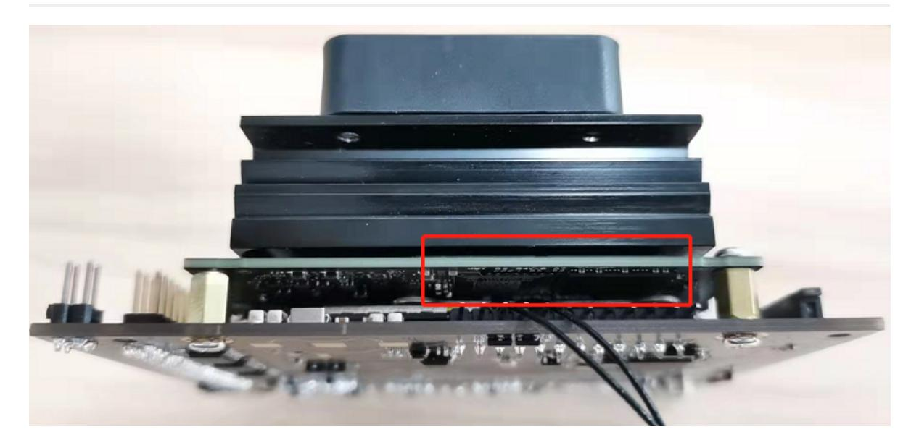
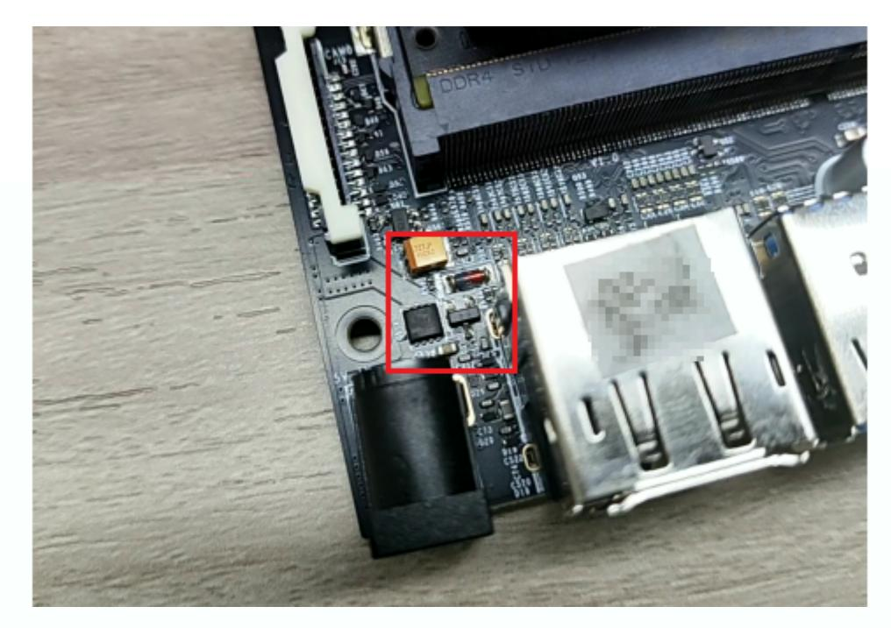
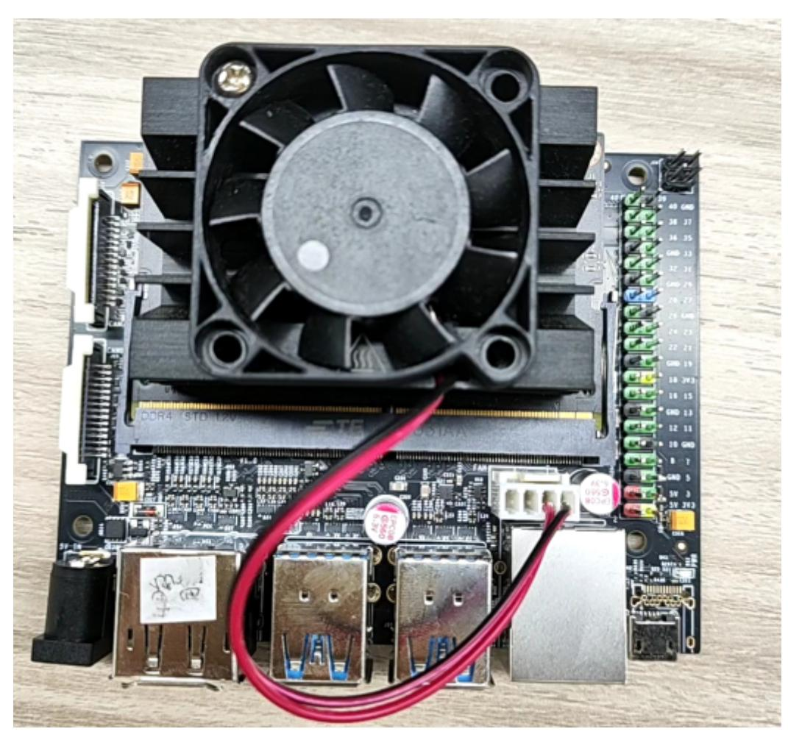
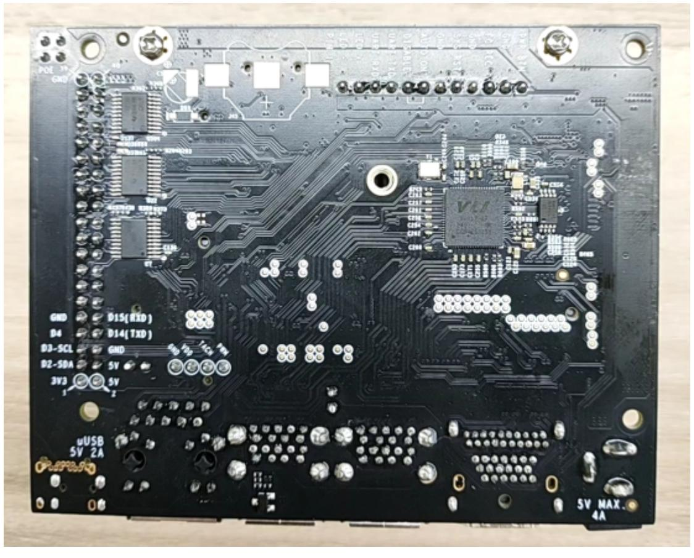

# Jetson Nano B01 SUB Version Introduction

The main differences between the Jetson Nano B01 SUB version development kit and the official Jetson Nano B01 official version development kit are:

1. The most obvious change is the removal of the core board's TF card slot and its replacement with a 16GB EMMC storage chip. Since 16GB of space is often insufficient in actual development and application, Jetson Nano B01 supports booting from the carrier board's TF card slot/U disk, allowing the system to be burned to a 32GB or larger TF card or U disk for use.

2. Remove the pin header switch of the DC power port, and you no longer have to worry about the DC power failure caused by the jumper cap not being inserted.

For the carrier board boot method using a TF card or USB flash drive, please note the following points:

- 1. The system version of the Jetson Nano B01 core board must match the system version of the TF card/U disk. For example, if the TF card/U disk has been burned with version V4.5.1, the system version of the Jetson Nano B01 core board must also be V4.5.1. To boot from a TF card, you need to modify the core board's EMMC system device tree. To boot from a U disk, you need to modify the core board's EMMC system configuration file boot/extlinux/extlinux.conf.
- 2. Both TF card and USB disk systems need to modify the configuration file boot/extlinux/extlinux.conf, find the statement APPEND \${cbootargs} quiet root=/dev/mmcblk0p1 rw rootwait rootfstype=ext4 console=ttyS0,115200n8 console=tty0

The key parameter mmcblk0p1 corresponds to the core board SD card startup, changed to sda1 corresponds to the U disk startup, changed to mmclk1p1 corresponds to the carrier board TF card startup

- 3. For users who use a USB flash drive system, after burning the EMMC boot file, they can directly use the USB flash drive system with the modified extlinux.conf configuration file to start the computer. There is no need to match the JetPack version of the EMMC system and the USB flash drive system.
- 4. The system in the core board needs to be burned using SDKManger, and the system in the TF card/U disk needs to be burned using Win32DiskImager.

Reference images:

