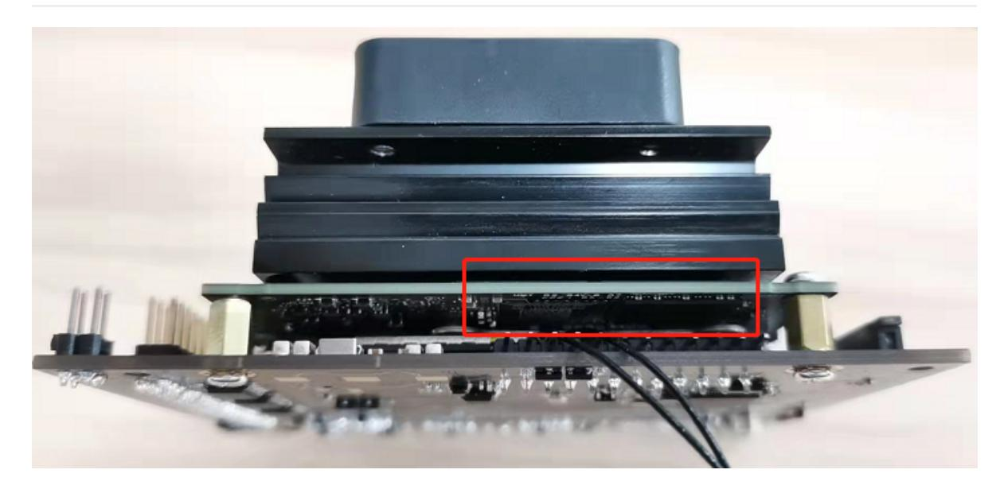
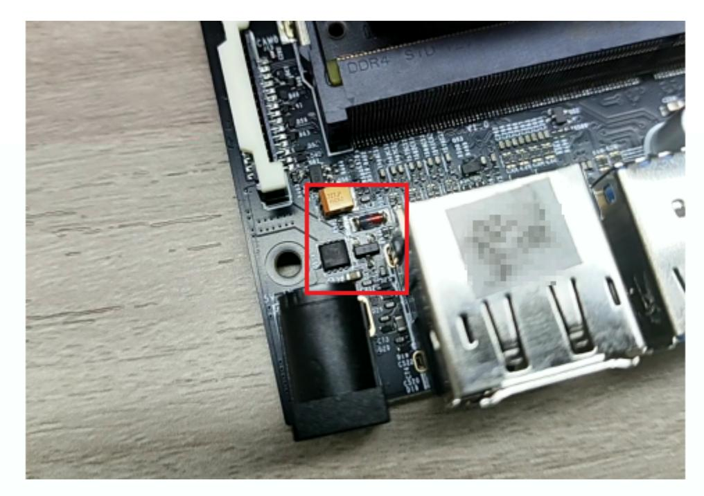
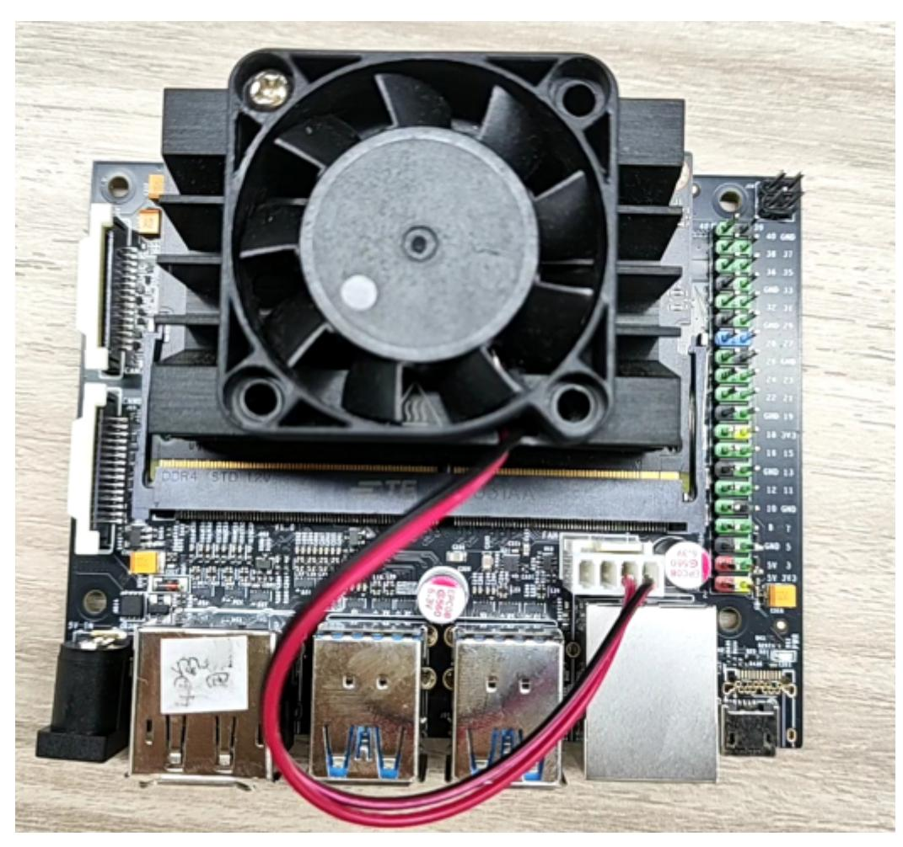
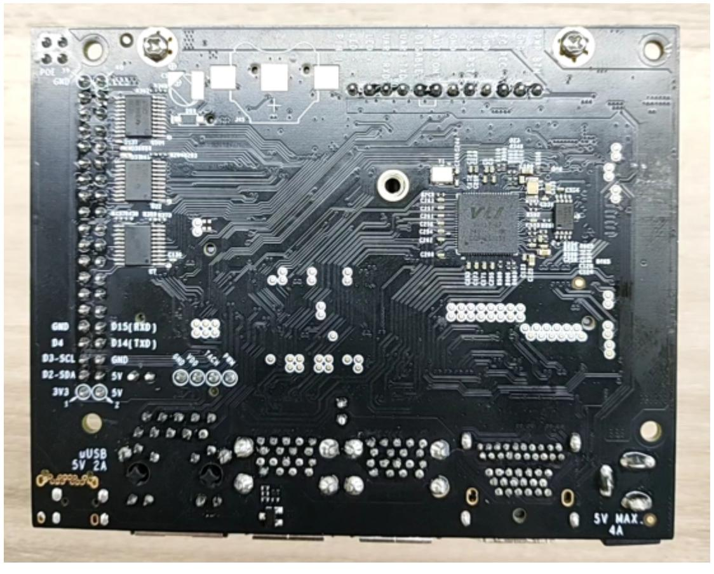

# Jetson Nano B01 SUB Board Introduction

The Jetson Nano B01 SUB development kit differs from the official Jetson Nano B01 development kit in the following ways:

1. The core board microSD card slot is removed and replaced with a 16GB eMMC storage chip. Because 16GB is often not enough for development, the Jetson Nano B01 can boot from the carrier board microSD card slot or from a USB drive. This lets you write the system image to a 32GB or larger microSD card or USB drive.



2. The DC power-port jumper switch is removed, so DC power is not affected by a missing jumper cap.



When booting from the carrier board microSD card slot or a USB drive, keep these points in mind:

1. The Jetson Nano B01 core-board system version must match the system version on the microSD card or USB drive. For example, if the microSD card or USB drive image is version `V4.5.1`, the Jetson Nano B01 core-board system must also be `V4.5.1`. To boot from a microSD card, modify the core-board eMMC system device tree. To boot from a USB drive, modify the core-board eMMC system configuration file at `boot/extlinux/extlinux.conf`.
2. Both microSD card and USB drive boot methods require editing `boot/extlinux/extlinux.conf`. Find this statement:

```text
APPEND ${cbootargs} quiet root=/dev/mmcblk0p1 rw rootwait rootfstype=ext4 console=ttyS0,115200n8 console=tty0
```

The key parameter is the root device. `mmcblk0p1` corresponds to core-board SD-card startup, `sda1` corresponds to USB-drive startup, and `mmclk1p1` corresponds to carrier-board microSD-card startup.

3. If you use a USB drive system, flash the eMMC boot file first. Then the USB drive system can boot through the modified `extlinux.conf` file without matching the JetPack versions of the eMMC system and USB drive system.
4. The core-board system is flashed with SDK Manager. The microSD card or USB drive system is written with Win32DiskImager.

Reference images:




