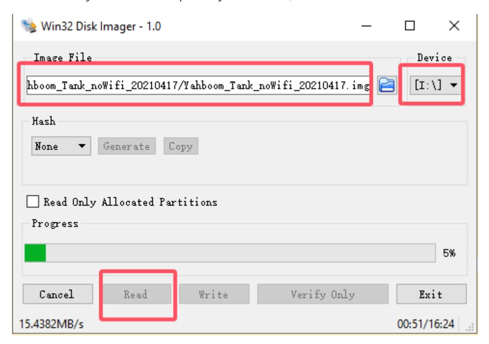

# system backup

The Jetson Nano B01 uses a TF card/USB drive to mount the system. If the TF card/USB drive is lost or damaged, the data on the Jetson Nano B01 will be lost, so it is important to backup the TF card/USB drive properly. This article can help you backup your Jetson Nano B01 system. The main content is to backup TF cards/USB drives, create Jetson Nano B01 system images, and restore backup methods when needed.

## 1. Preparation

- 1. Jetson Nano B01 TF card/USB drive
- 2. card reader

## 2. Backup (Restore) Jetson Nano B01 in Windows

If there is no Linux operating system, it can still be backed up under Windows, but the size of the backed up files is actually the size of a TF card/USB drive.First, create a blank. img suffix file, and then choose to directly read to back up the system. Then, reinstall it to restore it.

Advantages, simple operation, and the same software implementation for backup and restoreDisadvantage: occupying too much space, the backup is a full card backup, and the resulting IMG is the size of the card, which can only be restored to the original card or a card larger than the original card

Note: The WIN7 computer cannot recognize it here, and the WIN10 system is required to recognize backups;

The operation process of system backup is consistent between TF card and USB drive, except that the TF card requires the cooperation of a card reader and the USB drive can be used directly;
