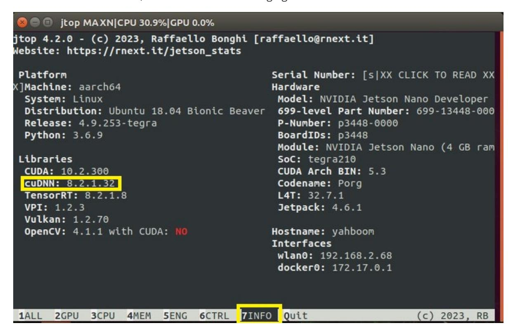

# Installation and Use of Jtop

### Installation of Jtop

(1) Installing JTOP to check CPU usage

```
sudo apt-get update
sudo apt-get full-upgrade
sudo apt install curl
sudo apt install nano
curl https://bootstrap.pypa.io/get-pip.py -o get-pip.py #下载安装脚本
sudo python3 get-pip.py # 运行安装脚本
sudo pip3 install jetson-stats
jtop
```

## Check the installed system components

(1) The OS image of Jetson Nano B01 already comes with JetPack, cuda, cudnn, opencv, and other installed examples. The installation path for these examples is as follows

```
TensorRT /usr/src/tensorrt/samples/
CUDA /usr/local/cuda-10.2/samples/
cuDNN /usr/src/cudnn_samples_v8/
VisionWorks /usr/share/visionworks/sources/samples/
/usr/share/visionworks-tracking/sources/samples/
/usr/share/visionworks-sfm/sources/samples/
OpenCV /usr/share/opencv4/samples/
```

### (2) Check CUDA

The CUDA10.2 version has already been installed in Jetson Nano B01, but at this time, if you run nvcc - V, it will not succeed. You need to write the path of CUDA to the environment variable. The Vim tool comes with the OS, so run the following command to edit the environment variables

Firstly, check if there is nvcc in the bin directory of cuda:

```
ls /usr/local/cuda/bin
```

If present,

```
sudo vim ~/.bashrc进入配置文件; 在最后面添加以下两行:
```

Note: In vim, use Esc to return to command mode, and switch to the input module through I to enter text in input mode

```
export PATH=/usr/local/cuda/bin:$PATH
export LD_LIBRARY_PATH=/usr/local/cuda/lib64:$LD_LIBRARY_PATH
```

Note: After exiting the command mode through Esc, press: to start inputting commands, wq to save and exit, q to exit, q! For forced exitSave to exit.

Then it needs to take effect under the source.

```
source ~/.bashrc
```

After the source, execute nvcc - V again at this time, and the result is as follows

beckhans@Jetson:~\$ nvcc -V

#### (3) Check OpenCV

OpenCV4.1.1 version is already installed in Jetson Nano B01. You can use the command to check if OpenCV is installed properlypkg-config opencv4 --modversionIf OpenCv is installed properly, the version number will be displayed, and my version is 4.4.1

### (4) Check cuDNN

CuDNN has been installed in Jetson Nano and there are examples available for operation. Let's run the examples to verify the CUDA above

Enter jtop at the terminal, press the right arrow key on the keyboard to select 7info, and you can see the version of cuDNN, as shown in the following figure:


