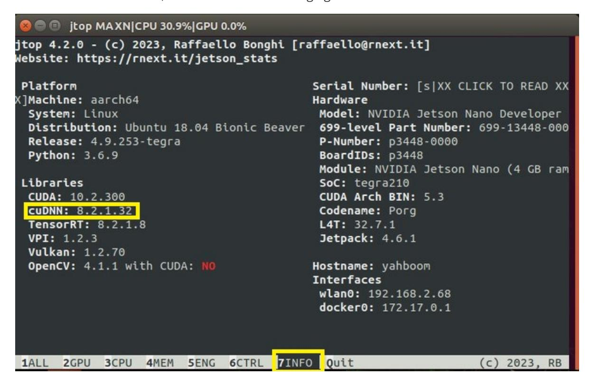

# jtop Installation and Use

## Install jtop

Install `jtop` to monitor CPU usage and other Jetson system resources:

```bash
sudo apt-get update
sudo apt-get full-upgrade
sudo apt install curl
sudo apt install nano
curl https://bootstrap.pypa.io/get-pip.py -o get-pip.py
sudo python3 get-pip.py
sudo pip3 install jetson-stats
jtop
```

## Check the installed system components

The Jetson Nano B01 OS image already includes JetPack, CUDA, cuDNN, OpenCV, and related sample projects. The sample paths are:

```
TensorRT /usr/src/tensorrt/samples/
CUDA /usr/local/cuda-10.2/samples/
cuDNN /usr/src/cudnn_samples_v8/
VisionWorks /usr/share/visionworks/sources/samples/
/usr/share/visionworks-tracking/sources/samples/
/usr/share/visionworks-sfm/sources/samples/
OpenCV /usr/share/opencv4/samples/
```

### Check CUDA

CUDA 10.2 is already installed on Jetson Nano B01. However, `nvcc -V` may fail until the CUDA path is added to the environment variables. Vim is included with the OS, so use it to edit the shell configuration.

First, check whether `nvcc` exists in the CUDA `bin` directory:

```bash
ls /usr/local/cuda/bin
```

If it is present, edit `~/.bashrc`:

```bash
sudo vim ~/.bashrc; :
```

Note: In Vim, press `i` to enter insert mode. Press `Esc` to return to command mode.

```
export PATH=/usr/local/cuda/bin:$PATH
export LD_LIBRARY_PATH=/usr/local/cuda/lib64:$LD_LIBRARY_PATH
```

Note: After pressing `Esc`, type `:wq` to save and exit. Use `:q` to exit without saving, or `:q!` to force quit.

Reload the shell configuration:

```bash
source ~/.bashrc
```

After sourcing the file, run `nvcc -V` again. The command should report the CUDA compiler version:

beckhans@Jetson:~\$ nvcc -V

### Check OpenCV

OpenCV 4.1.1 is already installed on Jetson Nano B01. Check the installed version with:

```bash
pkg-config opencv4 --modversion
```

If OpenCV is installed correctly, the command prints the version number.

### Check cuDNN

cuDNN is installed on Jetson Nano, and sample projects are available for testing. To view the cuDNN version, run `jtop` in a terminal, then use the right arrow key to open the `7INFO` page.


