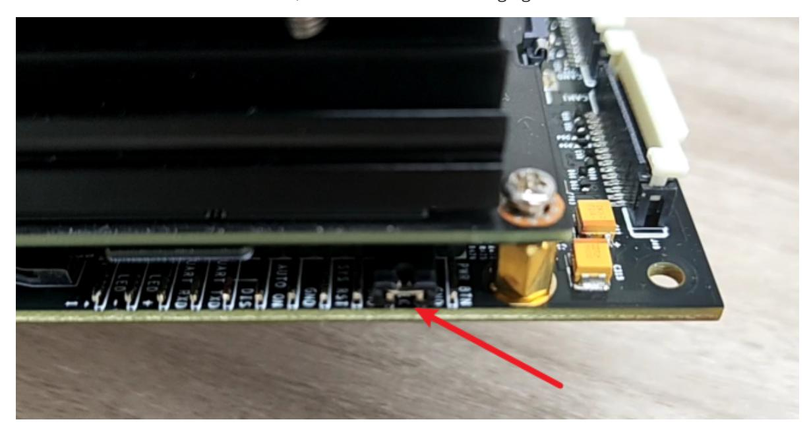
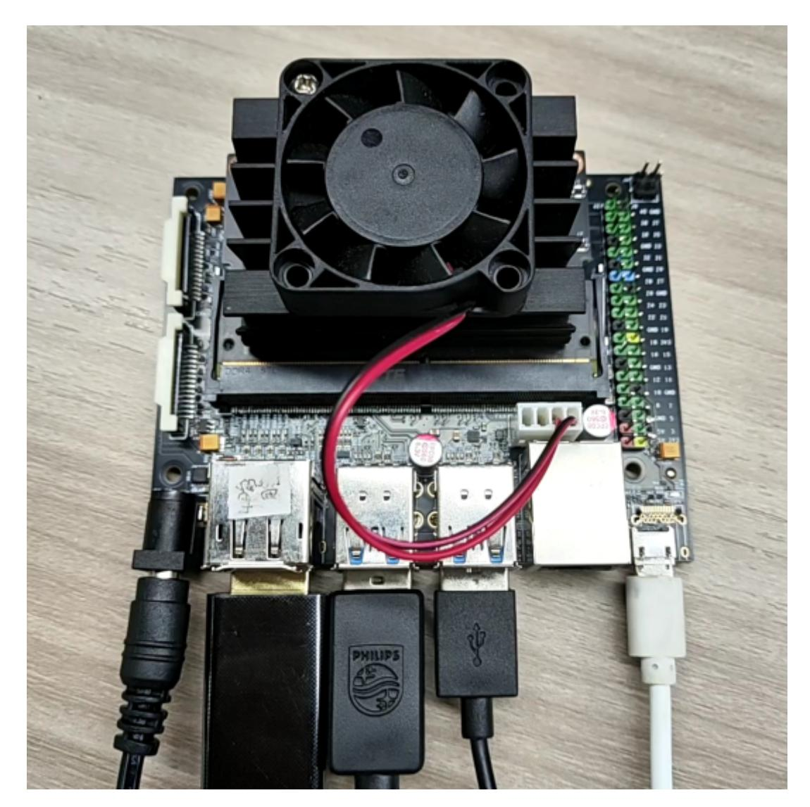
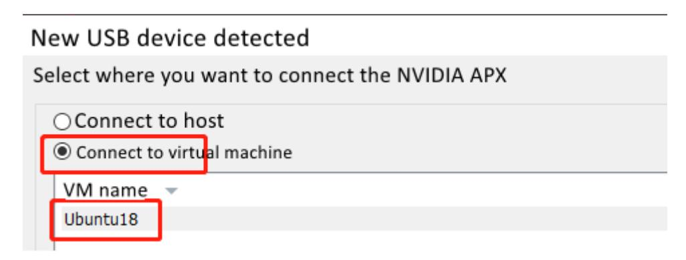
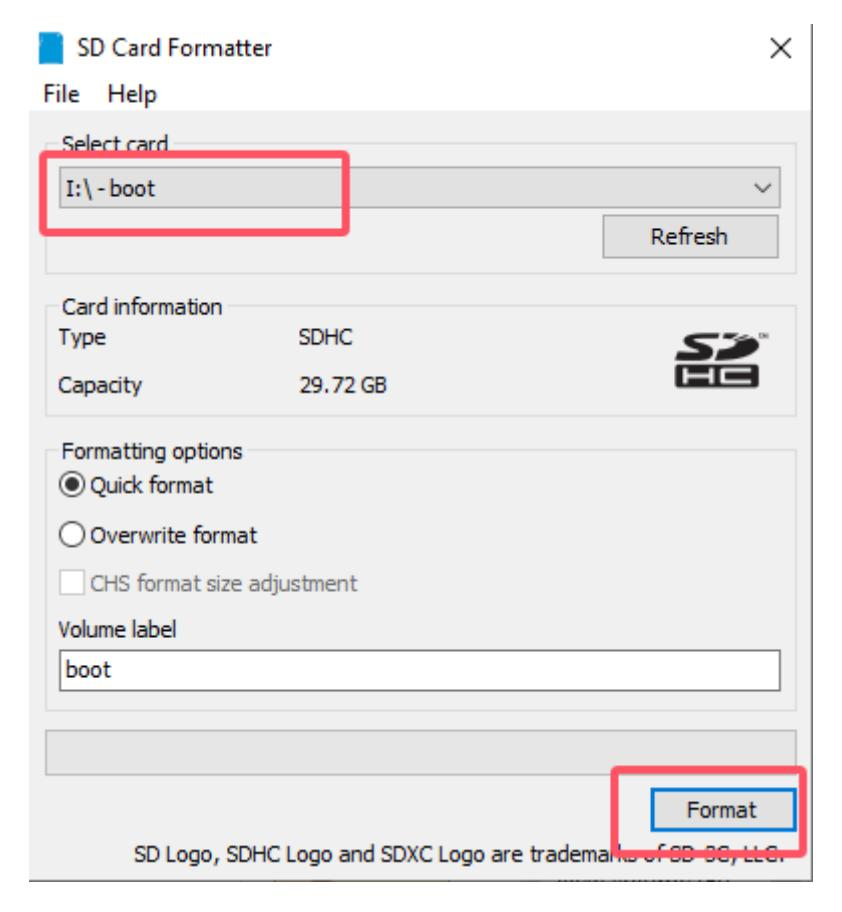
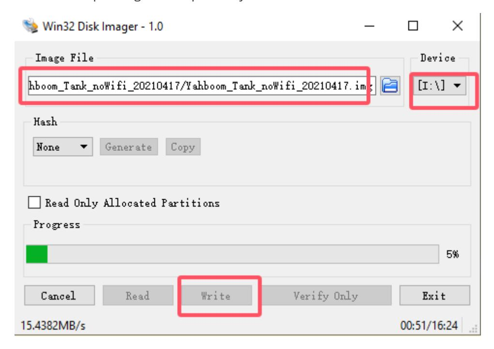
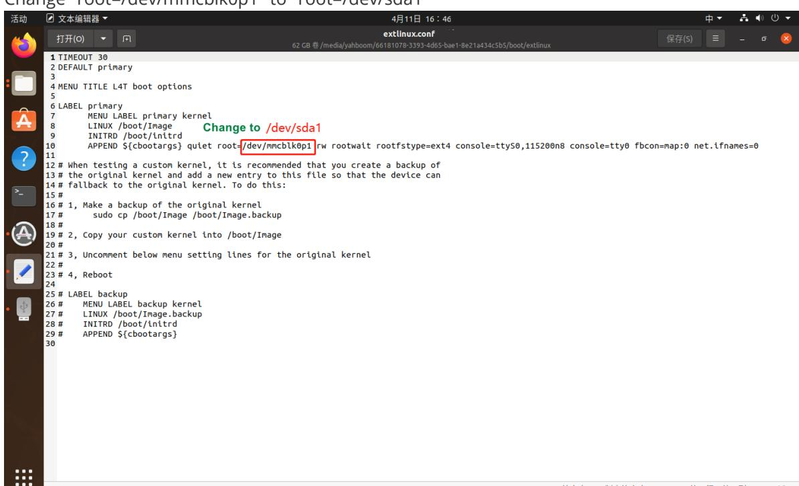

# Burn EMMC boot

After burning the EMMC boot, you can directly use the U disk system with the modified extlinux.conf configuration file to boot the computer, without the need to match the JetPack version of the EMMC system and the U disk system.

- 1. Connecting Jetson Nano B01 to a virtual machine
- 1.1 Prepare the Jetson Nano B01 motherboard, jumper caps, display, mouse and keyboard, etc.
- 1.2 Let Jetson Nano B01 enter the system REC flashing mode.

Connect the jumper caps to the FC REC and GND pins, which are the second and third pins on the carrier board below the core board, as shown in the following figure:



Connect the HDMI display, mouse, and keyboard to the Jetson Nano B01, plug in the power cord, and finally, plug in the microUSB cable. Since the jumper cap was connected to the FC REC and GND pins in the previous step, it will automatically enter REC flashing mode after powering on.



Under normal circumstances, the following window will pop up after inserting the microUSB data cable. Please note that when using a virtual machine, you need to set the device to connect to the virtual machine.



- 2. Start burning
- 2.1 Please transfer the Jetson_Boot_USB.tar.gz file in the document to the Ubuntu 18.04 system and open the terminal to run the decompression command.

```bash
tar xzvf Jetson_Boot_USB.tar.gz
```

- 2.2. After decompression, enter the Jetson_Boot_USB folder, then

```bash
cd Jetson_Boot_USB/
ls
```

- 2.3. Run the following command to burn the EMMC boot file.

```
sudo ./flash.sh -r jetson-nano-devkit-emmc mmcblk0p1
```

- 2.4. Finally, wait for the file to be burned into the EMMC. If successful, it will prompt **"The target t210ref has been flashed successfully. Reset the board to boot from internal eMMC."**

If an error message appears, please confirm whether the Jetson Nano B01 is connected properly and enter the flashing mode, and then reconnect according to the first step.

**After the burning is complete, please remove the jumper cap of Jetson Nano B01, insert the USB drive, and restart the computer**.

Note: If you are using the virtual machine provided in the Yahboom Intelligent Materials, which already contains the Jetson_Boot_USB file, you do not need to import it into the system again.

Virtual machine username: yahboom

Password: yahboom

## Burn USB system

The system in the U disk needs to use Win32DiskImager to burn the system.

### 1. Prepare for installation

The process of burning the USB disk system is the same as that of burning the TF card system.

- 1. Prepare a Windows 10 computer and a USB flash drive (32GB or larger is recommended). This step of burning the USB flash drive does not require the Jetson Nano B01.
- 2. Download the image (it is recommended to download the system with Yahboom configured environment)

Since the system configuration information in the USB disk needs to be modified, please download the USB disk system image provided by yahboom.

Do not download the official NVIDIA image, as it may fail to boot due to configuration issues.

The default system username configured by yahboom is: jetson, and the password is: yahboom

- 3. Format SD card

Use SDFormatter to format the USB drive. Be careful not to select the wrong Drive, otherwise it will cause unnecessary trouble. If the USB drive has already been burned with the system, the first formatting may fail. Just try it again.



### 2. Burn the USB system

- 1. Unzip the downloaded system compressed file to get the img image file
- 2. Insert the USB drive into the computer's USB port
- 3. Unzip and run the Win32DiskImager tool
- 4. Select the img (image) file in the software, select the drive letter of the USB flash drive under "Device", and then select "Write" and then start burning the system. The burning process will be fast or slow depending on the speed of your USB flash drive.



- 5. After the burning is completed, a completion dialog box will pop up, indicating that the installation is complete. If it is unsuccessful, please disable the firewall and other software, and reinsert the USB drive to burn. Please note that after the installation, the USB drive will be divided into multiple partitions in Windows and cannot be accessed. This is normal because the disk

partitions in Linux cannot be seen in Windows!

At this point, the USB flash drive system has been successfully burned into the Jetson Nano B01. After the system is successfully burned, it may prompt you to format the partition because it cannot recognize the partition. **Do not format it at this time! Do not format it! Do not format it!** Click Cancel, then eject the USB flash drive and finally insert the USB flash drive into the USB port on the Jetson Nano B01 motherboard.

### 3. If the system cannot start after burning the USB flash drive, the solution

- 1. Insert the U disk into the virtual machine, open the U disk in the virtual machine, open the terminal in the U disk interface, and enter the following command

```bash
cd boot/extlinux
sudo gedit extlinux.conf
```

Change "root=/dev/mmcblk0p1" to "root=/dev/sda1"



**mmcblk0p1: SD card boot sda1: USB boot** Save and exit, insert the USB into Jetson Nano B01, and boot it.

**[If the above methods still don't solve the problem:](https://blog.csdn.net/propor/article/details/127966228)** Reference link: https://blog.csdn.net/propo r/article/details/127966228
