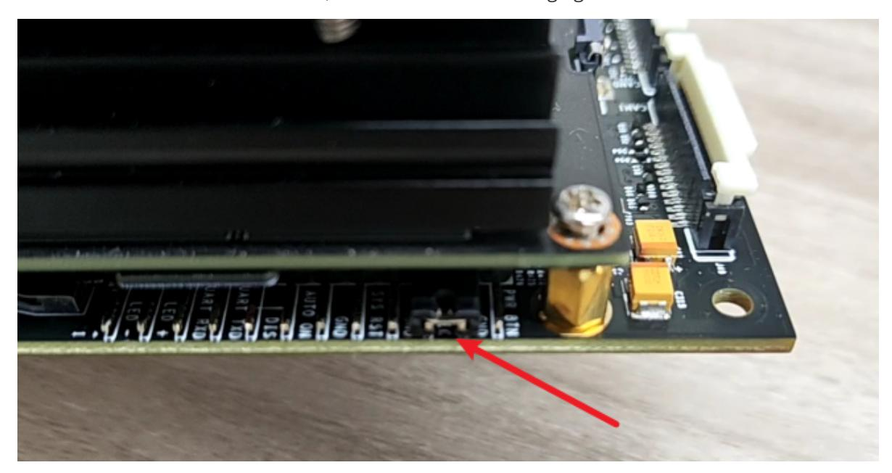
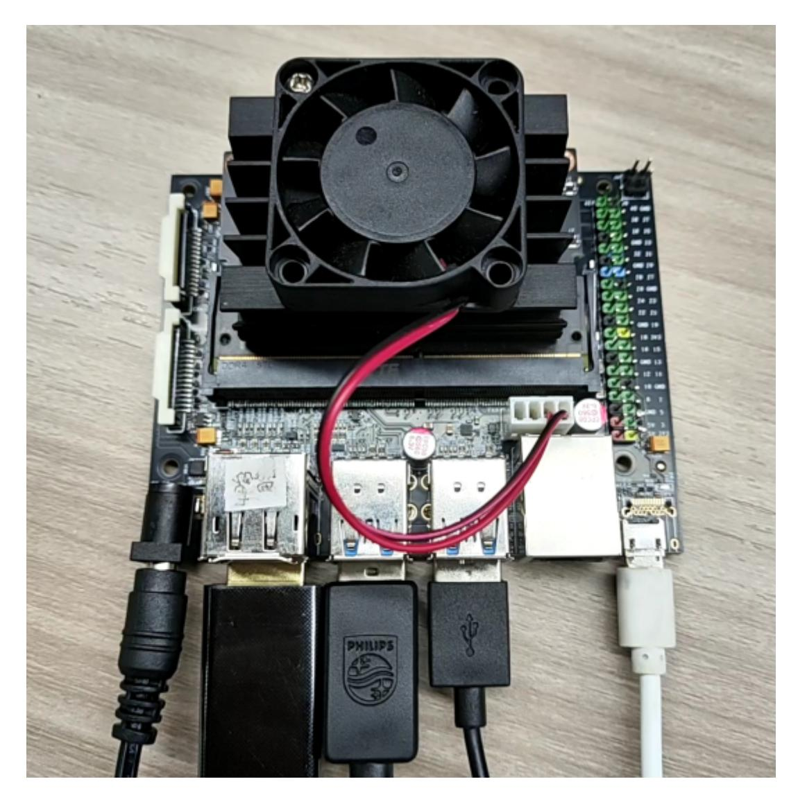
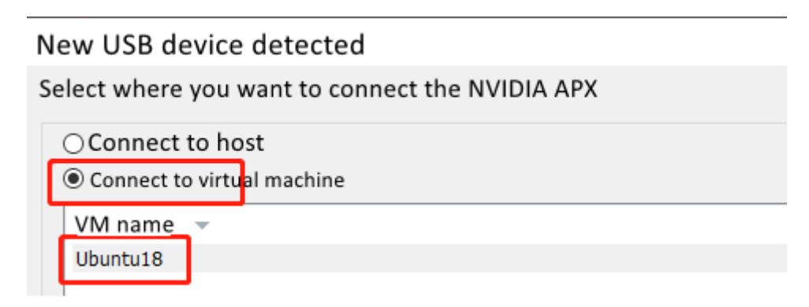
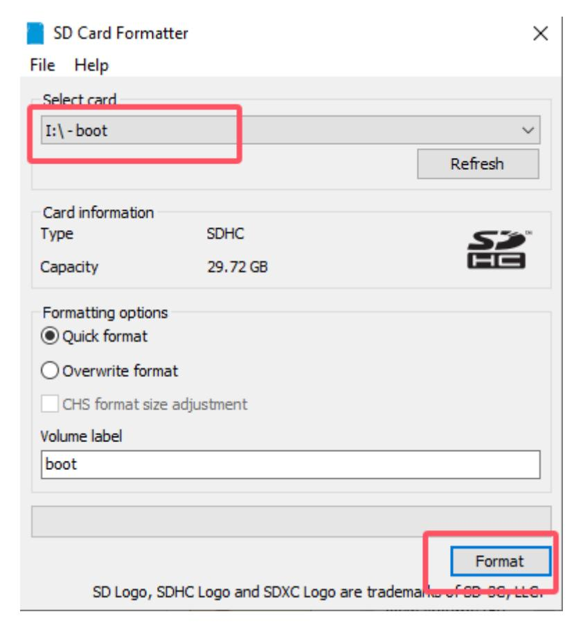
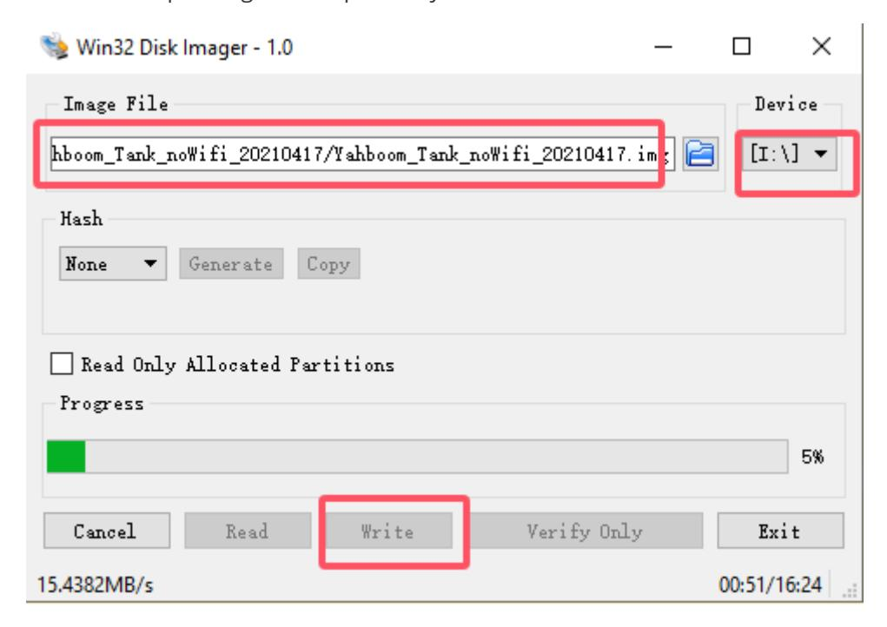
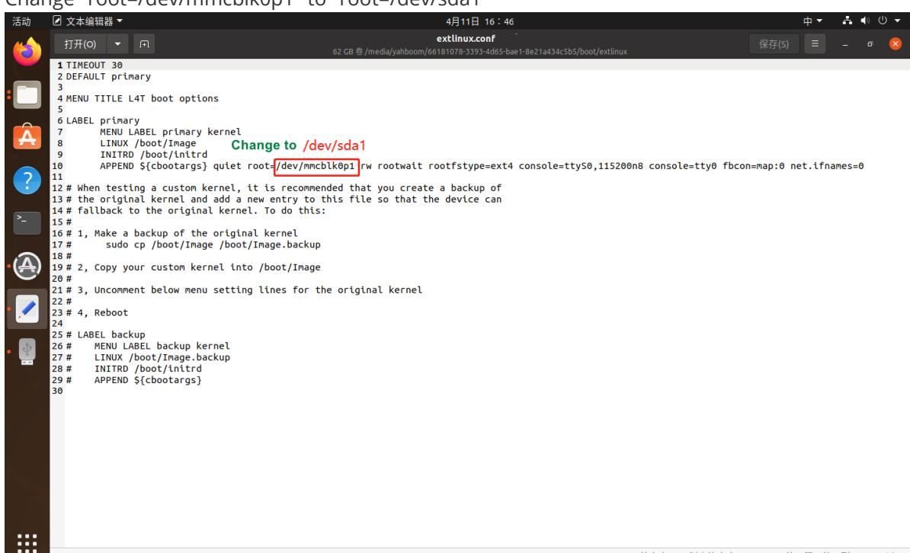

# Flash eMMC Boot

After flashing the eMMC boot files, you can boot from a USB drive system by using the modified `extlinux.conf` configuration file. The JetPack version of the eMMC boot system does not need to match the JetPack version of the USB drive system.

## 1. Connect Jetson Nano B01 to a Virtual Machine

Prepare the Jetson Nano B01 mainboard, jumper caps, display, mouse, keyboard, and required cables. Then put the Jetson Nano B01 into REC flashing mode.

Connect the jumper caps to the FC REC and GND pins, which are the second and third pins on the carrier board below the core board, as shown in the following figure:



Connect the HDMI display, mouse, and keyboard to the Jetson Nano B01, plug in the power cord, and finally, plug in the microUSB cable. Since the jumper cap was connected to the FC REC and GND pins in the previous step, it will automatically enter REC flashing mode after powering on.



Under normal circumstances, the following window will pop up after inserting the microUSB data cable. Note that when using a virtual machine, you need to set the device to connect to the virtual machine.



## 2. Flash eMMC Boot

Transfer `Jetson_Boot_USB.tar.gz` from the documentation package to the Ubuntu 18.04 system. Open a terminal and extract it:

```bash
tar xzvf Jetson_Boot_USB.tar.gz
```

After extraction, enter the `Jetson_Boot_USB` folder and list its contents:

```bash
cd Jetson_Boot_USB/
ls
```

Run the following command to flash the eMMC boot file:

```
sudo ./flash.sh -r jetson-nano-devkit-emmc mmcblk0p1
```

Wait for the file to be flashed to eMMC. If the process succeeds, the terminal prints **"The target t210ref has been flashed successfully. Reset the board to boot from internal eMMC."**

If an error appears, confirm that the Jetson Nano B01 is connected correctly and is in flashing mode, then reconnect it and repeat the first step.

After flashing is complete, remove the Jetson Nano B01 jumper cap, insert the USB drive, and restart the board.

Note: If you are using the virtual machine provided in the Yahboom Intelligent Materials, which already contains the Jetson_Boot_USB file, you do not need to import it into the system again.

Virtual machine username: yahboom

Password: yahboom

## Write USB System Image

Use Win32DiskImager to write the USB drive system image.

### 1. Prepare for installation

The process for writing a USB drive image is the same as writing a microSD card image.

1. Prepare a Windows 10 computer and a USB drive. A 32GB or larger drive is recommended. The Jetson Nano B01 is not required for this step.
2. Download the image. The Yahboom-configured system image is recommended.

Because the USB drive system configuration must be modified, use the USB drive system image provided by Yahboom.

Do not download the official NVIDIA image, as it may fail to boot due to configuration issues.

The default Yahboom-configured system username is `jetson`, and the password is `yahboom`.

3. Format the USB drive.

Use SD Formatter to format the USB drive. Be careful not to select the wrong drive. If the USB drive already contains a system image, the first formatting attempt may fail; run the format operation again.



### 2. Write the USB System Image

1. Extract the downloaded system archive to obtain the `.img` image file.
2. Insert the USB drive into the computer's USB port.
3. Extract and run Win32DiskImager.
4. In Win32DiskImager, select the `.img` file, choose the USB drive letter under `Device`, then click `Write`. The writing speed depends on the USB drive speed.



5. When writing is complete, a completion dialog appears. If writing fails, disable firewall or security software, reinsert the USB drive, and write the image again. After writing, Windows may show multiple inaccessible partitions on the USB drive. This is normal because Windows cannot read the Linux partitions.

At this point, the USB drive system image has been written successfully. Windows may prompt you to format a partition because it cannot recognize it. **Do not format it.** Click `Cancel`, eject the USB drive, and insert it into the Jetson Nano B01 USB port.

### 3. If the System Cannot Start After Writing the USB Drive Image

Insert the USB drive into the virtual machine, open the USB drive in the virtual machine, open a terminal in the USB drive directory, and run:

```bash
cd boot/extlinux
sudo gedit extlinux.conf
```

Change `root=/dev/mmcblk0p1` to `root=/dev/sda1`.



`mmcblk0p1` means SD-card boot, and `sda1` means USB boot. Save and exit, insert the USB drive into the Jetson Nano B01, and boot it.

If the steps above do not solve the problem, see this reference: <https://blog.csdn.net/propor/article/details/127966228>
