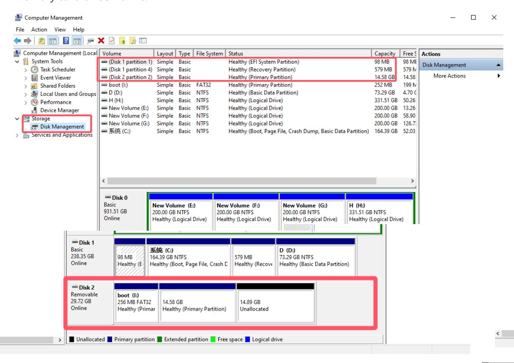

## Tutorial on how to re-burn a burned image

This tutorial is for re-burning a previously burned image on a memory card or USB drive that is no longer recognized by the computer. This **is usually caused by Windows 7 not being able to recognize the burned Ubuntu system drive. Windows 10 can use SDformat to format the drive.**

## 1. Check whether the memory card or USB drive is recognized.

Insert the memory card or USB drive into the computer, right-click the computer and select "Manage", select Disk Management, and find out if there is a removable disk with the size of the memory card or USB drive.

## 2. Delete partition

You can use Partition Assistant to delete all partitions on the memory card or USB drive, which are about 10 or so, and then format the disk. This way, the drive letters can be recognized again by the two software, and the image can be reburned. (You can also use Disk Management to select all partitions. Note that you should not only delete the partitions below, but also delete the extra small partitions in the list above. After deleting, create a new partition and format it as FAT32 so that the drive letter can be correctly recognized.)

Finally, follow the steps of burning the image to re-burn the image.
