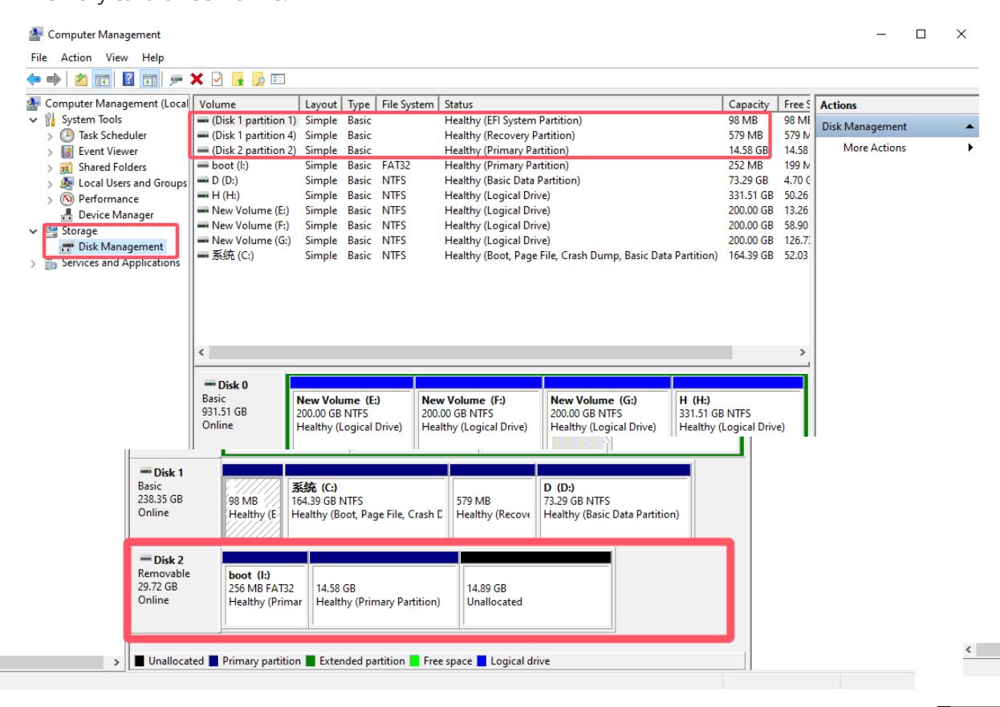

# Re-Write an Existing Memory Card or USB Drive

This lesson explains how to prepare a memory card or USB drive that already contains a Linux system image but is no longer recognized correctly by the computer. This usually happens because Windows cannot recognize the Ubuntu system partitions. Windows 10 can use SD Formatter to format the drive.

## 1. Check Whether the Drive Is Recognized

Insert the memory card or USB drive into the computer. Right-click `This PC`, select `Manage`, open Disk Management, and check whether a removable disk with the expected capacity appears.

## 2. Delete Partitions

Use Partition Assistant to delete all partitions on the memory card or USB drive, then format the disk. This lets the drive letter be recognized again so the image can be written again. You can also use Disk Management, but delete all partitions, including the small partitions shown in the upper list. After deletion, create a new partition and format it as FAT32 so the drive letter is recognized correctly.

Finally, follow the system-image writing steps again.
