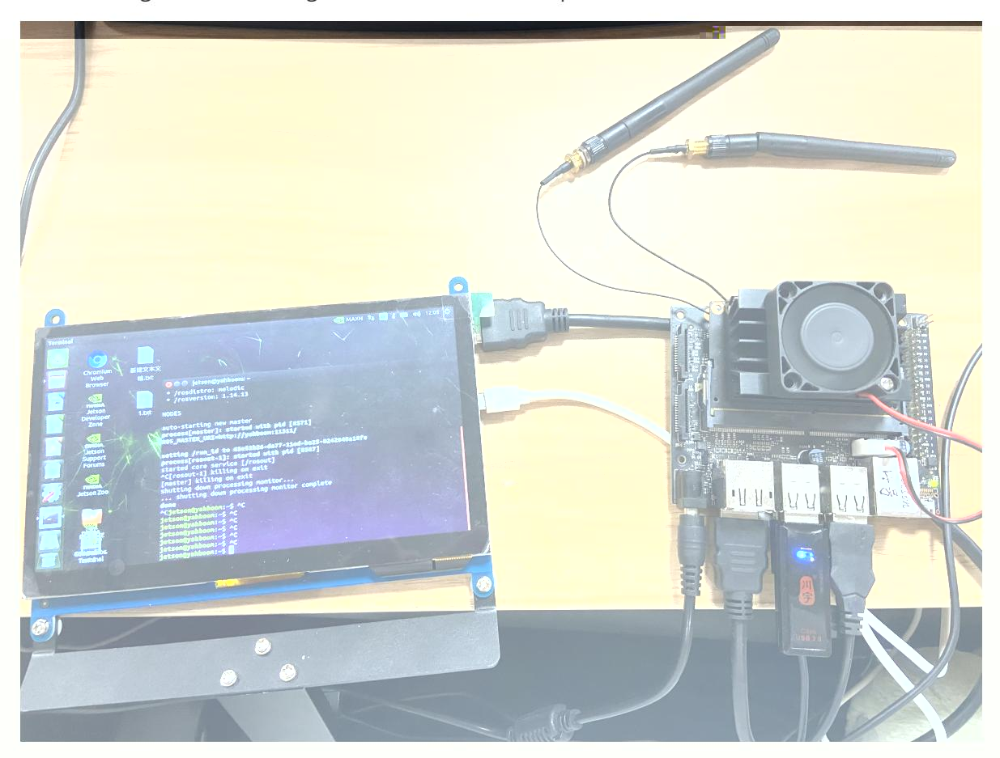

# Jetson Nano B01 SUB board startup

## 1. Power supply

It uses 5V4A power supply, which can meet most of the usage scenarios of Jetson Nano B01 and can also drive loads such as cameras, displays, and USB devices.

## 2. Start

There are two approaches here.

- First, if you burn our USB flash drive image, you can directly plug the USB flash drive into the Jetson Nano B01 motherboard to enter the system normally. You can also connect **the Jetson Nano B01 to** a monitor, DC power supply, mouse, and keyboard via HDMI.
- Second, if you want to boot the burned SD card image with a USB flash drive, you need to connect the SD card to a card reader, and then follow the above **4. Burn the USB flash drive system** to modify the boot mode. After that, plug the card reader with the SD card inserted into the Jetson Nano B01 as a USB flash drive. You can also connect **the Jetson Nano B01 to** a monitor, DC power supply (short-circuit the jumper cap J48), mouse, and keyboard via HDMI.

The following is the effect diagram of the second startup method:

