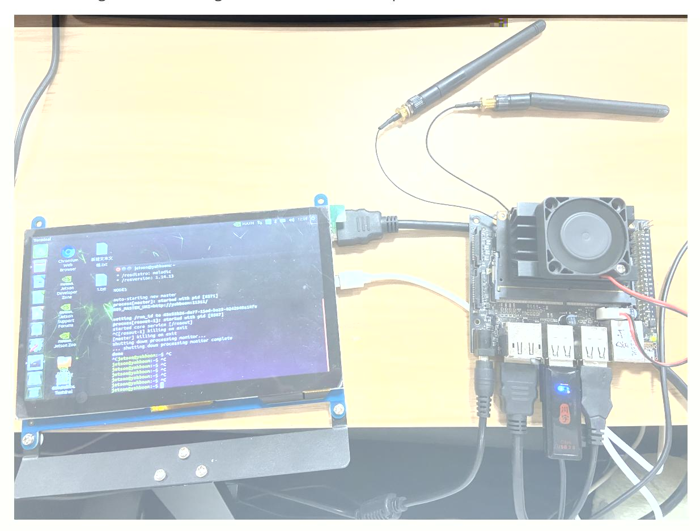

# Jetson Nano B01 SUB Board Startup

## 1. Power Supply

Use a 5V4A power supply. This meets most Jetson Nano B01 usage scenarios and can also power loads such as cameras, displays, and USB devices.

## 2. Start

There are two approaches here.

- If you wrote the Yahboom USB drive image, plug the USB drive into the Jetson Nano B01 mainboard to enter the system normally. You can also connect the Jetson Nano B01 to a monitor, DC power supply, mouse, and keyboard through HDMI.
- If you want to boot an SD card image through a USB adapter, insert the SD card into a card reader, then follow the previous USB drive boot-mode modification steps. After that, plug the card reader with the SD card into the Jetson Nano B01 as a USB drive. You can also connect the Jetson Nano B01 to a monitor, DC power supply, mouse, and keyboard through HDMI. If needed, short-circuit jumper cap `J48` for DC power.

The figure below shows the second startup method:

