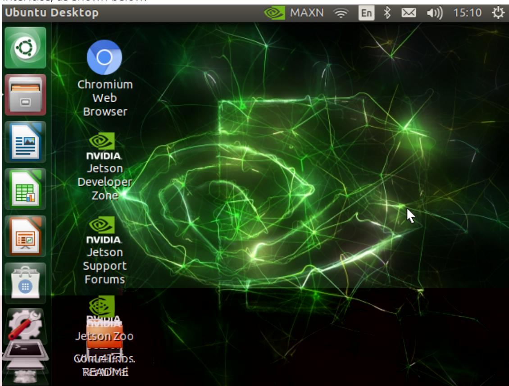
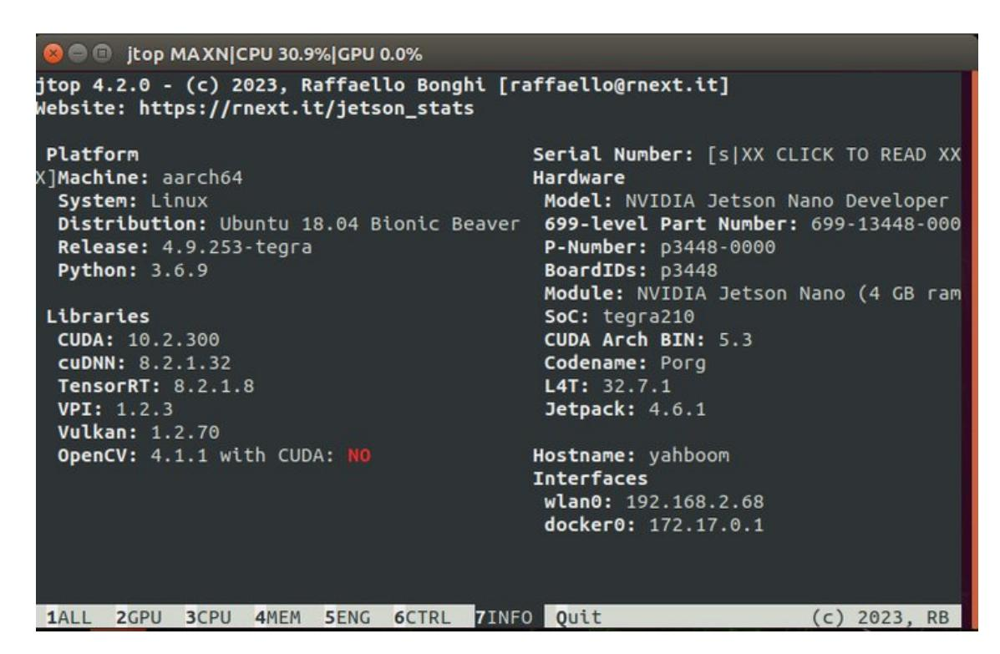

# Jetson Nano B01 System and Desktop Introduction

- 2. Version information of this system

- Ubuntu 18.04 (64-bit system)
- CUDA: 10.2
- CUDNN:8.2.1.32
- TensorRT:8.2.1.8
- OPENCV:4.1.1
- jetpack:4.6.1

If you want to build the environment from scratch, you must keep the same jetpack version as us, otherwise you will get an error according to the case we provide.
