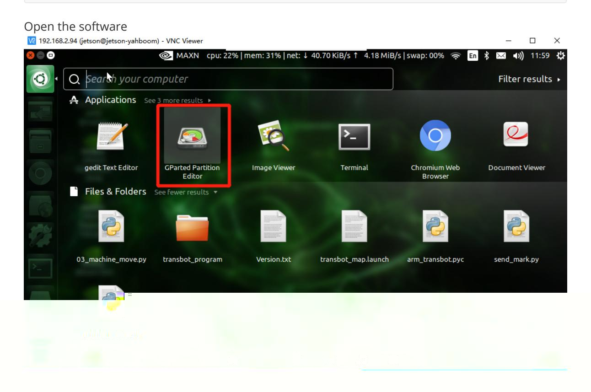
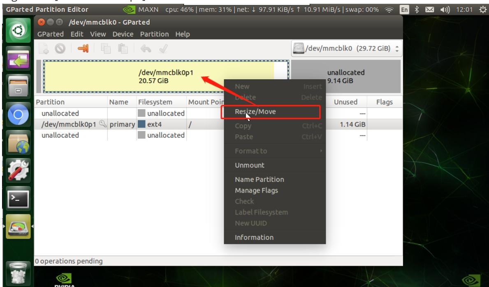
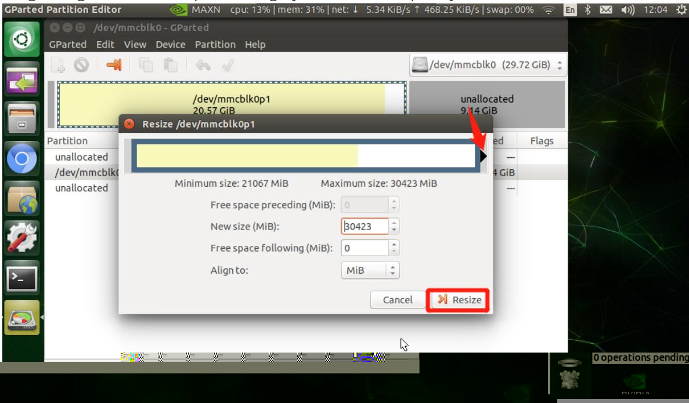
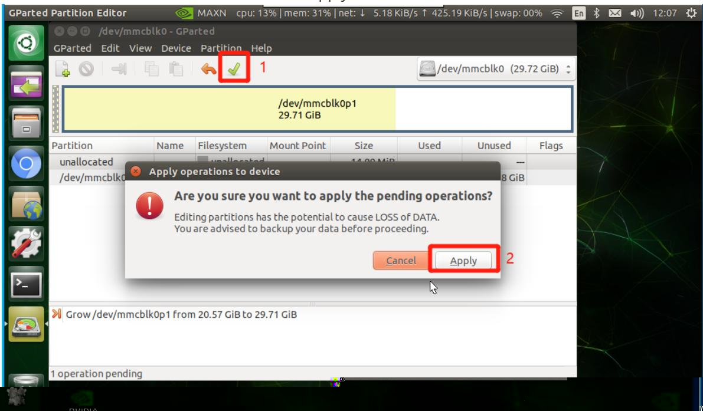
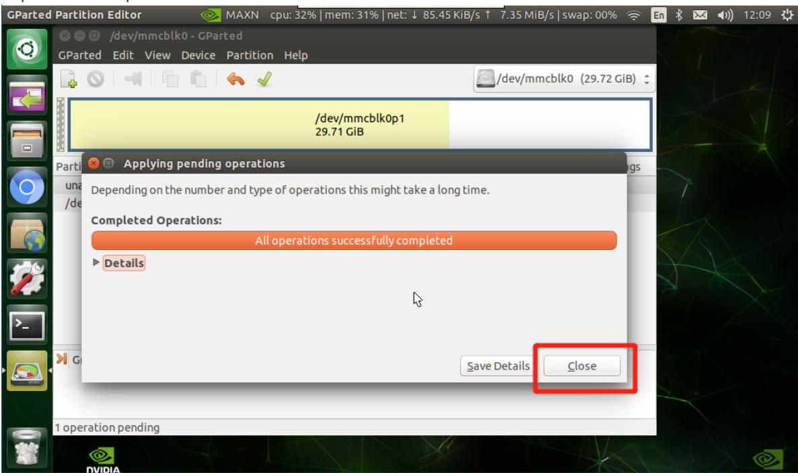
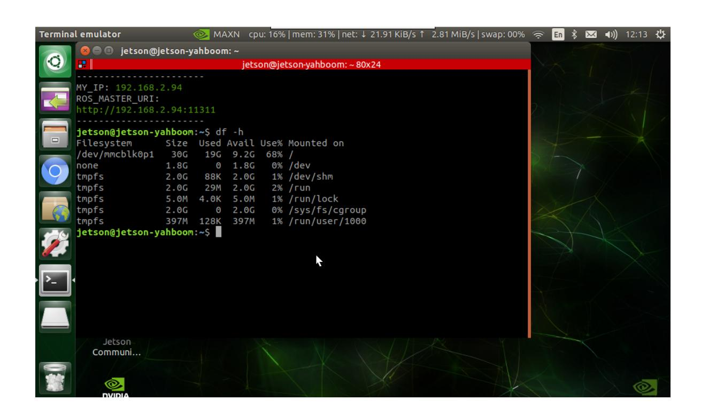

# TF card/U disk expansion

## Capacity Expansion Tutorial

### 1. Problem

After burning an image using a TF card or USB flash drive that is larger than the image memory, some of the free memory will be unusable, resulting in an error message indicating insufficient space or failure to run large projects.

Note: This tutorial is only for users who burn the image by themselves. If there is a factory image in the TF card/U disk, you can skip this tutorial.

### 2. Solution

Install the capacity expansion software and use it to expand capacity.

```bash
sudo apt install gparted
```



Right click [/dev/mmcblk0p1] -> Resize/Move



Drag the right box to the top until the gray area turns completely white -> Resize



Click the check mark at the bottom of the function bar -> Apply



Expansion completed!



Use the command to query and verify in the terminal

```
df -h
```

Verify that the expansion is successful. The 32G card expansion information is as follows


