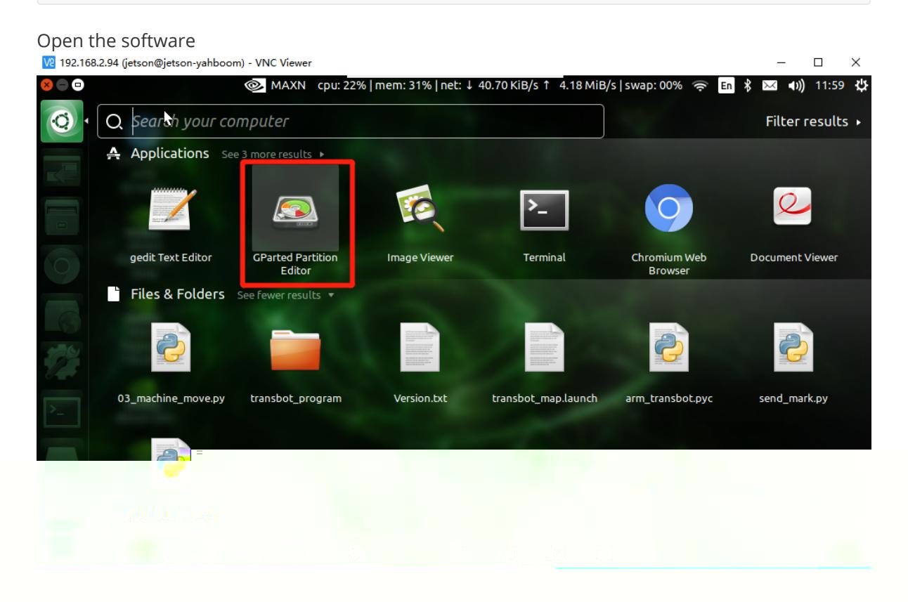
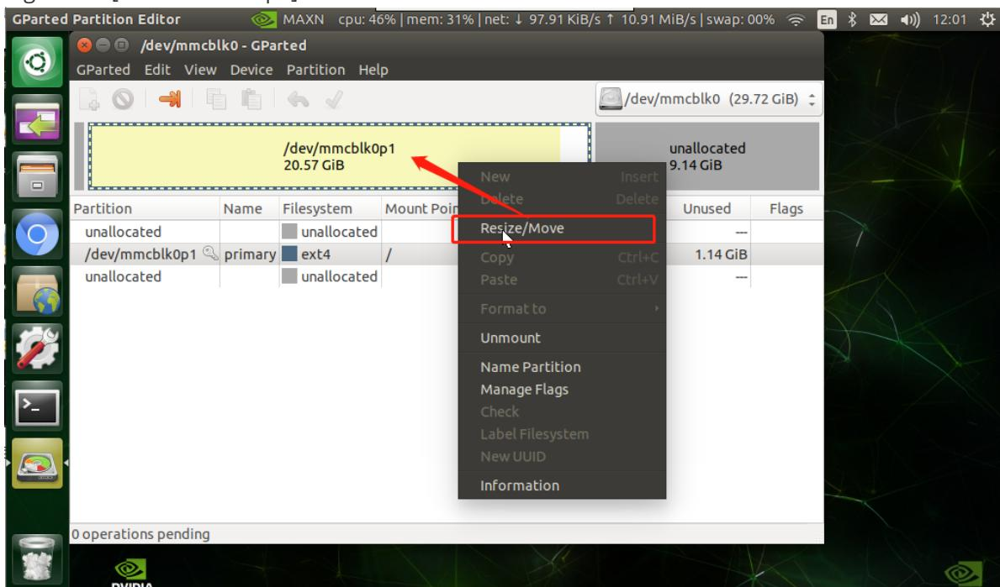
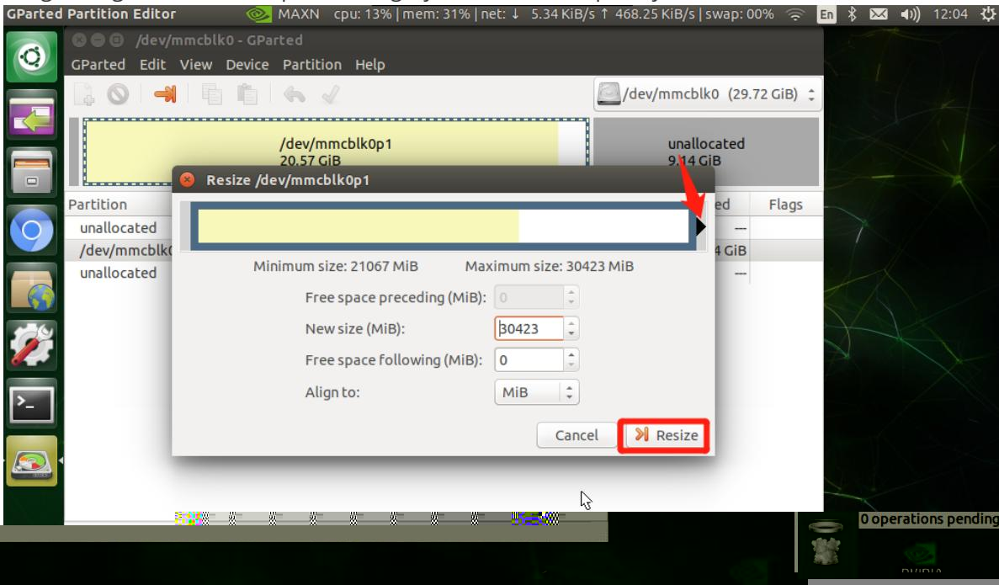
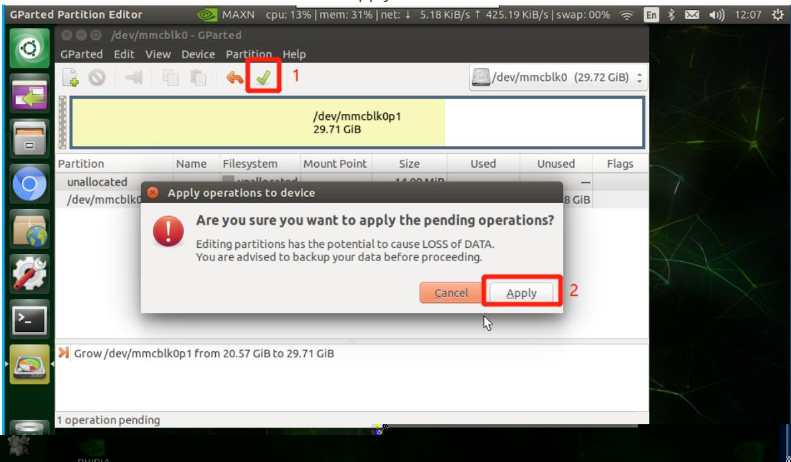
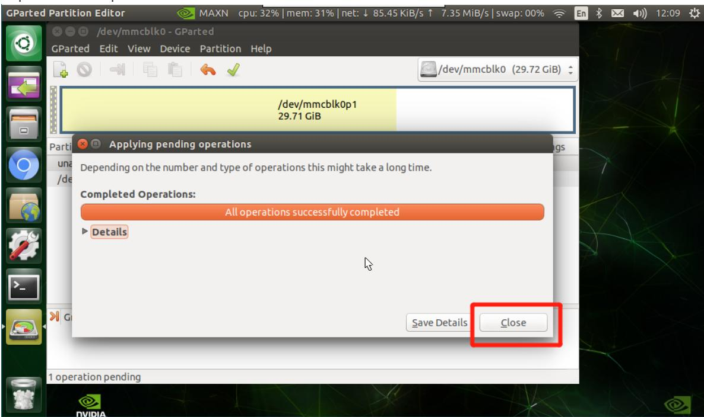
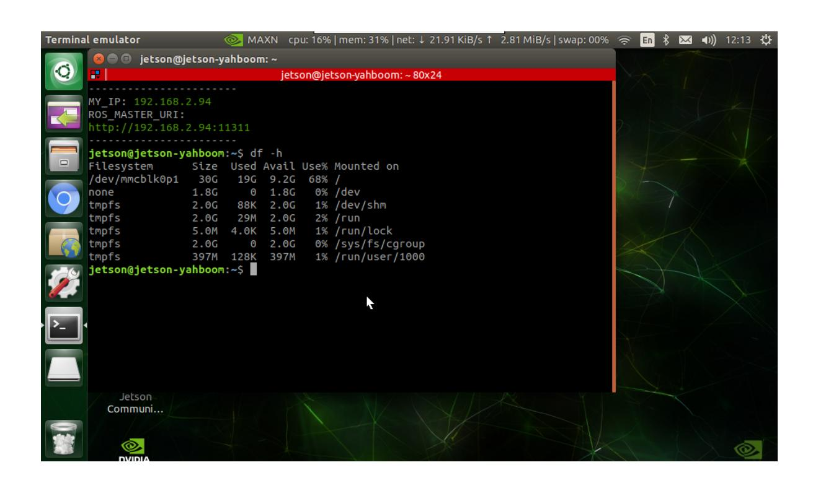

# microSD card/USB drive expansion

## Capacity Expansion Tutorial

### 1. Problem

After writing an image to a microSD card or USB drive that is larger than the image size, some free space may remain unallocated. When that happens, the system can report insufficient storage or fail to run larger projects.

Note: This tutorial is only for users who write the image themselves. If the microSD card or USB drive already contains the factory image, you can skip this tutorial.

### 2. Solution

Install the capacity expansion software and use it to expand capacity.

```bash
sudo apt install gparted
```



Right click [/dev/mmcblk0p1] -> Resize/Move



Drag the right box to the top until the gray area turns completely white -> Resize



Click the check mark at the bottom of the function bar -> Apply



Expansion completed!



Use the command to query and verify in the terminal

```
df -h
```

Verify that the expansion is successful. The 32G card expansion information is as follows


