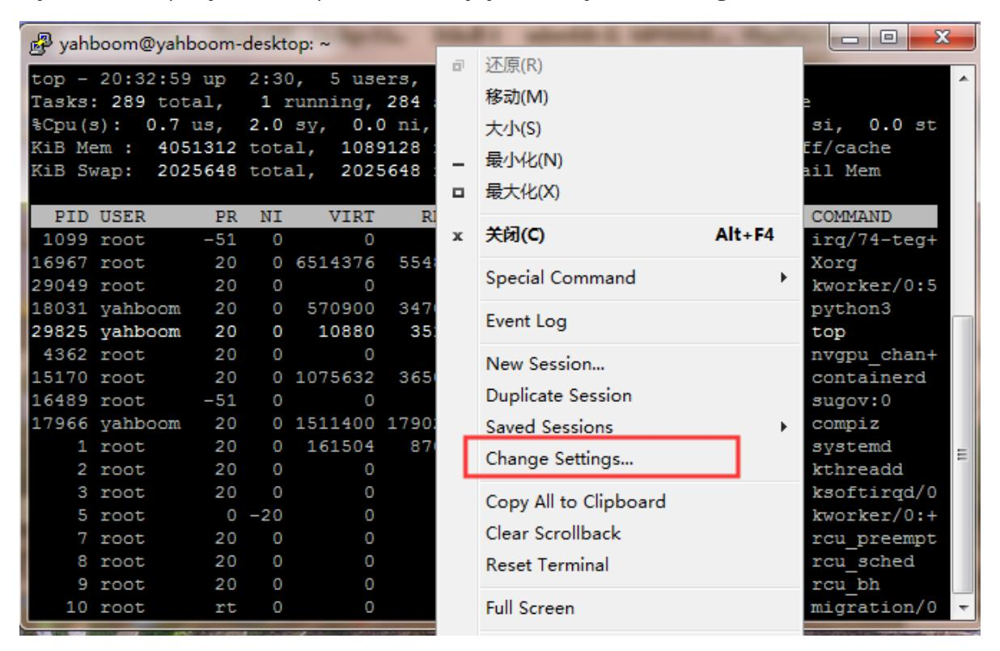
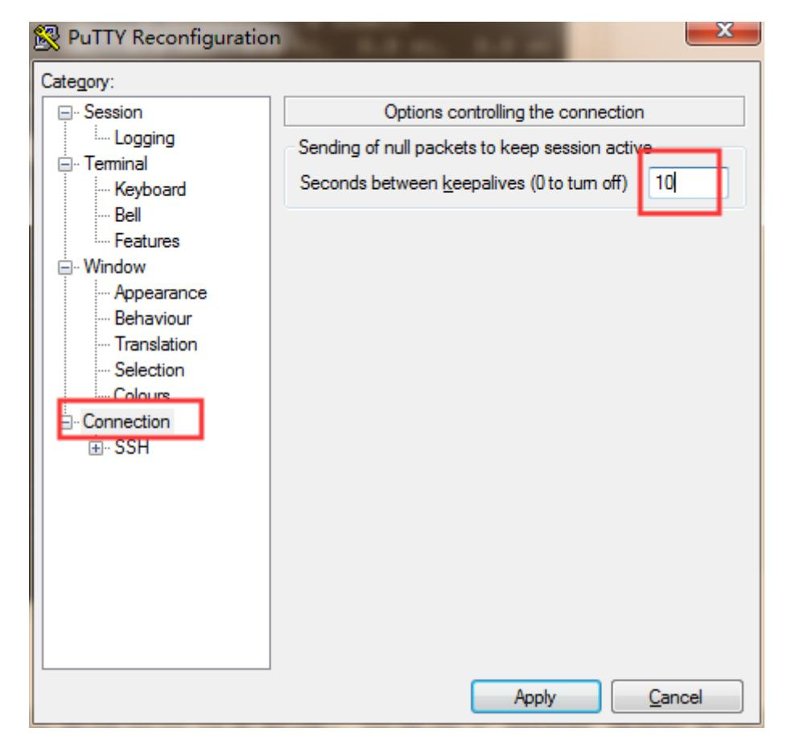
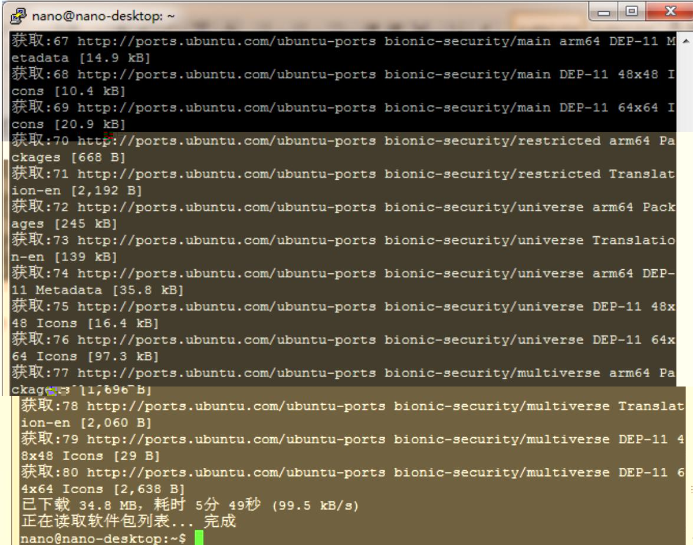
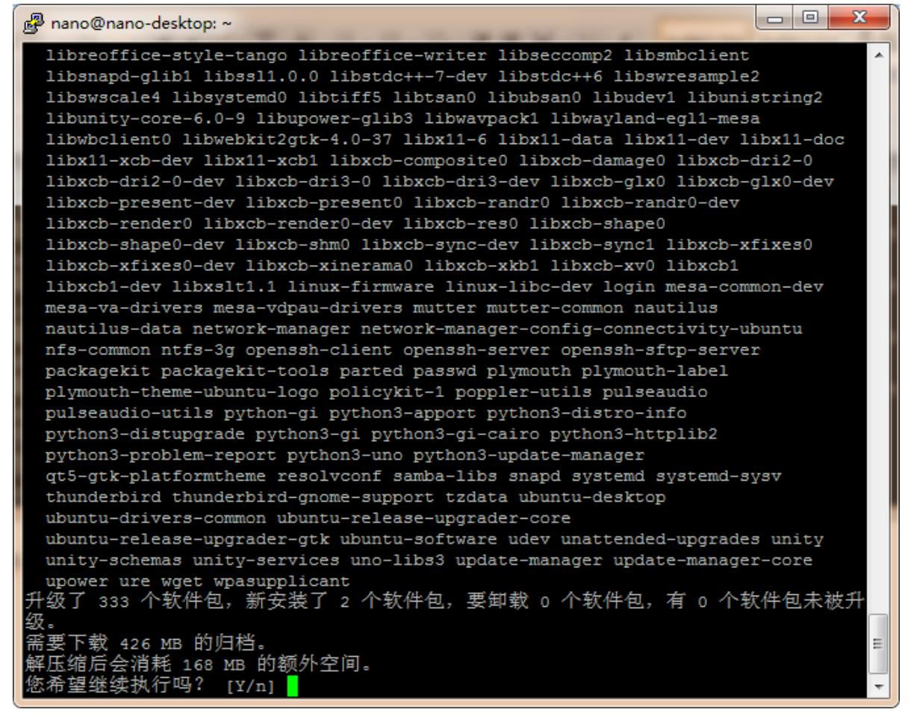
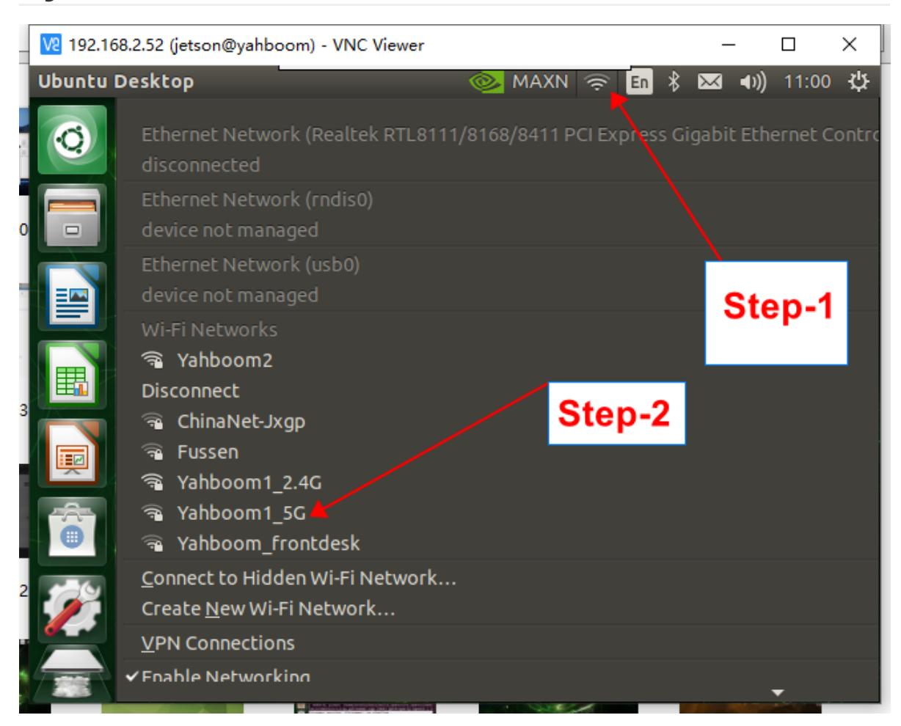

# Network Configuration

### 1.Remote login.

Choose tools such as PuTTY, SSH, and Xshell to remotely log in according to your preferences. The following is an example of the PuTTY tool. Note: If you find that the computer cannot be remotely accessed, you can try ping each other and view the IP address command on nano: ifconfig.

View local IP address cmd command under Windows: ipconfig. After knowing the IP address of the other party, ping 192.168.1.xx will modify the IP address based on the actual command

If you find that PuTTY often drops automatically, you can try the following methods:





A. Enter PuTTY and select Connection on the left side

B. Sending of null packets to keep session active on the right sideSet it to 10 (meaning to send an empty packet every ten seconds to maintain connectivity)

### 2.About updating sources.

Generally speaking, after installing the system, the source should be updated. However, since Jetson Nano B01 uses the aarch64 architecture Ubuntu 18.04.2 LTS system, which is different from the AMD architecture Ubuntu system, and I have not found a perfect domestic source, I do not recommend that you switch sources

There is no source change here, so it is still updated using the default source of Jetson Nano B01. The update process is very long, everyone can execute the command and do other things. The following two actions are recommended to be carried out before starting an AI project, otherwise installing some libraries may result in missing installation addresses and frequent errors in the future.

**sudo apt-get update**

```
_ _ X
nano@nano-desktop: ~
获取:20 http://ports.ubuntu.com/ubuntu-ports bionic-security InRelease [88.7 kB]
|获取:21 http://ports.ubuntu.com/ubuntu-ports bionic/main arm64 Packages [975 kB]
获取:22 http://ports.ubuntu.com/ubuntu-ports bionic/main Translation-en [516 kB]
获取:23 http://ports.ubuntu.com/ubuntu-ports bionic/main Translation-zh CN [67.7
kB1
获取:24 http://ports.ubuntu.com/ubuntu-ports bionic/main arm64 DEP-11 Metadata
获取:25 http://ports.ubuntu.com/ubuntu-ports bionic/main DEP-11 48x48 Icons [118
kB1
获取:26 http://ports.ubuntu.com/ubuntu-ports bionic/main DEP-11 64x64 Icons [245
获取:27 http://ports.ubuntu.com/ubuntu-ports bionic/restricted arm64 Packages [6
64 B]
获取:28 http://ports.ubuntu.com/ubuntu-ports bionic/restricted Translation-en [3
,584 B]
获取:29 http://ports.ubuntu.com/ubuntu-ports bionic/restricted Translation-zh CN
[1,188 B]
获取:30 http://ports.ubuntu.com/ubuntu-ports bionic/universe arm64 Packages [8,3
16 kB1
获取:31 http://ports.ubuntu.com/ubuntu-ports bionic/universe Translation-zh CN |
174 kB]
获取:32 http://ports.ubuntu.com/ubuntu-ports bionic/universe Translation-en [4,9
41 kB]
|获取:33 http://ports.ubuntu.com/ubuntu-ports bionic/universe arm64 DEP-11 Metada
ta [3,243 kB]
获取:34 http://ports.ubuntu.com/ubuntu-ports bionic/universe DEP-11 48x48 Icons
[2,151 kB]
|获取:35 http://ports.ubuntu.com/ubuntu-ports bionic/universe DEP-11 64x64 Icons
[8,420 kB]
                                                                 127 kB/s 50秒
80% [35 icons-64x64 6,698 kB/8,420 kB 80%]
                                                                      _
🗗 nano@nano-desktop: ~
获取:67 http://ports.ubuntu.com/ubuntu-ports bionic-security/main arm64 DEP-11 M 🔺
etadata [14.9 kB]
获取:68 http://ports.ubuntu.com/ubuntu-ports bionic-security/main DEP-11 48x48 I
cons [10.4 kB]
获取:69 http://ports.ubuntu.com/ubuntu-ports bionic-security/main DEP-11 64x64 I
cons [20.9 kB]
获取:70 http://ports.ubuntu.com/ubuntu-ports bionic-security/restricted arm64 Pa
ckages [668 B]
```





Enter Y during the process to confirm the update. The second process may take about 2 hours depending on the network situation. Please be patient and wait. After completion, as shown in the following figure

## 3.Jetson Nano B01 connects to Wi-Fi



The first step is to click on the network symbol above. The second step is to select the network we need to connect to, and enter the password. I have already connected to the network of yahboom2Obtain the IP address of the motherboard (when connected to the network)

ifconfig

Because I am using Wi-Fi, looking at the IP address in the wlan0 line, I can see that my IP address here is 192.168.2.52.

### 4.Jetson Nano B01 connecting network cable

If we want to know the IP address without a display screen, we can use the method of directly plugging in the network cable, and then the computer and a router will also be connected to the network. Download an IP scanning software to perform IP scanning, which is Advanced IP Scanner.

Scanned IP

| 果火      | 蔵夹                     |              |                   |    |  |
|---------|------------------------|--------------|-------------------|----|--|
| 状态      | 名称 名称               | IP           | MAC 地址            | 备注 |  |
|         | yishuifengxingdeMacBoo | 192.168.2.73 | 84:38:35:56:13:2E |    |  |
|         | yishuifengxingdeMacBoo | 192.168.2.64 | 84:38:35:56:13:2E |    |  |
|         | yahboomrdc             | 192.168.2.51 | D0:94:66:74:E6:64 |    |  |
| <b></b> | yahboom-4              | 192.168.2.52 | 00:04:4B:E7:0C:07 |    |  |
| Ţ       | yahboom-4              | 192.168.2.88 | 00:04:4B:E7:0C:07 |    |  |
|         | yahboom-3              | 192.168.2.80 | 40:1C:83:42:2A:5C |    |  |
|         | yahboom-2              | 192.168.2.70 | E4:5F:01:0E:23:C6 |    |  |
|         | yahboom                | 192.168.2.82 | 2C:EA:7F:E7:A2:00 |    |  |
|         | ubuntu-2               | 192.168.2.67 | 08:FB:EA:79:9E:16 |    |  |
|         | ubuntu-14              | 192.168.2.85 | 08:E9:F6:AE:F8:20 |    |  |
|         | ubuntu                 | 192.168.2.63 | CE:C3:CF:B1:28:80 |    |  |
|         | rr-pc                  | 192.168.2.75 | CE:91:65:A1:C0:EB |    |  |
|         | chenshuaiqideiPhone    | 192.168.2.79 | 3E:63:57:3F:F9:1B |    |  |
|         | YAB101                 | 192.168.2.93 | 18:C0:4D:A5:6B:09 |    |  |
|         | XWTPP7GF4NG421H        | 192.168.2.68 | 9C:B6:D0:01:35:05 |    |  |
|         | Transbot               | 192.168.2.97 | 64:79:F0:90:52:AE |    |  |
|         | Transbot               | 192.168.2.96 | 1C:1B:B5:13:56:FA |    |  |
|         | Transbot               | 192.168.2.50 | 00:13:EF:F3:5C:18 |    |  |
|         | DESKTOP-NH96BIF        | 192.168.2.87 | F2:26:75:54:68:9C |    |  |
|         | DESKTOP-NH96BIF        | 192.168.2.86 | 50:EB:F6:5A:32:C4 |    |  |
|         | DESKTOP-NH96BIF        | 192.168.2.92 | 04:42:1A:30:CF:EF |    |  |
|         | DESKTOP-GATONG4Y       | 192.168.2.81 | AC:88:FD:11:44:D9 |    |  |
|         | DESKTOP-CFUMO3M        | 192.168.2.57 | 00:CF:E0:47:DE:8B |    |  |
|         | DESKTOP-1              | 192.168.2.89 | 48:F3:17:01:82:74 |    |  |
|         | Blair                  | 192.168.2.90 | 00:D8:61:D7:3B:36 |    |  |
|         | Android-5              | 192.168.2.61 | 04:F9:F8:2D:58:2A |    |  |
|         | Android-2              | 192.168.2.69 | 7C:D6:61:F3:C7:54 |    |  |
|         | Android                | 192.168.2.91 | AE:F1:07:22:D9:0F |    |  |
|         | 7K5SNJ4OEGW68P2        | 192.168.2.84 | 50:EB:F6:58:AA:BA |    |  |
|         | 7K5SNJ4OEGW68P2        | 192.168.2.77 | 50:EB:F6:58:AA:BA |    |  |
|         | 4CE229B8FH             | 192.168.2.95 | 84:69:93:80:63:CF |    |  |
|         | 192.168.2.98           | 192.168.2.98 | FC:83:C6:05:A5:51 |    |  |
|         | 192.168.2.78           | 192.168.2.78 | D8:5E:D3:73:47:F5 |    |  |
|         | 192.168.2.74           | 192.168.2.74 | E0:80:6B:BE:3A:C1 |    |  |
|         | 192.168.2.71           | 192.168.2.71 | 72:28:F6:DB:7D:24 |    |  |
|         | 192.168.2.62           | 192.168.2.62 | 16:D3:91:0D:FE:6B |    |  |
|         | 192.168.2.60           | 192.168.2.60 | 12:C6:38:41:4A:CF |    |  |
