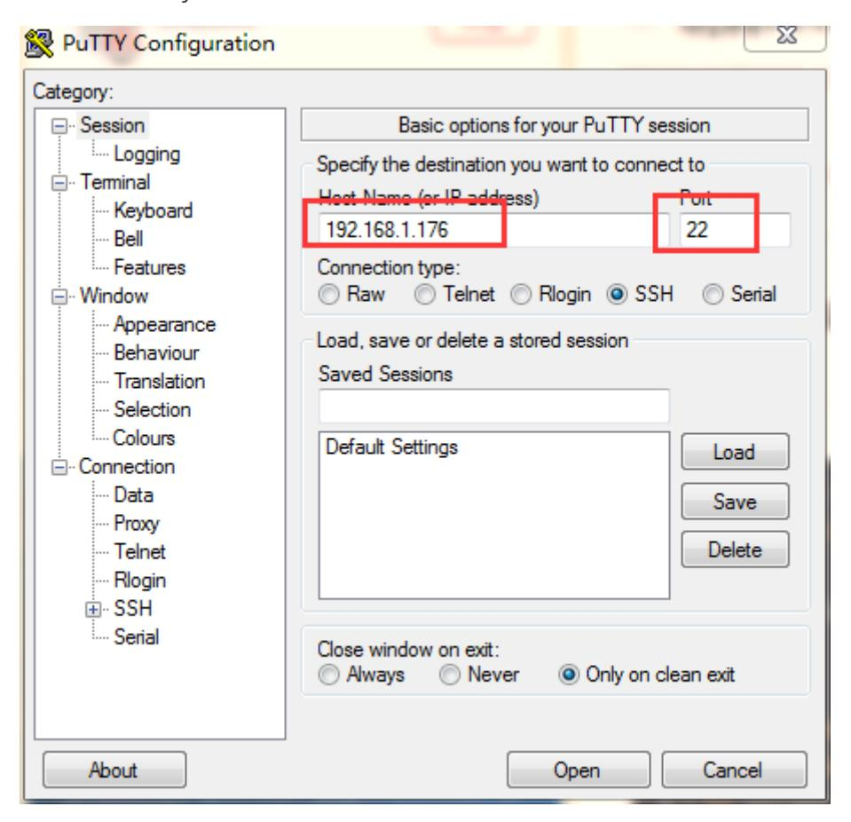
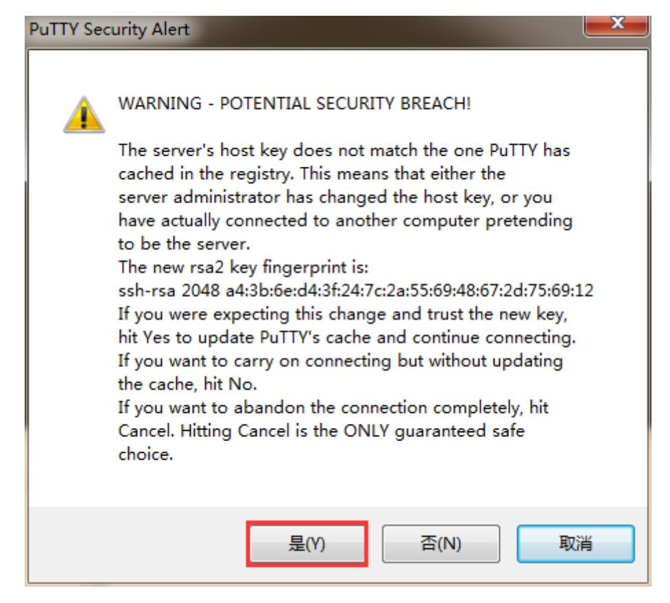
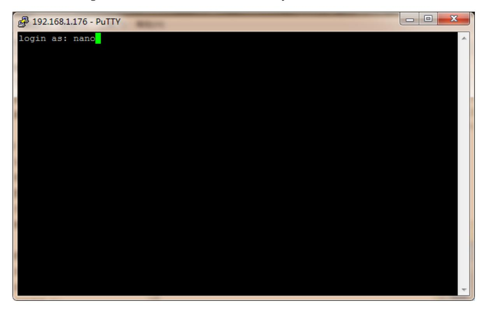
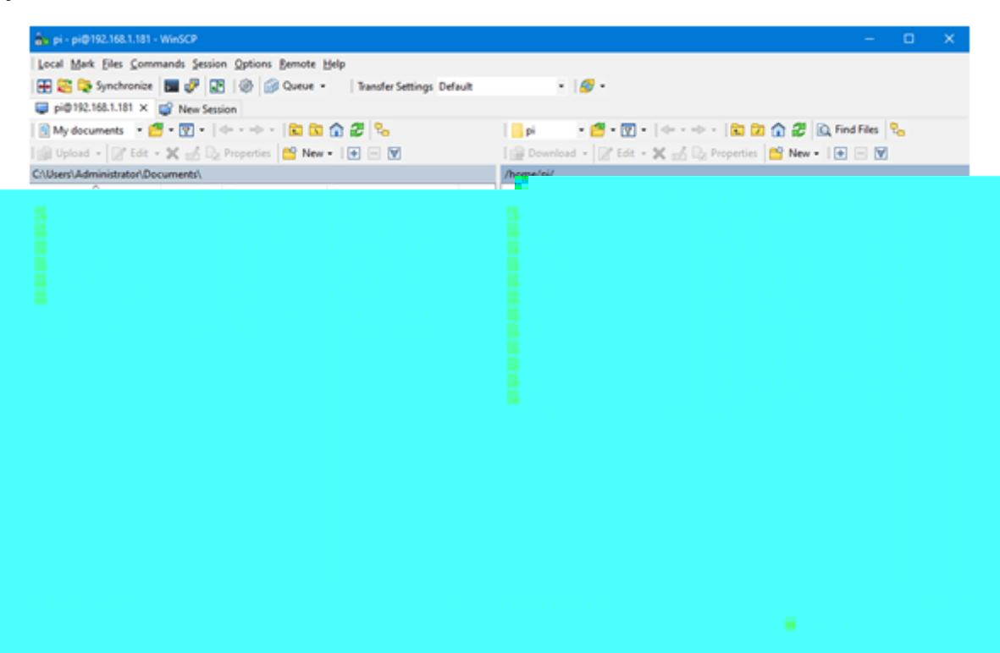
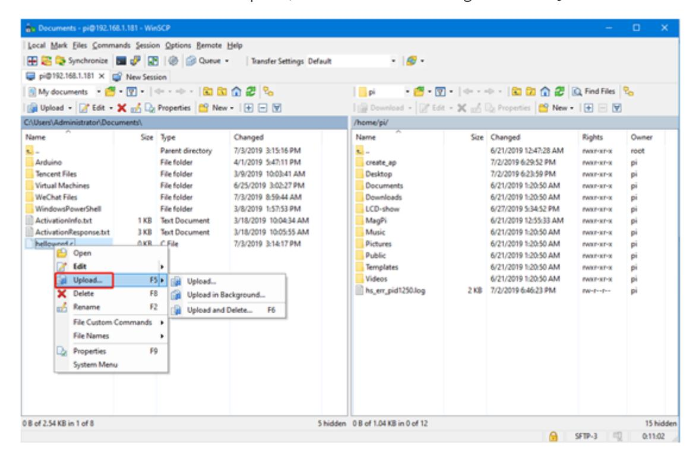
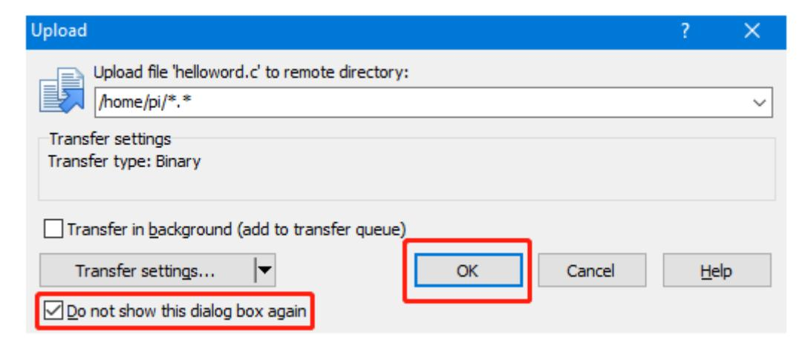
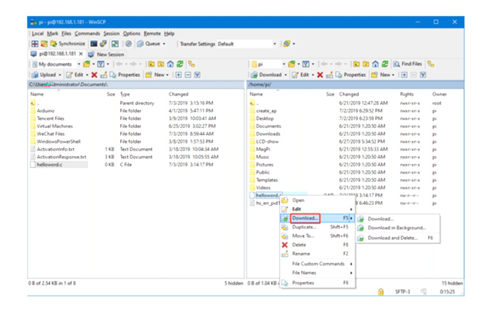

# Jason Nano Remote Login Tutorial&Remote File Transfer Tutorial

Tip: The configured image has a username of Jetson, and the original password is yahboom,

## 1.Remote login tutorial

- 1. First, determine the IP address of your board.

Method 1: Directly during the system installation process, through the interfaceCtr+Alt+T Open the Command Prompt and enter ifconfigFind the IP address of the corresponding wired network card eth0. If you have purchased a wireless network card, please refer to the address under wlan.

Method 2: You can log in to the wireless router management system and find the IP address of the board

- 2. Open PuTTY and enter the IP address and port number below. By default, the SSH service has been enabled in the system.

Finally, open Open and click Yes when prompted.

- 3. Enter the login name we entered in the installation system, if this is nano.

Then enter the password and enter terminal mode.

Note: Enter the password here. The password you entered is hidden. After entering it, simply press Enter

## 2.Remote File Transfer Tutorial

Sometimes we need to transfer files between two different systems, Windows and Linux. As these are two different file systems, we need to use the so-called SSH service to transfer files across systems. Here I use WinSCP software for transmission, which is simple and easy to use.

Enter the IP address, username, and password for the new site and click to log in. If the above information is not modified much, you can save it directly and enter the corresponding user system next time.

The following interface appears to indicate successful login

The left side is the window side, and the right side is the Linux system side. You can directly drag and drop files to the other end for file transfer, or right-click the file to select the corresponding operation, such as moving, deleting, etc.

After successfully logging in by clicking on Login, the following interface will be displayed. The folder on the left is for the win computer, and the folder on the right is for the Jetson Nano B01.

There are three operation methods for file transfer. The first one is to directly drag the file from left to right, or from right to left, and the system will automatically copy a file and transfer it.

The second method is to select a file with the mouse and press the F5 key once, and the selected file will be copied to the other side.

The third method is to select the file and click the right mouse button. If it is transferred from the Win computer to the Jetson Nano B01 click Upload,

A prompt will pop up, you can choose not to prompt again, and click OK to automatically transfer the file.

If transferring files from Jetson Nano B01 to win computer, right-click to select the file and select Download

