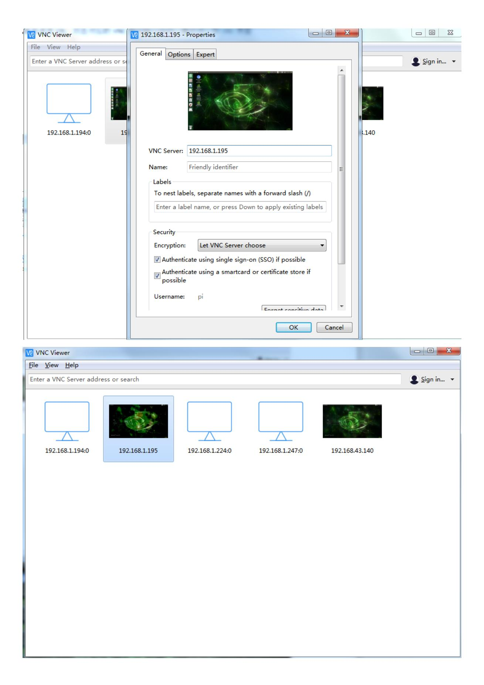
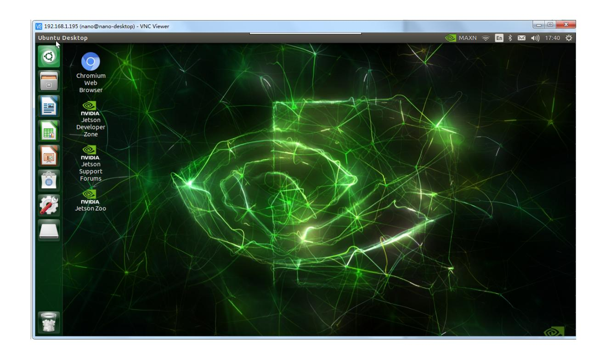

# VNC remote login

## Jetson Nano B01 remote desktop control through VNC

Tip: The configured image has a username of Jetson and the original password is yahboom. If you are using a configured image and VNC is already configured, you can directly skip to step 6 and log in to VNC based on the current IP address

### 1. Install Vino

```bash
sudo apt update
```

```bash
sudo apt install vino
```

### 2. Set Enable VNC service (at this time, the VNC server can be manually opened)

```
sudo ln -s ../vino-server.service
/usr/lib/systemd/user/graphical-session.target.wants
```

```bash
# Configure VNC server:
gsettings set org.gnome.Vino prompt-enabled false
gsettings set org.gnome.Vino require-encryption false
```

Edit org.gnome, restore the missing 'enabled' parameter, enter the command to enter the file, and add the key content below to the end of the file. Save and exit.

```bash
sudo vi /usr/share/glib-2.0/schemas/org.gnome.Vino.gschema.xml
```

```
<key name='enabled' type='b'>
<summary>Enable remote access to the desktop<summary>
<description>
If true, allows remote access to the desktop via the RFB protocol. Users on
remote machines may then connect to the desktop using a VNC viewer.
<description>
<default>false<default>
<key>
```

Set to GNOME compilation mode

```
sudo glib-compile-schemas /usr/share/glib-2.0/schemas
```

Now the screen sharing panel is working in the unit control center But this is not enough to make Vino run! So you need to add the program Vino server when the session starts, using the following command line:

### 4. Restart the machine and verify if VNC settings were successful

```
sudo reboot
```

### 5. Set the VNC Server to start automatically after startup

The VNC server is only available after you log in locally to Jetson. If you want VNC to be automatically available, please use the system settings application to enable automatic login.

```bash
gsettings set org.gnome.Vino enabled true
mkdir -p ~/.config/autostart
vi ~/.config/autostart/vino-server.desktop
```

Add the following content to the file, save and exit.

```
[Desktop Entry]
Type=Application
Name=Vino VNC server
Exec=/usr/lib/vino/vino-server
NoDisplay=true
```

If the system is set to require a user password to enter before entering the desktop, the above modification script will not start until entering the desktop. It is recommended to set the system to automatically log in to the desktop by the user.

### 6. Connecting to VNC Server

Using VNC Viewer to connect to VNC using the viewer software, the first step is to query the IP address. I found 192.168.1.195 here. After entering the IP address, click OK, double-click the corresponding VNC user to enter the password, and finally enter the VNC interface




