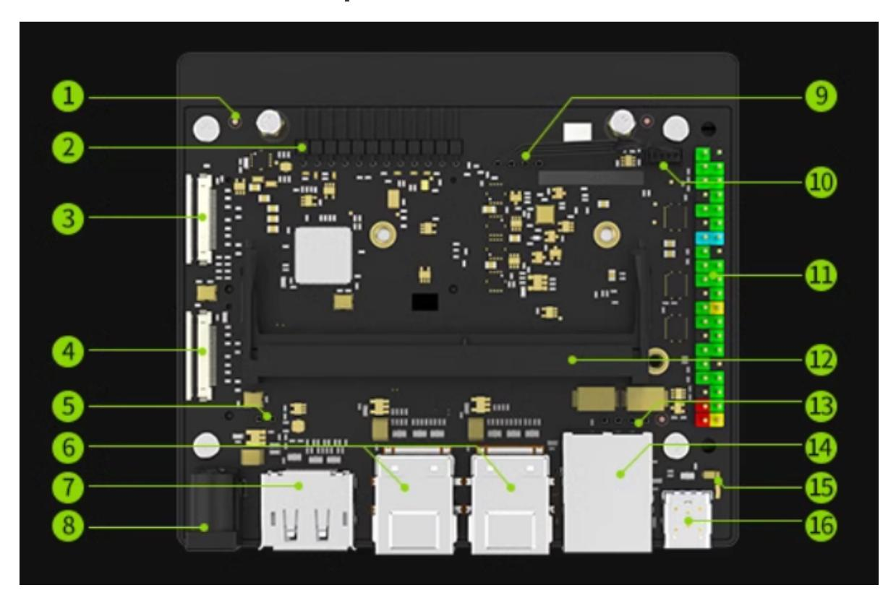
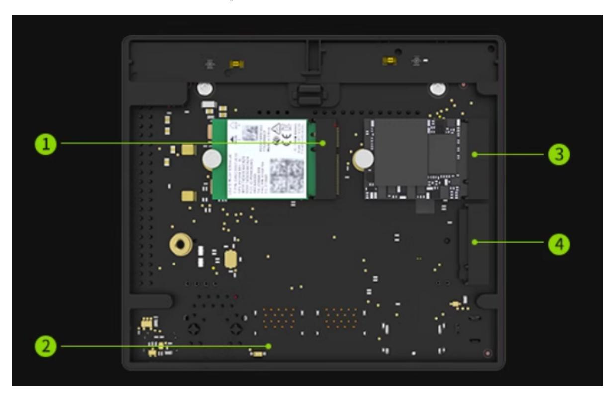

## Jetson board introduction

#### Jetson board introduction

- 1. Jetson Orin development kit
  - 1.1. Front of the development board
  - 1.2. Back of the development board

## 1. Jetson Orin development kit

The main difference between the Jetson Orin official development kit and the SUB version development kit: the official kit does not have ① switch button

### 1.1. Front of the development board

| Serial number | Description                                 | Serial number | Description                     |
|------------------|---------------------------------------------|------------------|---------------------------------|
| 1                | Power switch button (SUB)                   | 9                | CAN bus                         |
| 2                | 12Pin button row                            | 10               | Fan interface                   |
| 3                | Camera interface 1 (22pin)                  | 11               | 40-Pin GPIO expansion interface |
| 4                | Camera interface 2 (22pin)                  | 12               | Core module card holder         |
| 5                | PoE reverse power supply interface (1x2pin) | 13               | PoE interface                   |
| 6                | USB 3.0*4                                   | 14               | Ethernet interface              |
| 7                | DisplayPort interface                       | 15               | Power indicator                 |
| 8                | Power interface                             | 16               | USB Type C                      |

# 1.2. Back of the development board

| Serial number | Description                       | Serial number | Description               |
|------------------|-----------------------------------|------------------|---------------------------|
| 1                | M.2 Key E connector slot (75-pin) | 3                | M.2KeyM slot (75- pin) |
| 2                | RTC battery holder (optional)     | 4                | M.2KeyM slot (75- pin) |
