# Back Up the SSD System

During development, you may need to back up the system so later changes do not permanently affect the current working environment.

The image file shown in this lesson is only an example for the tutorial; it is not the actual factory image.

## 1. Hardware Connection

Prepare an SSD enclosure, install the SSD in the enclosure, and connect it to the computer or virtual machine. The computer or virtual machine must run Ubuntu.

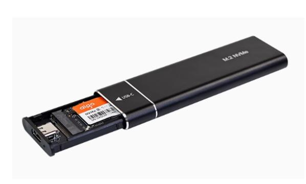

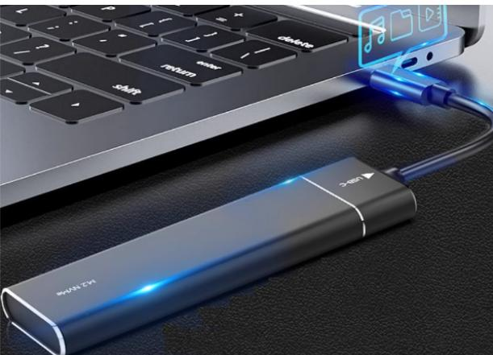

## 2. Shrink the SSD Partition

Because the Jetson Orin SSD is relatively large, shrink the system partition before backup. This reduces the image size and saves time when backing up or writing the image later.

### 2.1. Install Gparted

```bash
sudo apt update
sudo apt install gparted -y
```

### 2.2. Use GParted

Find the GParted application icon in the system application menu bar to open it or enter the following command in the terminal to start it:

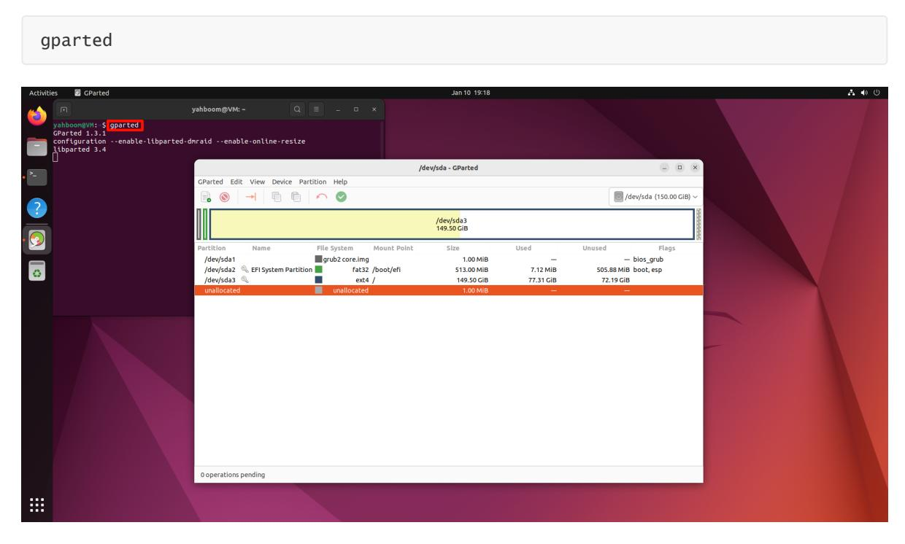

#### 2.2.1 Select the SSD

Select the newly added disk. Confirm that it is the mounted SSD by checking the disk capacity.

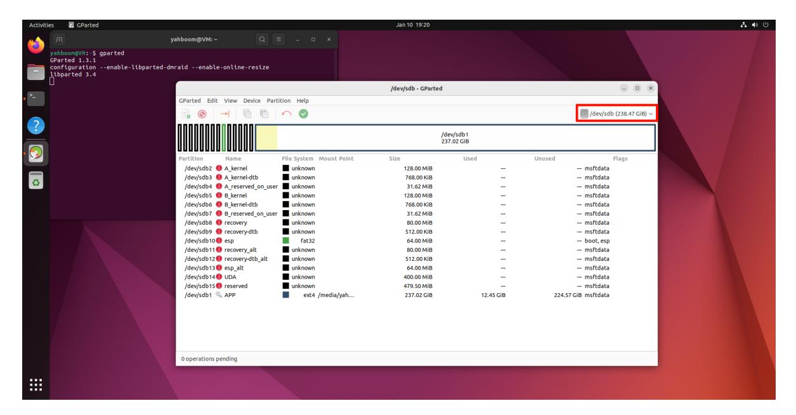

#### 2.2.2 Unmount the Partition

Before modifying the disk, unmount it. Select the `APP` partition, which is the largest partition, then click `Unmount`.

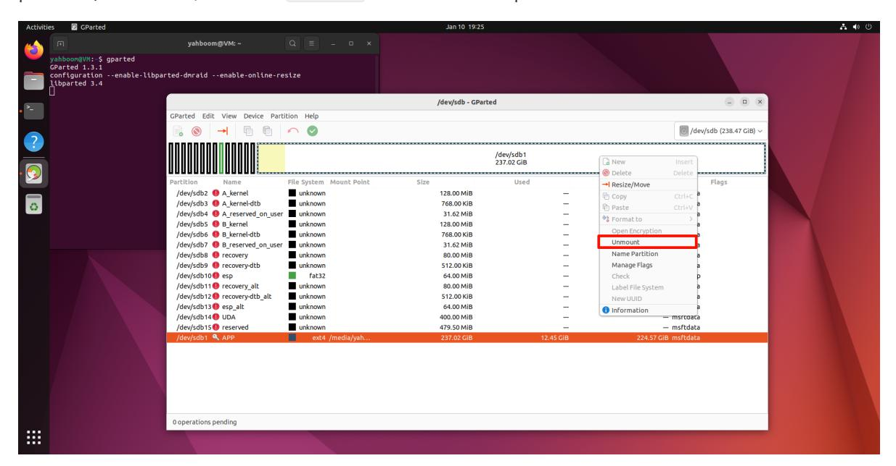

#### 2.2.3 Shrink the Partition

Right-click the unmounted partition and resize it.

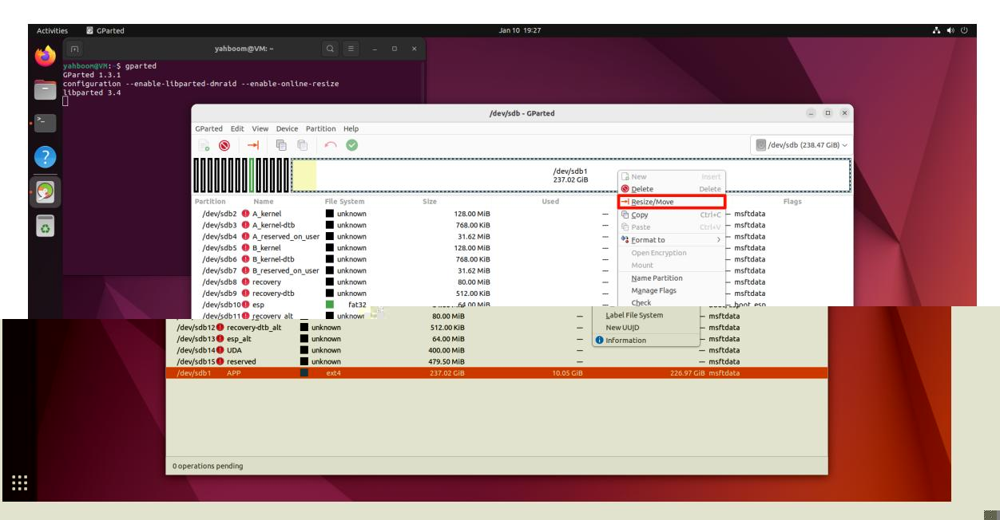

Adjust the partition size with the slider. Yellow indicates used space, and white indicates free space. Leave about 5-10G of free space in the partition to avoid startup failure.

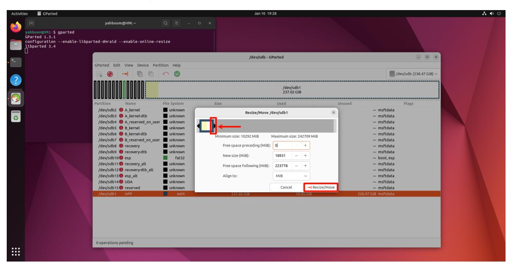

Confirm the disk operation:

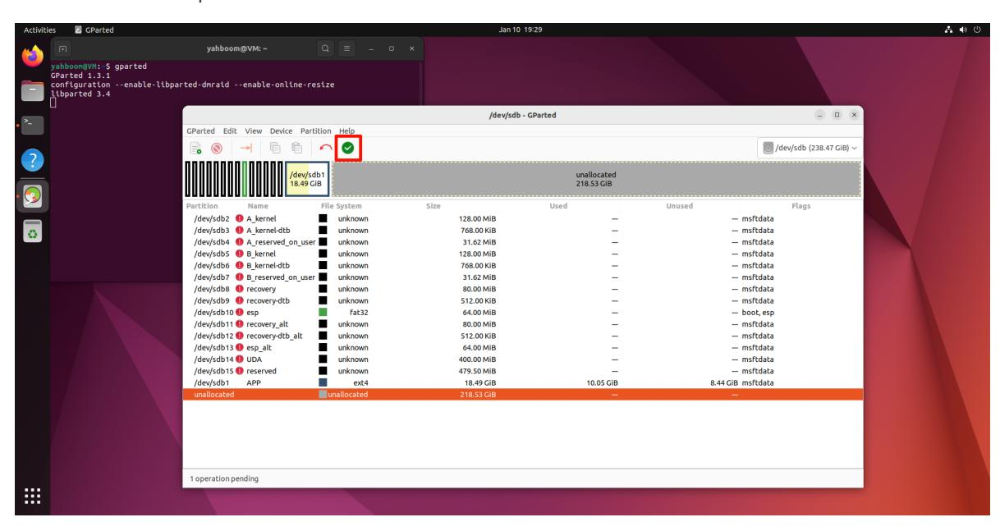

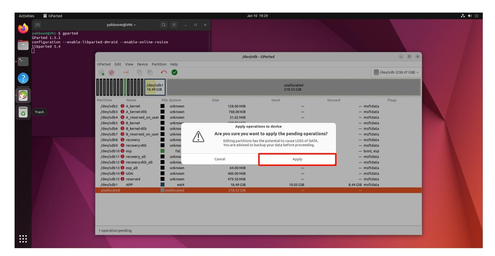

Wait for the operation to complete:

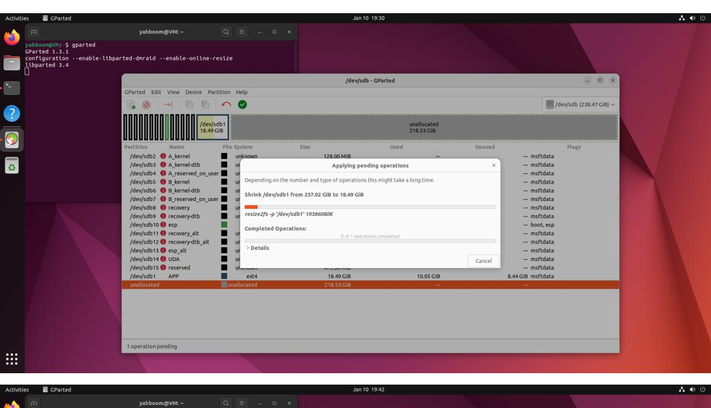

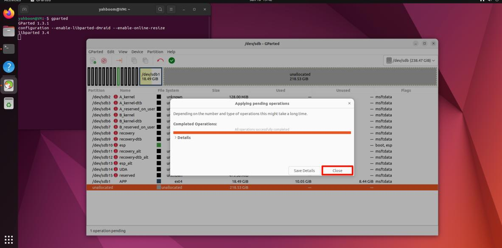

After completing the above operations, close GParted!

## 3. Back up the SSD

### 3.1. Check disk information

Open a terminal and use the script to view the current disk information. The device path must correspond to the SSD you are backing up.

```
sudo bash parted_info.sh /dev/sdb
```

#### parted_info.sh script content

```
#!/bin/bash
date
echo $1
sudo parted $1 <<EOF
unit s
print free
quit
EOF
```

Record the sector count shown in the output. In this example, it is `41822208s`.

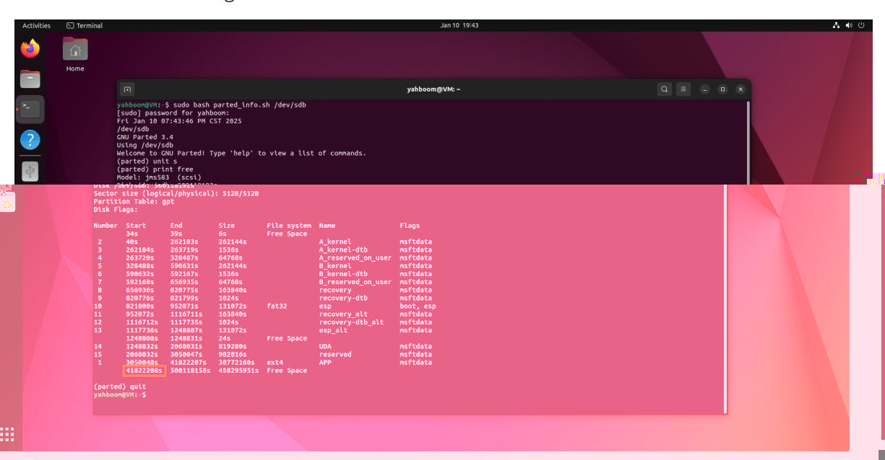

### 3.2. Start disk backup

Use `dd` to back up the SSD to an `.img` file:

```
sudo dd if=/dev/sdb of=Jetson_Orin_Nano_8G.img bs=512 count=41822208
```

`/dev/sdb`: SSD device path

`Jetson_Orin_Nano_8G.img`: output image name

`bs=512`: sets the block size to 512 bytes

`41822208`: sector count queried by the script

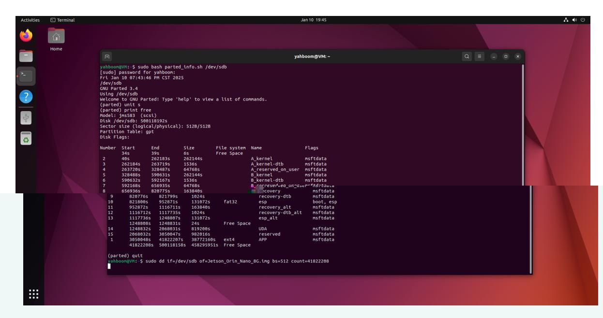

To view the dd process information, open another terminal and enter the following command:

```
sudo watch -n 3 pkill -USR1 ^dd$
```

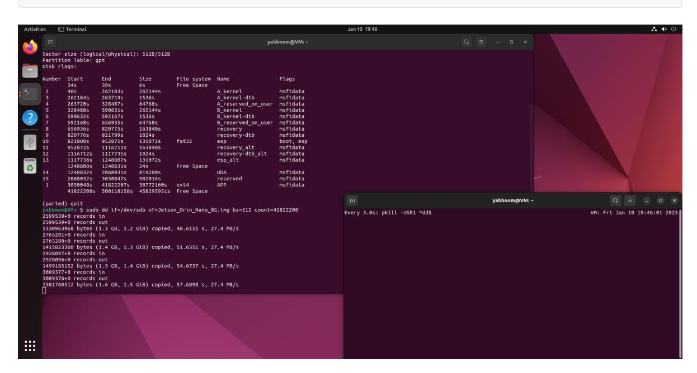

Wait for the backup to complete:

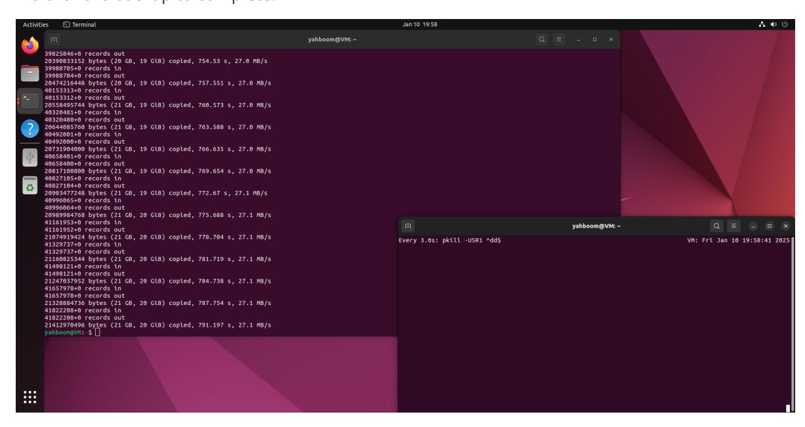

After the system backup is complete, move the backup file (Jetson_Orin_Nano_8G.img) to the Windows system for use.

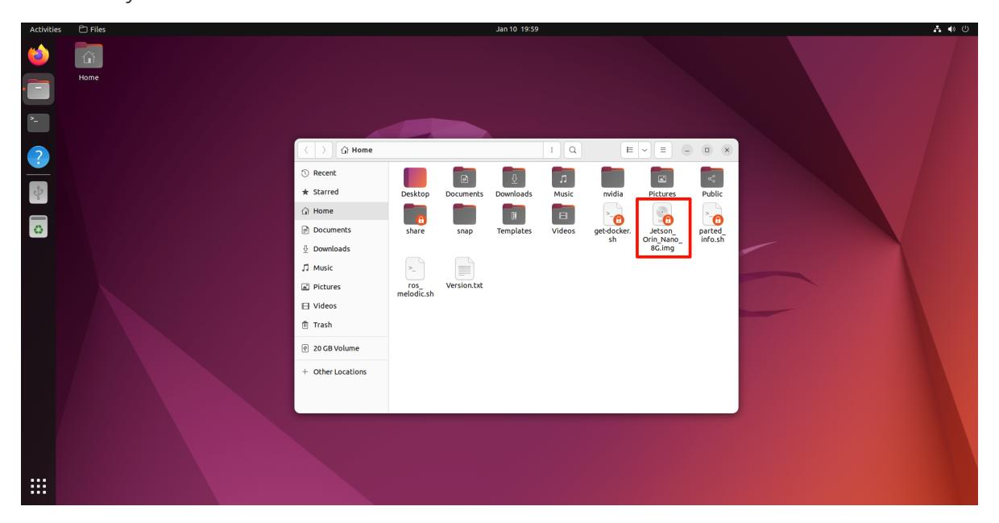
