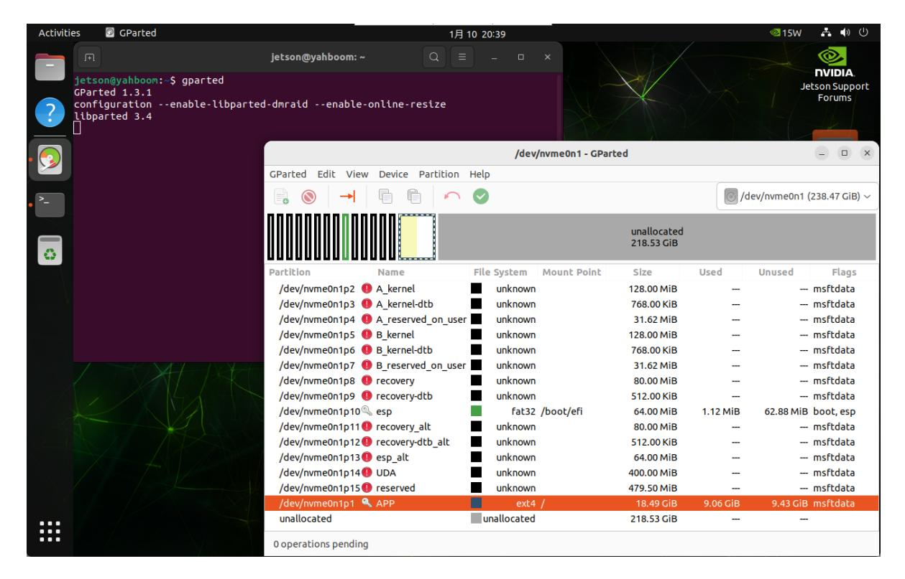
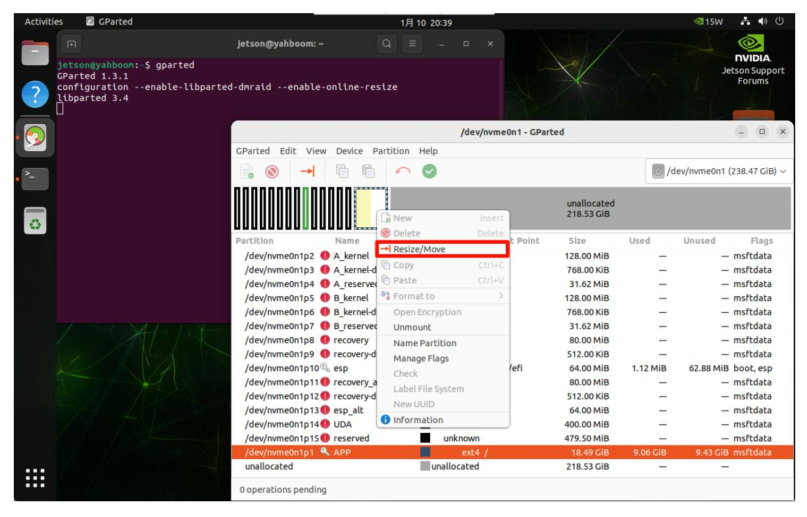
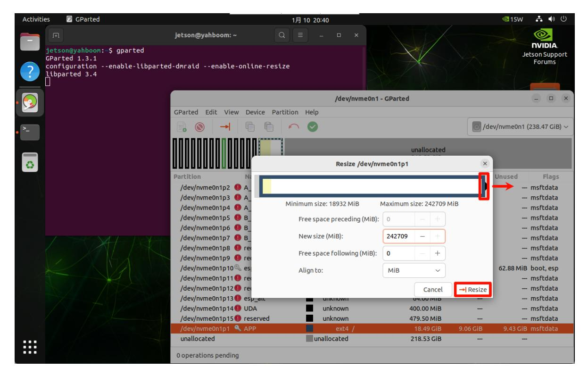
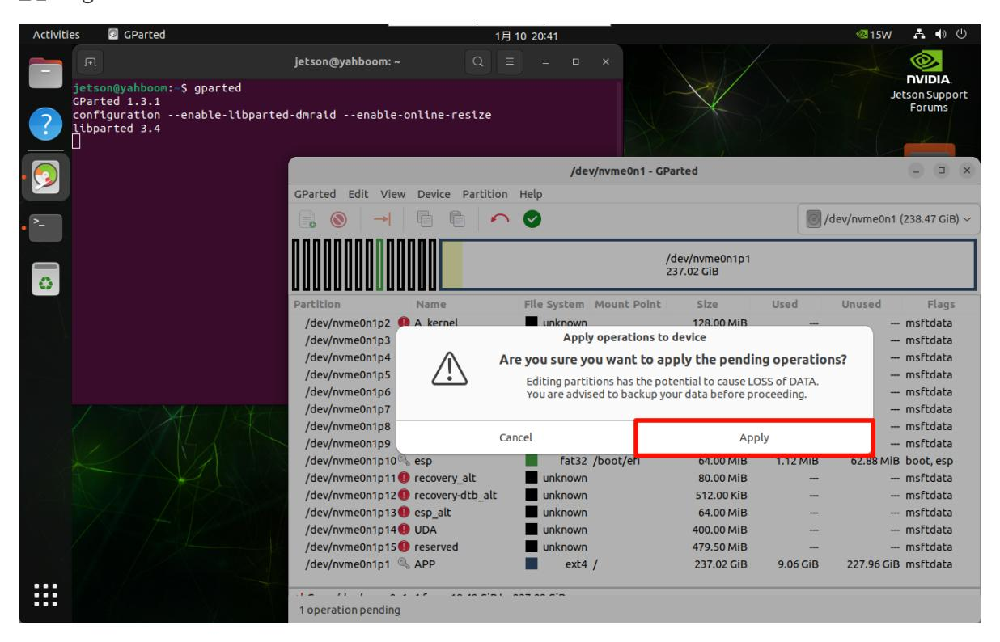
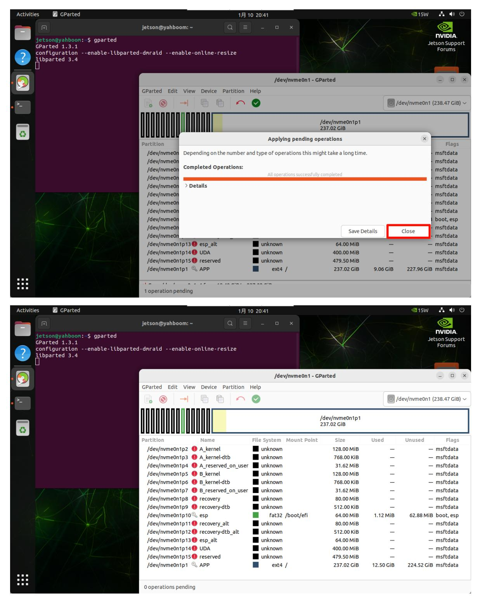

# SSD expansion

#### SSD expansion

- 1. Install GParted
- 2. Use GParted
- 3. Adjust partitions

The factory image system will perform disk compression, so the capacity displayed in the system will be inconsistent with the actual capacity. Users can follow the tutorial to expand the SSD.

The tutorial is located in the Jetson Orin motherboard system

### 1. Install GParted

```
sudo apt update
sudo apt install gparted -y
```


## 2. Use GParted

Find the GParted application icon in the system application menu bar to open it or enter the following command in the terminal to start it:

gparted



### 3. Adjust partitions

Right-click the disk partition that needs to be expanded: generally select the largest partition in the disk



You can adjust the partition size through the slider: you can maximize the space and slide to the far right



Confirm the partition adjustment operation:

image-20250110204116310





After partitioning is completed, close the GParted software by yourself!
