# VNC remote control

#### VNC remote control

- 1. VNC Viewer
  - 1.1. VNC download
  - 1.2. VNC Installation
- 2. System Settings (Jetson)
  - 2.1. Enable desktop remote
    - 2.1.1. Sharing
    - 2.1.2. Remote Desktop
    - 2.1.3, Media Sharing
    - 2.1.4 Remote Login
  - 2.2, Fixed remote password
    - Passwords and Keys
  - 2.3, Start VNC automatically after booting

Desktop extension manager

3. VNC remote control

Frequently Asked Questions

VNC Remote Display Reconnection

Reconnection Phenomenon

Solution

VNC remote switch uppercase and lowercase

Tutorial to configure the built-in screen sharing of Ubuntu22.04 system for VNC remote control.

Windows computer needs to download and install VNC Viewer in advance and the remote device and the remote device are in the same LAN

## 1. VNC Viewer

### 1.1. VNC download

Official website download address:<https://www.realvnc.com/en/connect/download/viewer/>

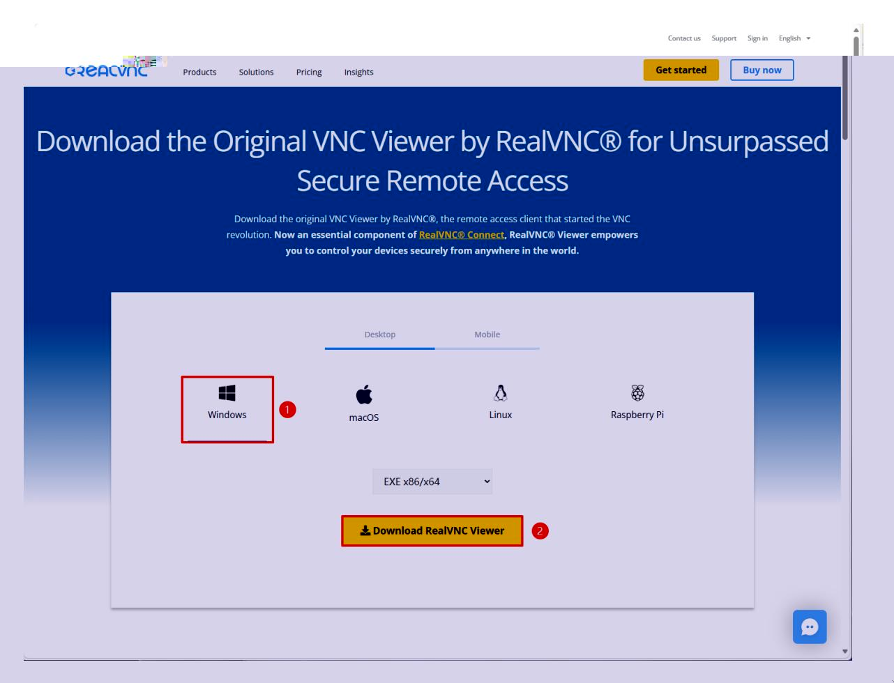

## 1.2. VNC Installation

Run VNC-Viewer-xxx.exe as an administrator:

![image.png] (1731245794795-9efa7e97-85ea-4c79-b598-f17a6c46ad8b.webp) RealVNC Viewer 7.12.1 Setup **Custom Setup** Select the way you want features to be installed. Click the icons in the tree below to change the way features will be installed. Installs RealVNC Viewer allowing X - Desktop Shortcut you to control other computers remotely. This feature requires 16MB on your hard drive. It has 0 of 1 subfeatures selected. The subfeatures require 0KB on your hard drive. C:\Program Files\RealVNC\VNC Viewer\ Location: Browse... Reset Disk Usage Back Next Cancel RealVNC Viewer 7.12.1 Setup Ready to install RealVNC Viewer 7.12.1 Click Install to begin the installation. Click Back to review or change any of your installation settings. Click Cancel to exit the wizard. Back Install Cancel RealVNC Viewer 7.12.1 Setup X Completed the RealVNC Viewer 7.12.1 Setup Wizard Click the Finish button to exit the Setup Wizard. ### 1.3. Use

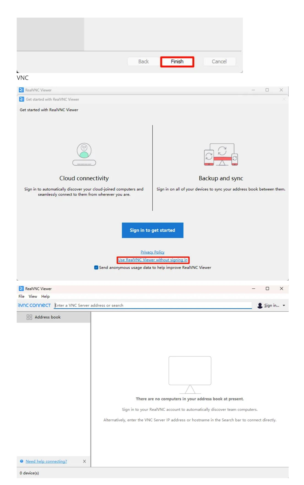

## 2. System Settings (Jetson)

### 2.1. Enable desktop remote

#### 2.1.1. Sharing

Settings → Sharing

#### 2.1.2. Remote Desktop

Turn on the remote desktop and enable the traditional VNC protocol (need to check the password required): the access password can be modified by yourself!

#### 2.1.3, Media Sharing

You need to check this option every time you switch networks and turn on the switch of the new network:

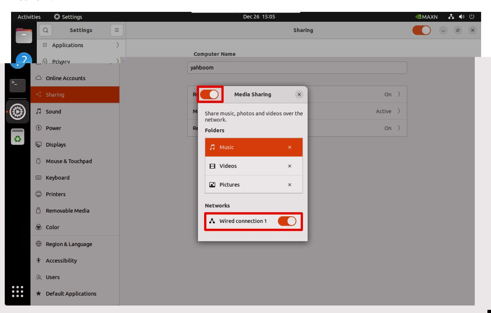

#### 2.1.4 Remote Login

Turn on remote login:

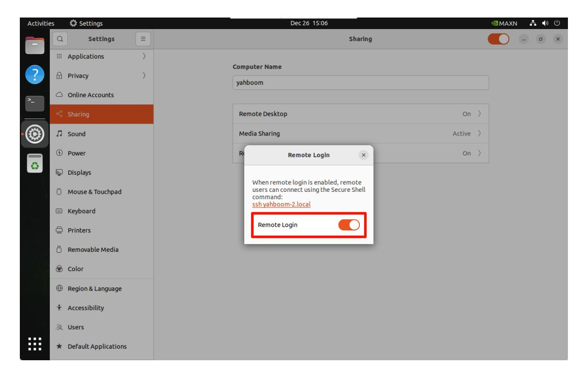

### 2.2, Fixed remote password

You can perform VNC remote control by completing the above settings, but the access password of the Jetson motherboard will change every time it restarts. The fixed password needs to be operated as follows!

#### Passwords and Keys

Enter Passwords and Keys to set no key:

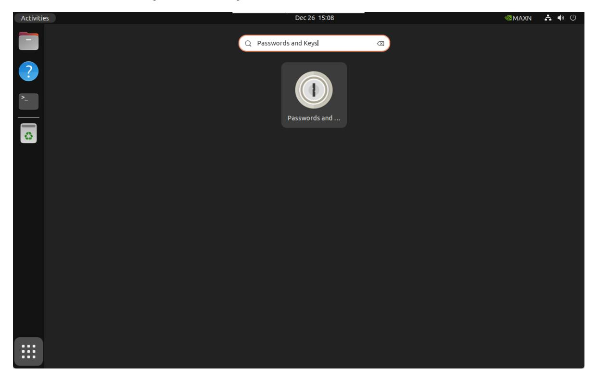

Select the default key to modify the password:

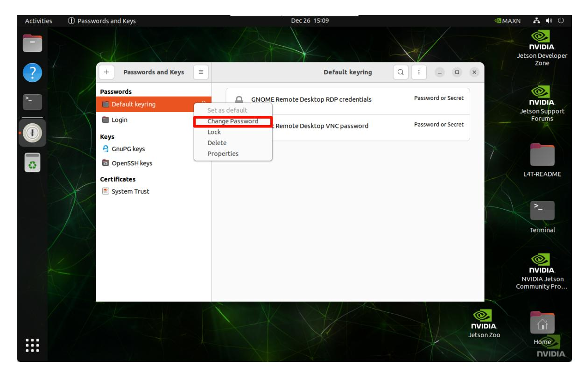

Enter the current password:

Set an empty key: Submit without filling in any content

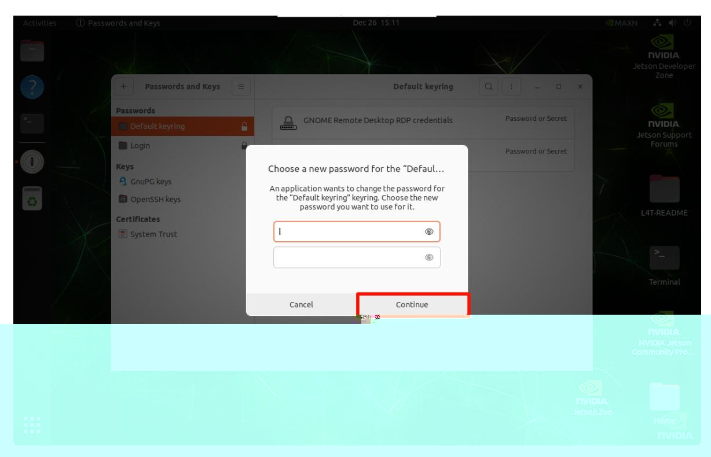

### 2.3, Start VNC automatically after booting

After completing the above operations, the Jetson motherboard cannot be remotely accessed by VNC after the screen is locked. We can follow the following operations to solve the remote problem of locked screen.

#### Desktop extension manager

Install desktop extension manager:

sudo apt install gnome-shell-extension-manager -y

Get the gnome-shell version number:

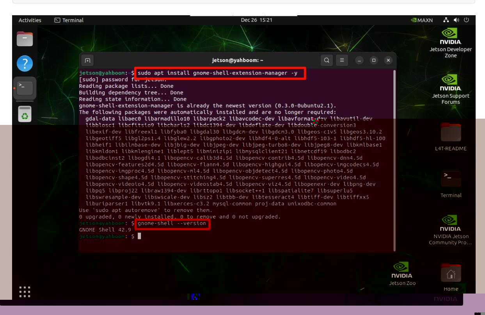

Download the plug-in that allows remote access under lock screen according to the version number:

Official website: https://extensions.gnome.org/extension/4338/allow-lockedremote-desktop/

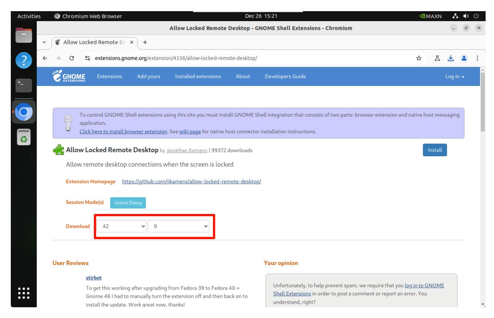

Install/enable plug-in: Users need to enter the file location to install

gnome-extensions install allowlockedremotedesktopkamens.us.v9.shellextension.zip

sudo gnome-extensions enable allowlockedremotedesktop@kamens.us

Restart the system: open Extension Manager to enable the corresponding function (find it in the Ubuntu system application)

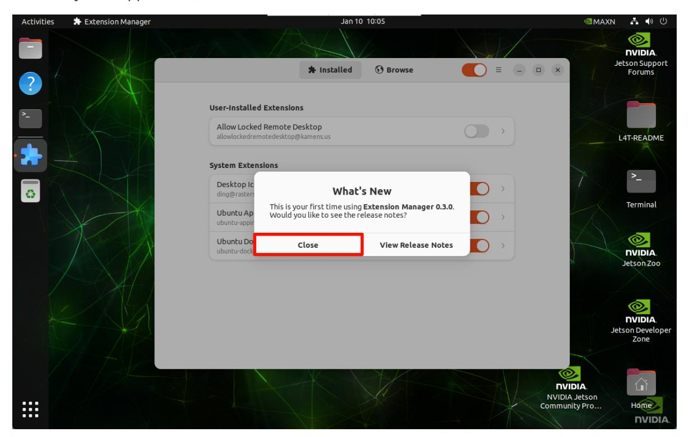

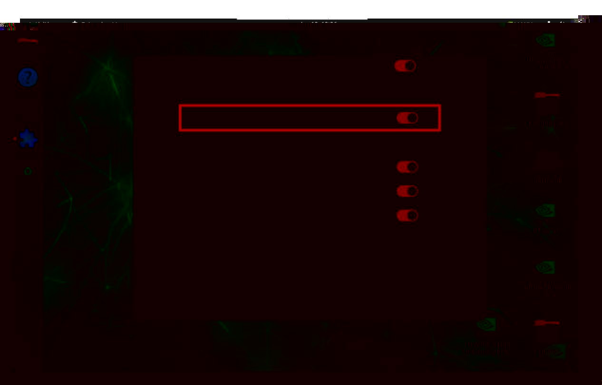

## 3. VNC remote control

VNC Viewer input motherboard IP:

Fill in the motherboard system password:

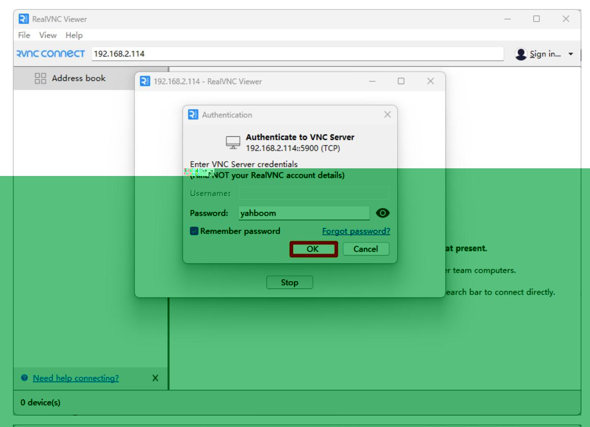

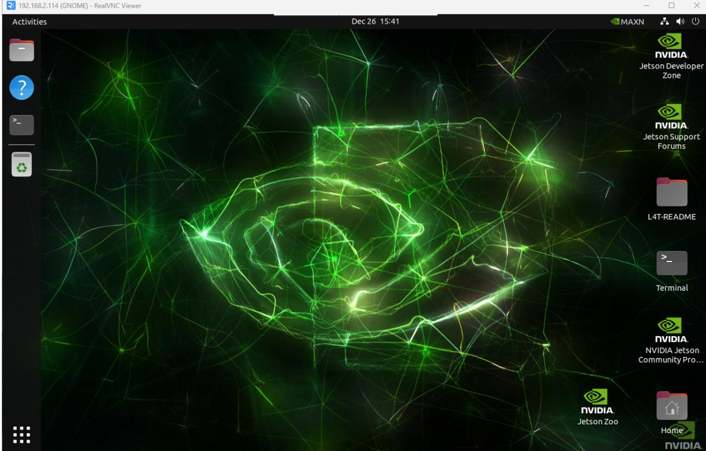

## Frequently Asked Questions

## VNC Remote Display Reconnection

**Reconnection Phenomenon**

#### Solution

Modify the options of the corresponding remote device → Specify remote image quality

## VNC remote switch uppercase and lowercase

Enter Settings → Compose Key → Caps Lock: Set to Caps Lock to switch uppercase and lowercase input

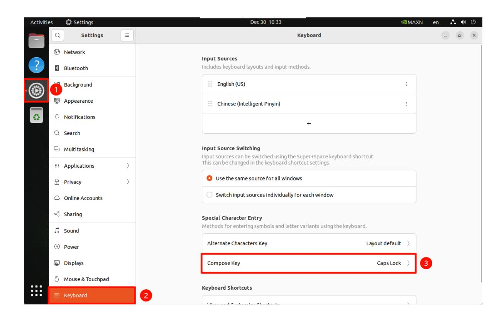
