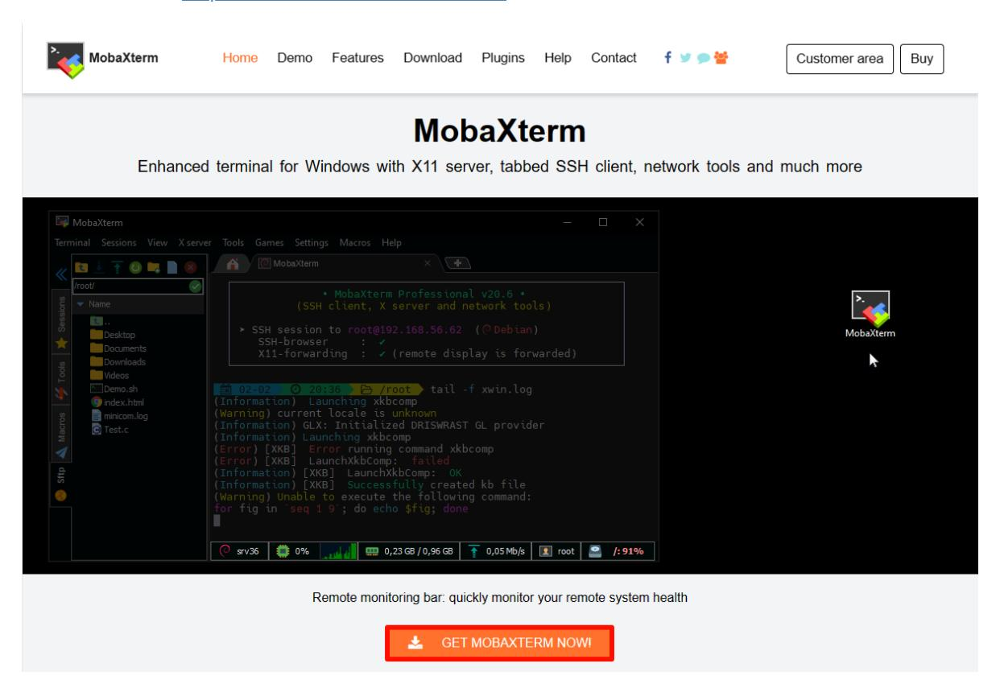
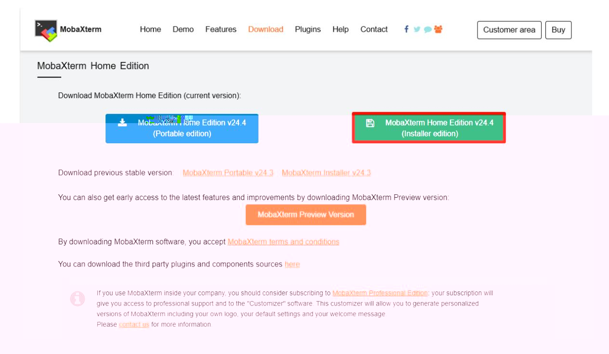
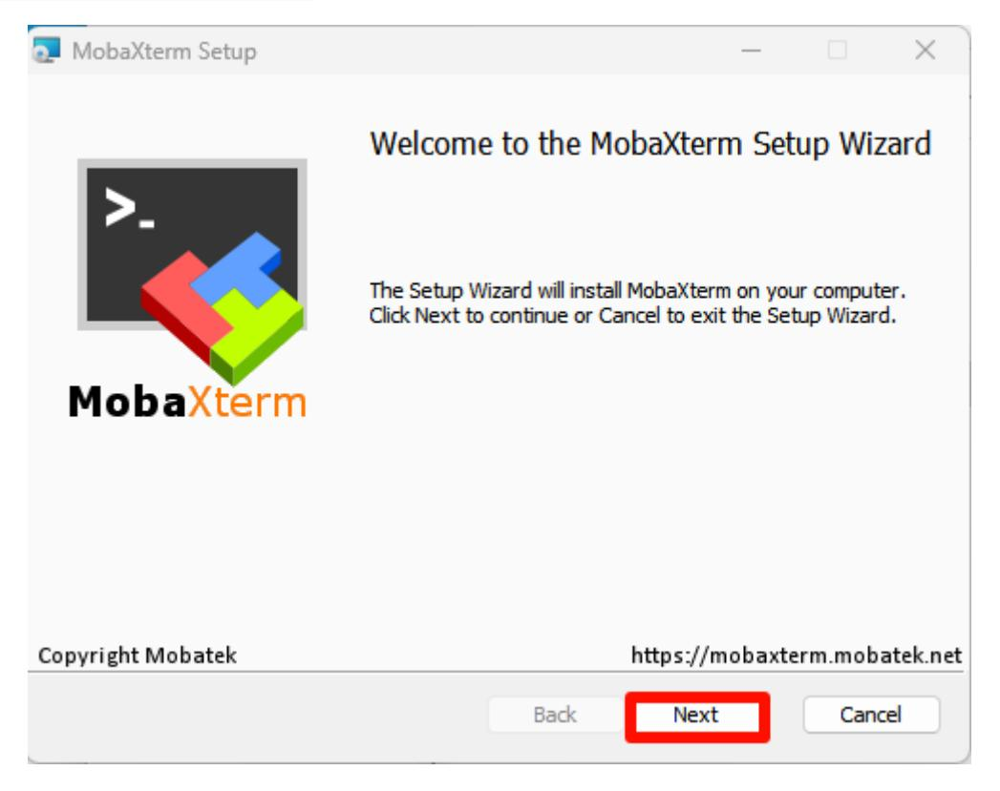
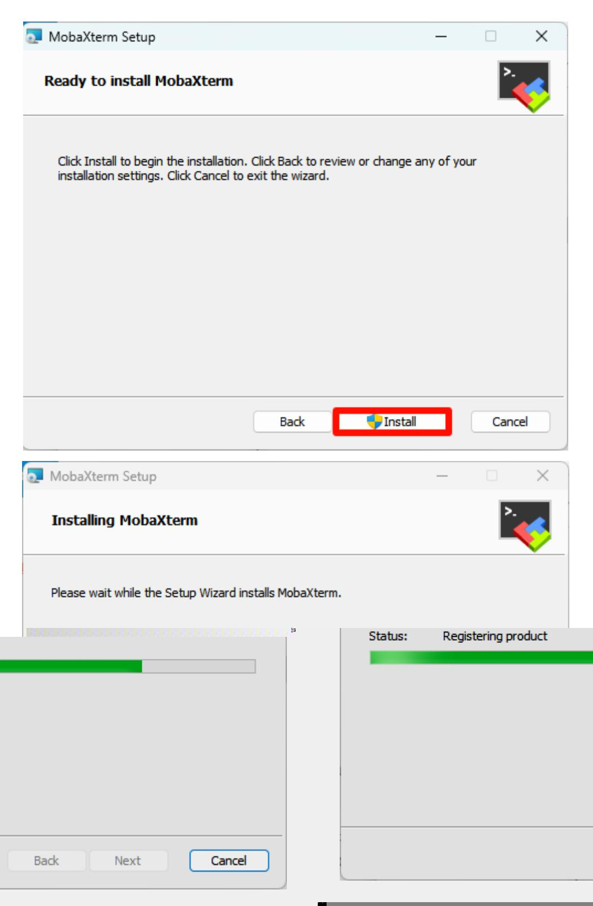
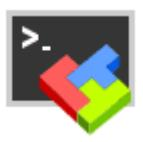
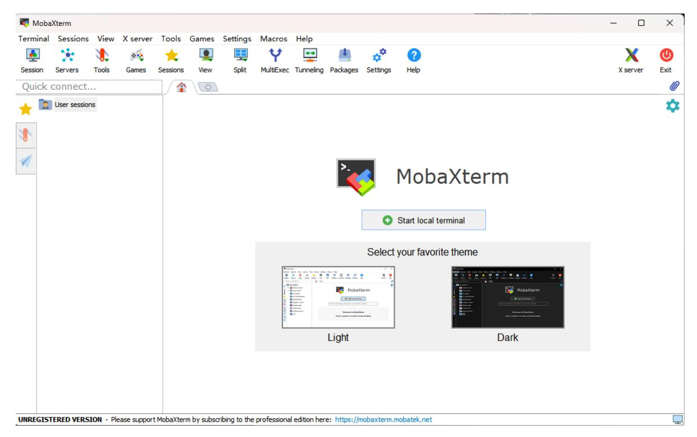
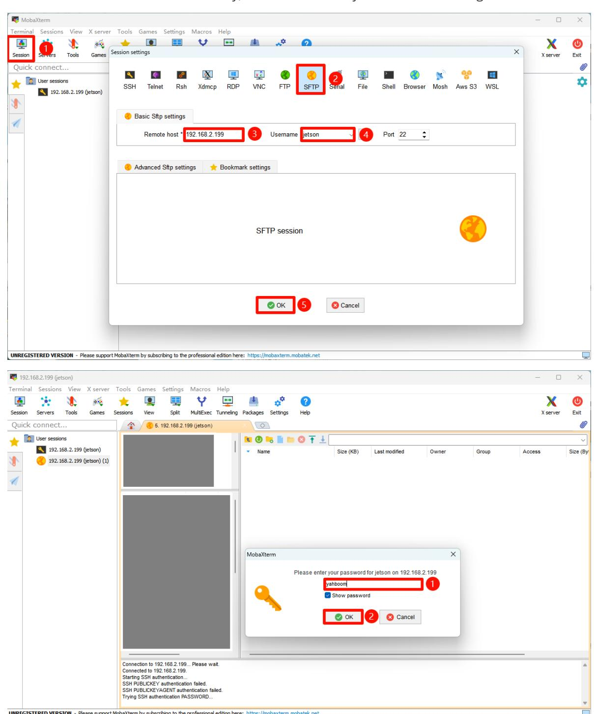

# Remote file transfer

#### Remote file transfer

- 1. MobaXterm
- 2. MobaXterm installation
  - 2.1. Download MobaXterm
  - 2.2. Install MobaXterm
- 3. Use MobaXterm
- 4. MobaXterm: SFTP remote

### 1. MobaXterm

MobaXterm is a powerful remote tool that integrates SHH, VNC, FTP and other remote tools.

## 2. MobaXterm installation

Official website: <https://mobaxterm.mobatek.net/>

#### 2.1. Download MobaXterm

Select the free version to download:

Select the installation version to download:

### 2.2. Install MobaXterm

Unzip the compressed package downloaded from the official website, open the MobaXterm_installer_24.4.msi file to install:

Agree to the agreement:

Select the software installation location: the default location is recommended

Official installation:

Complete installation:

### 3. Use MobaXterm

Find the MobaXterm icon on the desktop and open it:

### 4. MobaXterm: SFTP remote

Select Session → FTP: Fill in the remote device IP and username

Default information of Jetson motherboard:

Username: jetson Password: yahboom

Note: If MobaXterm uses SSH remotely, it will automatically use SFTP remote login in the sidebar

