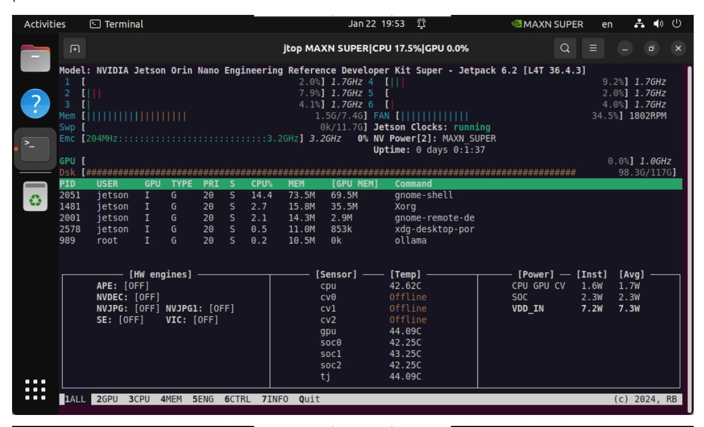
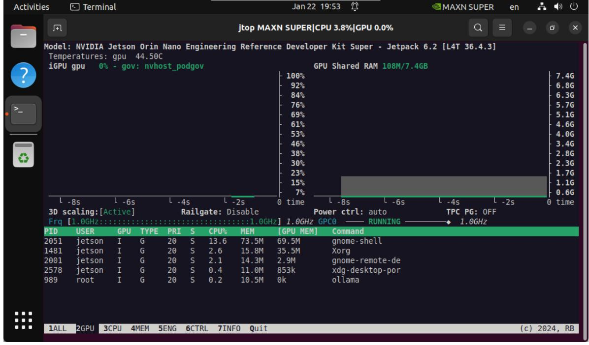
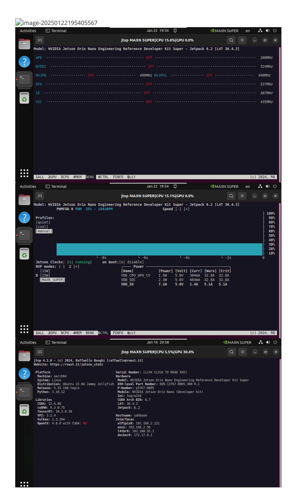

# Jtop tool

#### Jtop tool

- 1. Install Jtop
- 2. Best performance mode
  - 2.2. Enable MAXN mode
  - 2.2. Enable Jetson Clocks
- 3. Use Jtop

Jtop is a system monitoring tool developed for NVIDIA Jetson series devices. It can display the resource usage of various aspects of Jetson devices, such as CPU, GPU, memory, disk, network, etc., and can display different hardware temperatures, power consumption, frequency, etc. in real time.

# 1. Install Jtop

```
sudo apt update
sudo apt install python3-pip -y
sudo pip3 install -U jetson-stats
```


### 2. Best performance mode

#### 2.2. Enable MAXN mode

Enabling MAXN Power Mode on Jetson will ensure that all CPU and GPU cores are turned on:

```
sudo nvpmodel -m 2
```

#### 2.2. Enable Jetson Clocks

Enabling Jetson Clocks will ensure that all CPU and GPU cores run at maximum frequency:

```
sudo jetson_clocks
```

## 3. Use Jtop

Only after restarting the system can you enter the jtop command in the terminal to start the Jtop tool:

```
jtop
```

Note: The motherboard power mode must be set to MAXN to display the strongest performance parameters!







