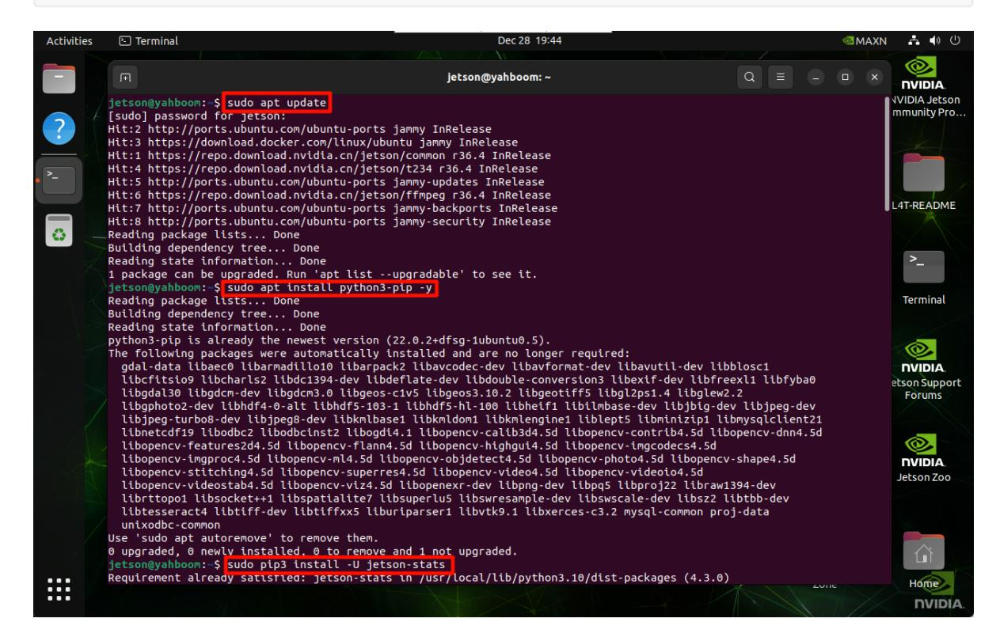
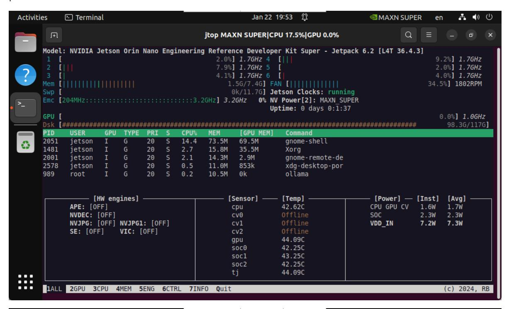
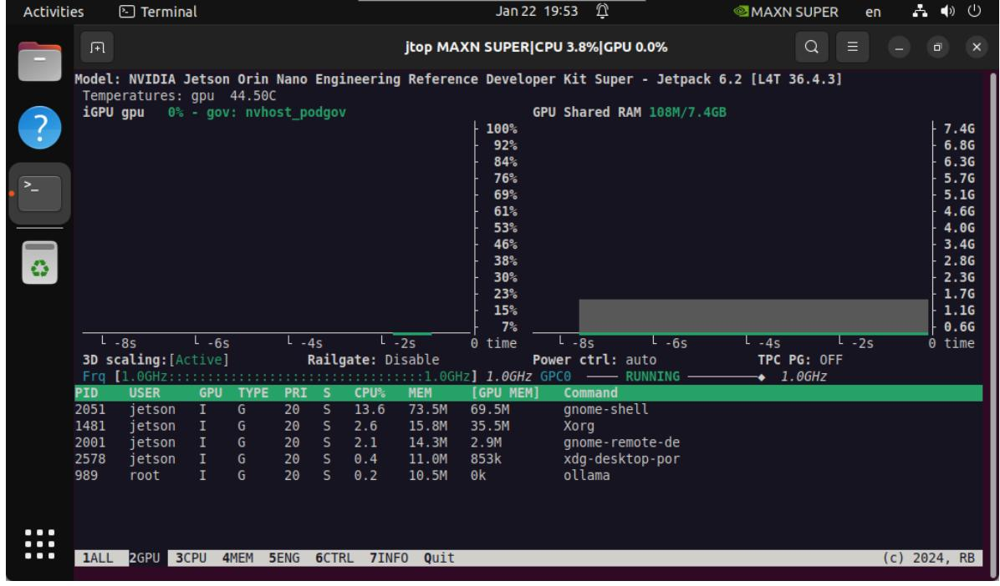
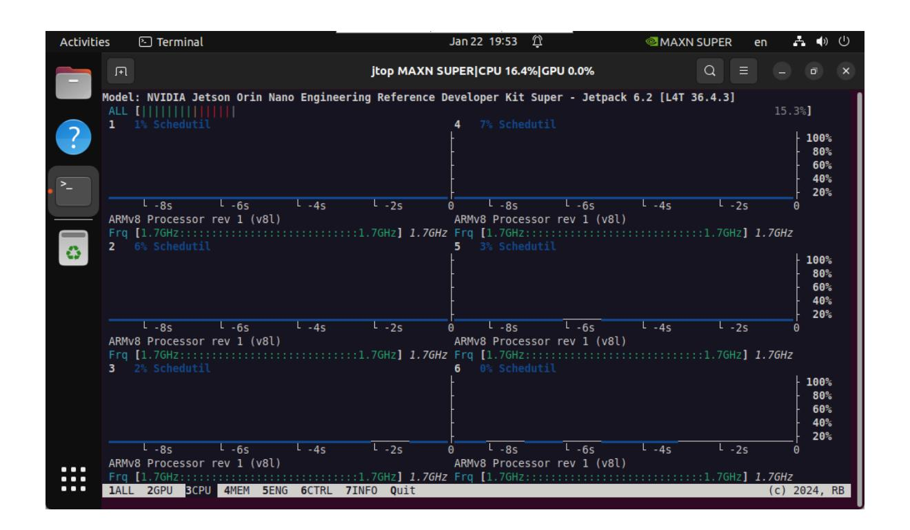
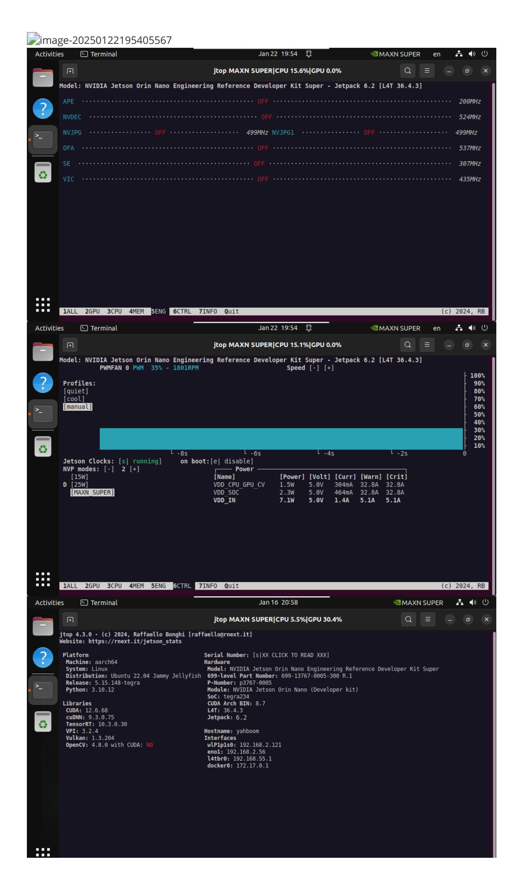

# jtop Tool

## 1. Install jtop

```bash
sudo apt update
sudo apt install python3-pip -y
sudo pip3 install -U jetson-stats
```



## 2. Best performance mode

### 2.1. Enable MAXN mode

Enable MAXN power mode so all CPU and GPU cores are available:

```
sudo nvpmodel -m 2
```

### 2.2. Enable Jetson Clocks

Enable Jetson Clocks so the CPU and GPU cores run at maximum frequency:

```
sudo jetson_clocks
```

## 3. Use jtop

After restarting the system, run `jtop` in a terminal to start the monitoring tool:

```
jtop
```

Note: Set the mainboard power mode to MAXN to display the highest performance parameters.








