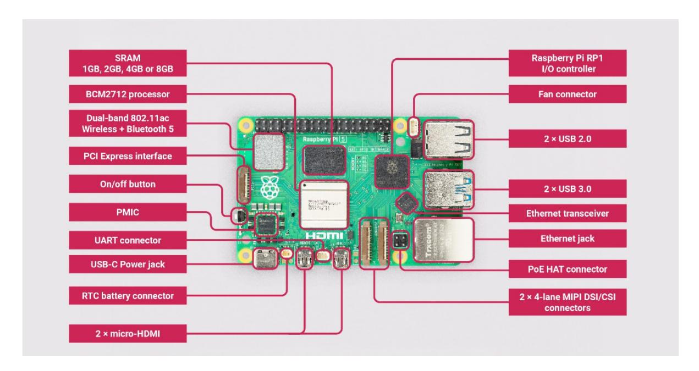
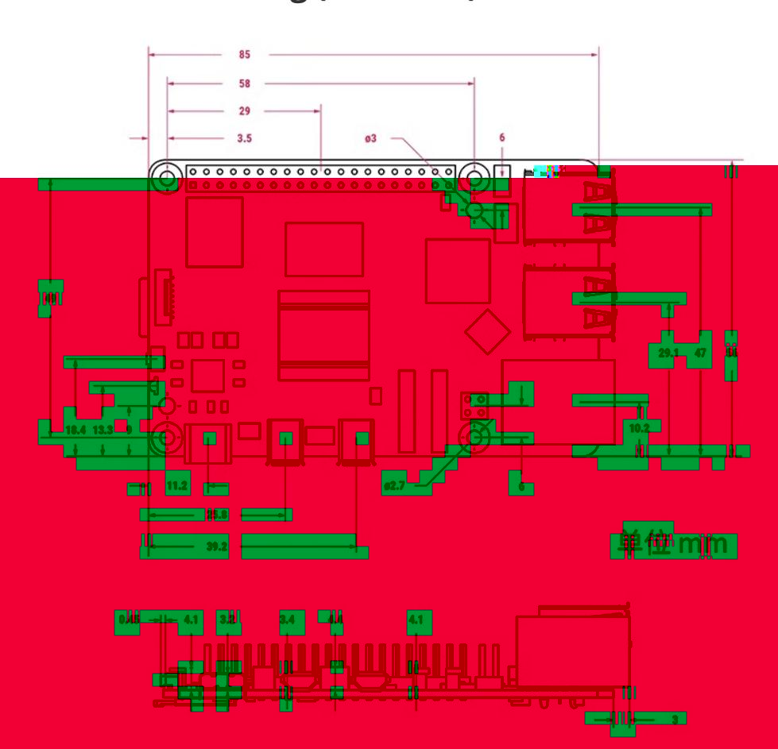

# 1. Introduction to Raspberry Pi 5

This chapter introduces information about Raspberry Pi 5.

## 1. Introduction to Raspberry Pi 5

### 1.1. Preparation before use

To use the Raspberry Pi, you will need the following:

A Raspberry Pi motherboard;

apower;

An SD card and a card reader;

You can set up a Raspberry Pi as an interactive computer with a desktop, or as a headless computer that can only be accessed over the network. To set up a Raspberry Pi as a headless computer, there is no need to prepare any additional peripherals. You can pre-configure the hostname, user account, network connection and SSH when installing the operating system.

If you want to use the Raspberry Pi directly with a desktop interactable, you will need the following additional accessories:

A monitor and HDMI cable;

A set of keyboard and mouse.

### 1.2. Introduction

Raspberry Pi 5 uses a 64-bit quad-core Arm Cortex-A76 processor running at 2.4GHz, which improves CPU performance by 2 to 3 times compared to Raspberry Pi 4. Additionally, it features an 800MHz VideoCore VII GPU that delivers a massive graphics performance boost, dual 4Kp60 display outputs via HDMI, and state-of-the-art camera support via a redesigned Raspberry Pi image signal processor. It provides consumers with a smooth desktop experience and opens new application doors for industrial customers.

This is the first full-size Raspberry Pi computer to use silicon made in-house. The RP1 provides most of the I/O functionality for the Raspberry Pi 5 and brings a huge change in peripheral performance and functionality. Aggregate USB bandwidth has more than doubled, allowing for faster data transfer to external UAS drives and other high-speed peripherals; the dedicated duallane 1Gbps MIPI camera and display interface used on earlier models has been replaced by a pair of quad-lane 1.5Gbps MIPI Transceiver replacement, total bandwidth is tripled, supporting any combination of up to two cameras or displays; peak SD card performance is doubled by supporting SDR104 high-speed mode; the platform debuts a single-lane PCI Express 2.0 interface for high-speed Bandwidth peripherals are supported.

### 1.3. Comparison with Raspberry Pi 4B parameters

| product                           | Raspberry Pi 5                                                   | Raspberry Pi 4B                                |
|-----------------------------------|------------------------------------------------------------------|------------------------------------------------|
| CPU Central processing unit       | Broadcom BCM2712                                                 | Broadcom BCM2711                               |
|                                   | Quad-core Cortex-A76 (ARM v8) 64-bit SoC                         | Quad-core Cortex-A72 (ARM v8) 64-bit SoC       |
|                                   | The main frequency is 2.4GHz                                     | The main frequency is 1.5GHz                   |
| buffer memory                     | L1 cache: 64KB data+                                             | L1 cache: 32KB data+                           |
|                                   | 64KB Instruction per core                                        | 48KB Instruction per core                      |
|                                   | L2 cache: 512KB Per-core                                         | L2 cache: 1MB shared                           |
|                                   | L3 cache: 2MB shared                                             | L3 cache: None                                 |
| GPU                               | 800 MHz VideoCore VII                                            | 600 MHz VideoCore VI                           |
|                                   | Support OpenGL ES3.1, Vulkan 1.2                                 | Support OpenGL ES3.0                           |
| internal storage                  | LPDDR4X-4267 SDRAM                                               | LPDDR4-3200 SDRAM                              |
| Operating system and data storage | The MicroSD card slot supports high-speed SDR104 mode            | Micro SD card slot                             |
| USB interface                     | 2 x USB3.0, supporting 5Gbps synchronous operation               | 2 x USB 3.0, 2 x USB 2.0                       |
|                                   | 2 x USB2.0 (The position is symmetric to PI4B)                   |                                                |
| CSI interface                     | 2X4lane MIPI Camera                                              | 1X2lane MIPICamera 15pin large mouth           |
| DSI interface                     | Or Display bidirectional transmission interface 22pin            | 1X2laneMIPI Display15Pin large mouth           |
| HDMI                              | Two MicroHDMI ports                                              | Two Micro HDMI ports                           |
|                                   | Can support dual-channel 4Kp60 support HDR                       | support single 4Kp60 or double 4Kp30           |
| PCle                              | A PCIe 2.0x1 interface FPC connector                             | None                                           |
| Audio and video                   |                                                                  |                                                |
| composite                         | None (provide a pair of pads with 0.1-inch spacing)              | Yes                                            |
| Output interface                  |                                                                  |                                                |
| power input                       | 5V/5ADC via USB-C interface (PD support)                         | 5V/5ADC via USB-C interface (PD not supported) |
| Other interfaces                  | The 5V/5ADC is interfaced through GPIO                           | The 5V/3ADC is interfaced through GPIO         |
|                                   | POE via separate new POEHAT (Change of network port position) | POE via the stand-alone POEHAT                 |
| power switch                      | The on/off switch button                                         | None                                           |
| Real-time clock(RTC)              | RTC battery connector (2 pinsJST)                                | None                                           |
| UART                              | Special UART interface (3 pins JST)                              | None                                           |
| Fan interface                     | PWM control and tacho Feedback (4 pins JST)                   | None                                           |

Its main features are as follows:

Quad-core Arm Cortex-A76 @ 2.4GHz

Dual 4kp60 HDMI display output, supports HDR

VideoCore VII graphics card, supports OpenGL-ES 3.1, Vulkan 1.2

Raspberry Pi connector for PCIe (1 2.0 port, additional HAT required)

802.11ac dual-band Wi-Fi and Bluetooth 5.0 (supports BLE)

Real-time clock (RTC) and RTC battery interface

Fan interface

Power button

### 1.4. Function distribution

### 1.5. Dimensional drawing (unit: mm)

