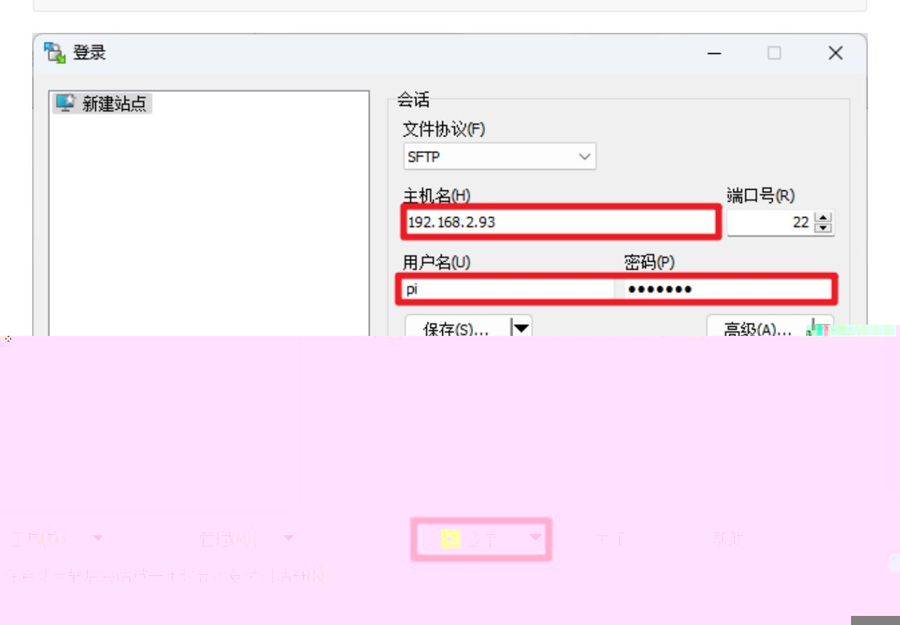
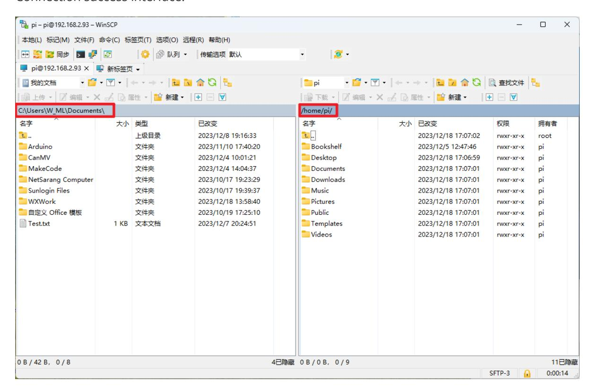
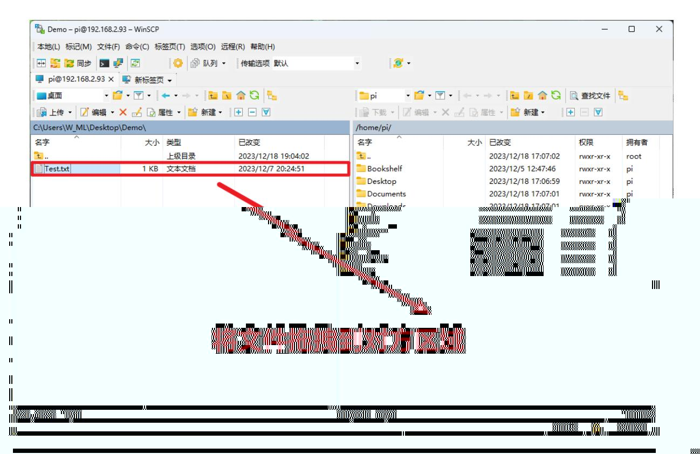

# Transfer files remotely

## 1. WinSCP software

Install the WinSCP software by yourself. Here we mainly introduce how to connect to the Raspberry Pi system based on IP, username and password information.

My current login user name is pi, the password is yahboom, and the IP address is 192.168.2.93




### Ed25519

```bash
ssh-ed25519 255
```

SHA-256: AmyCUFkAYb3rKjKuYS9Jli0b39Pj03CmqWQpxokTOEk

MD5: ba:7e:d9:3a:dd:22:6c:51:ec:04:a2:37:3f:5b:68:83


### (C)


#### Connection success interface:



## Transfer files

You can directly drag local files to the other party's area, so that the files can be copied; the following demonstration is to transfer the Text.txt file to the Raspberry Pi system.



You can directly select a folder on your computer and move it to the other party's area. It does not necessarily need to be done within the software!

## 2. SCP command

Use the scp command to send files to the Raspberry Pi system through ssh. This operation does not require the use of software, just use the terminal!

My current login user name is pi, the password is yahboom, and the IP address is 192.168.2.93

### 1.1. Copy the file to the Raspberry Pi motherboard

#### Single file copy command: scp file name username@IP address:path

Copy the file to the user directory: scp Test.txt pi@192.168.2.93:


Copy the file to the desktop: scp Test.txt pi@192.168.2.93:Desktop/


### 1.2. Copy files from the Raspberry Pi motherboard to the current computer

### Single file copy command: scp username@IP address: file name

Copy the files in the Raspberry Pi system to the current directory of the computer: scp pi@192.168.2.93:Test.txt.

Note: The copied file should be in the user directory of the Raspberry Pi system (the copied Test.txt file should be in the pi user directory of the Raspberry Pi)


