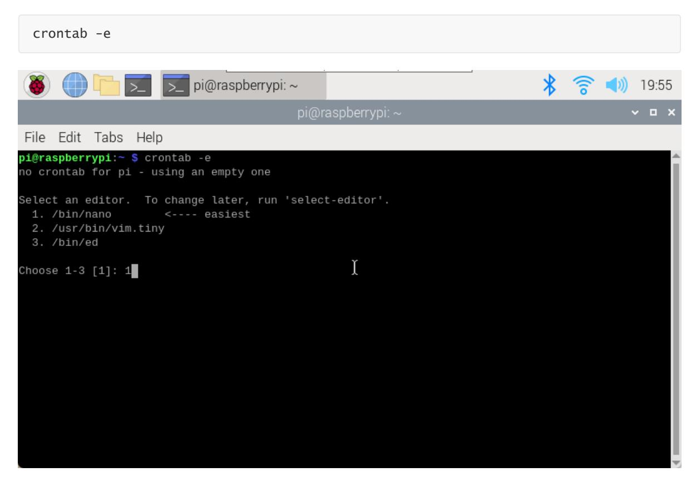
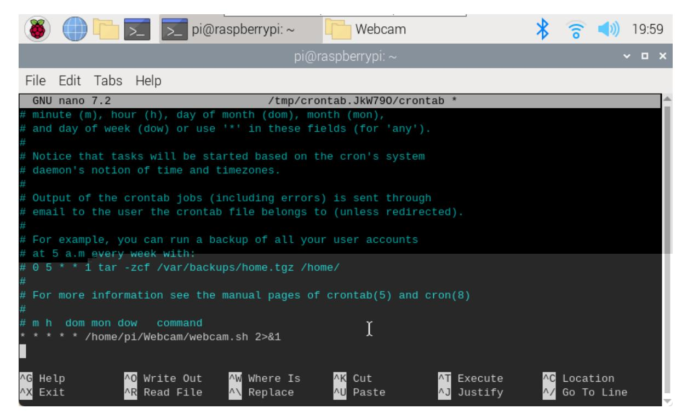
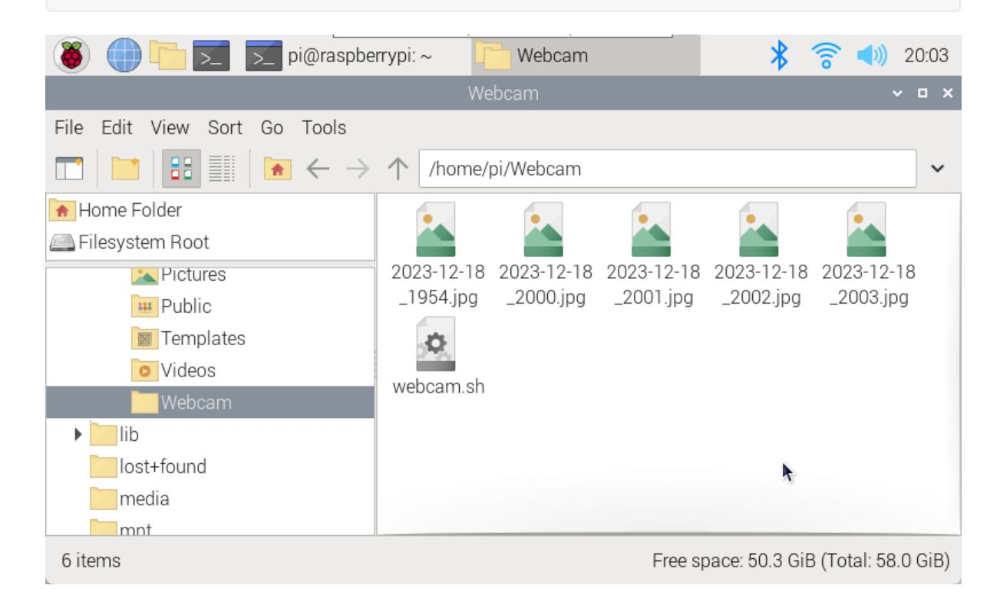

# Using USB camera

#### Using USB camera

Install FSWebcam View USB camera device Photograph Time-lapse photography Using Cron \(scheduled tasks\) Web page preview camera Install Motion Modify configuration file Start service Web page preview screen

Take photos and videos on your Raspberry Pi using a standard USB camera.

### Install FSWebcam

FSWebcam is a simple and clear webcam application. The software installation command is as follows:

```
sudo apt install fswebcam
```

Add user permissions: sudo usermod -a -G video

Example: Add pi user permissions to the group

```
sudo usermod -a -G video pi
```

Check if the user has been added to the group correctly Command: groups

## View USB camera device

Use the lsusb command to view all USB devices recognized by the system;

Use the ls /dev/video\* command to list all video devices recognized by the system.

The next two commands are to detect the information displayed by the camera. You can compare the differences by yourself: One is image/video collection and the other is metadata collection.

### Photograph

fswebcam <image_name>

Example: Take a photo and save it as image.jpg (the file saving path defaults to the user directory)

```
fswebcam image.jpg
```

fswebcam -r resolution <image_name>

Example: Take an image file with a resolution of 1280x720 and save it as image2.jpg

```
fswebcam -r 1280x720 image2.jpg
```

fswebcam -r resolution --no-banner <image_name>

Example: Take an image file with a resolution of 1280x720, no information such as time is displayed on the picture, and save it as image3.jpg

```
fswebcam -r 1280x720 --no-banner image3.jpg
```

### Time-lapse photography

Create a new Webcam folder and enter the file

```
mkdir Webcam
cd Webcam
```

Create a new webcam.sh script file and edit the content

```
sudo nano webcam.sh
```

File content: The file saving path needs to be modified by yourself. My system username directory is yahboom.

```
#!/bin/bash
DATE=$(date +"%Y-%m-%d_%H%M")
fswebcam -r 1280x720 --no-banner /home/pi/Webcam/$DATE.jpg
```

Hold down Ctrl+X, enter Y, and press Enter.

Add executable permissions

```
sudo chmod +x webcam.sh
```

run script

```
./webcam.sh
```

### Using Cron (scheduled tasks)

Open the cron table for editing. You will be prompted to select an editor when using it for the first time. It is recommended to use the nano editor.



Add the following code to the edited document: the first 5 \* symbols represent a timer of 1 minute, and 2>&1 is to input the error output to the standard output.

```
* * * * * /home/pi/Webcam/webcam.sh 2>&1
```



After saving the file and exiting, the terminal will output the following content:

```
crontab: installing new crontab
```

For Cron jobs, you can learn about format and syntax by yourself!

If no pictures are generated after one minute, you can restart the service and check whether the path is correct! Start cron service: sudo service cron start Stop the cron service: sudo service cron stop



If you cannot turn off the camera to automatically shoot using the cron service stop command, it is recommended to use the crontab -e command directly to delete the previously edited content!

## Web page preview camera

Use Motion to view the video captured by the USB camera in real time on the web page.

```
CSI cameras cannot use this method to preview the camera!
```

### Install Motion

```
sudo apt install motion
```

#### Modify configuration file

-motion.conf

```
sudo nano /etc/motion/motion.conf
```

Add or modify the following:

```
daemon on
stream_localhost off
picture_output off
movie_output off
stream_maxrate 100
framerate 70
width 640
height 480
```

#### illustrate:

- 1. The above options that are not found in the configuration file can be added directly to the file. For example, the stream_maxrate option needs to be added by yourself, but other options are available.
- 2. Frame rate: You can modify it yourself (the above parameters are my best results)
- 3. The nano editor can use the Ctrl+W shortcut keys to search for keywords and quickly locate the content that needs to be modified.

stream_maxrate: real-time streaming frame rate

framerate: frame rate width: image width height: image height

The above parameters can be adjusted!

motion

```
sudo nano /etc/default/motion
```

Add the following code: motion runs in the background

```
start_motion_daemon=yes
```

### Start service

Start service

```
sudo service motion start
```

Out of service

```
sudo service motion stop
```

Restart service

```
sudo service motion restart
```

Turn on motion

```
sudo motion
```

#### Web page preview screen

Enter the start motion service and enable motion commands in the terminal:

```
sudo service motion start
sudo motion
```

Preview screen

After turning on motion, enter the car IP: 8081 on the browser on the same LAN to view the realtime image of the camera.

Example: 192.168.2.93:8081
