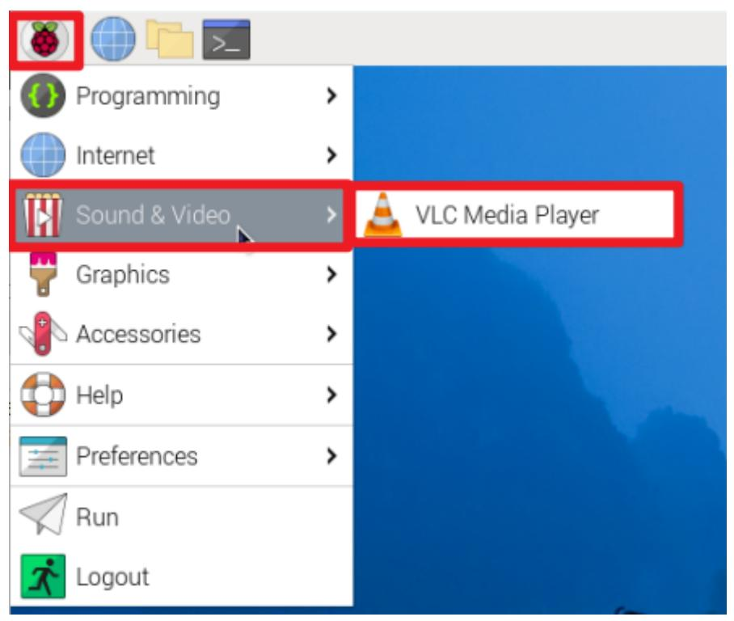
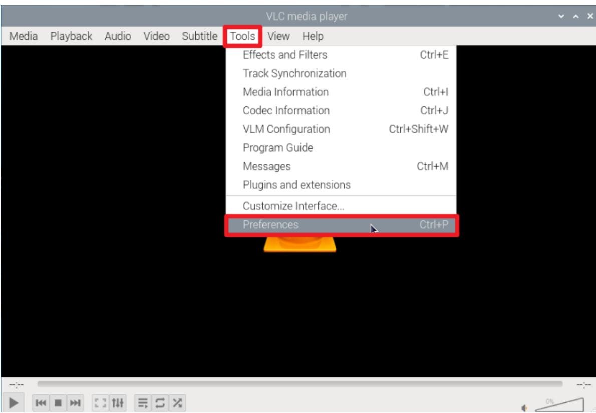
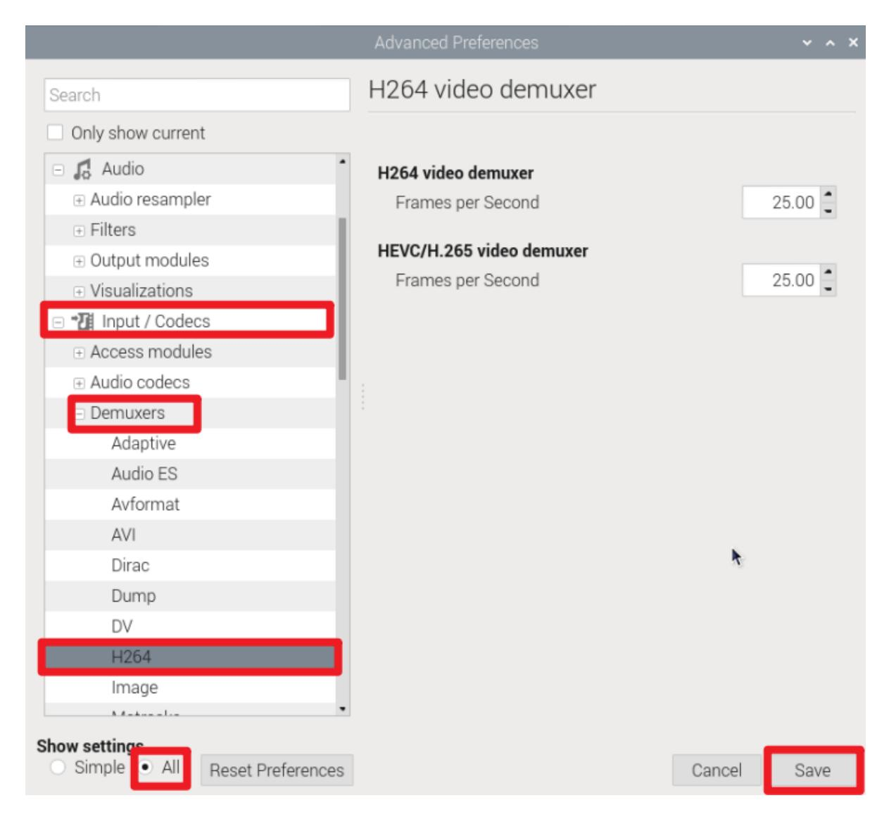
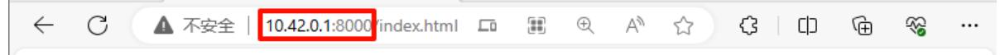

# Using MIPI camera

Configure camera Use camera Preview camera Photograph rpicam-still Video rpicam-vid Error resolution Web page preview camera Run script Web access

The Raspberry Pi 5 combines the previous CSI and DSI interfaces into two dual-purpose CSI/DSI (MIPI) ports.

# Configure camera

When using a Raspberry Pi camera or a third-party camera, you can modify the camera configuration according to the following table:

| Camera module               | File located at: /boot/firmware/config.txt                                                                                                                                                                        |
|-----------------------------|-------------------------------------------------------------------------------------------------------------------------------------------------------------------------------------------------------------------|
| V1 Camera (OV5647)          | dtoverlay=ov5647                                                                                                                                                                                                  |
| V2 camera (IMX219)          | dtoverlay=imx219                                                                                                                                                                                                  |
| HQ Camera (IMX477)          | dtoverlay=imx477                                                                                                                                                                                                  |
| GS camera (IMX296)          | dtoverlay=imx296                                                                                                                                                                                                  |
| Camera module 3 (IMX708) | dtoverlay=imx708                                                                                                                                                                                                  |
| IMX290 and IMX327           | dtoverlay=imx290,clock-frequency=74250000 or (both modules share the IMX290 kernel driver; for the correct frequency, see the module vendor's instructions) dtoverlay=imx290,clock-frequency=37125000 |
| IMX378 type                 | dtoverlay=imx378                                                                                                                                                                                                  |
| OV9281 series               | dtoverlay=ov9281                                                                                                                                                                                                  |

If you are not using the official Raspberry Pi camera, you can modify the config.txt file as shown in the table and add the dtoverlay content to the /boot/firmware/config.txt file.

```bash
sudo nano /boot/firmware/config.txt
```

For example: Raspberry Pi uses IMX219 camera, connect the camera to the Raspberry Pi J4 interface, and then modify the /boot/firmware/config.txt file:


To use the IMX219 camera, it needs to be connected to the J4 interface of Raspberry Pi 5 for recognition!

Modify the configuration file and restart to take effect!

## Use camera

# Preview camera

rpicam-hello

Entering this command in the terminal will display the preview window for about 5 seconds.

rpicam-hello -t 0

Running this command in the terminal will always display the preview window. You can use the window close button and Ctrl+C to exit!

```bash
Photograph
```

rpicam-jpeg -o test.jpg

Display a preview for 5 seconds, then capture the image and save it as a test.jpg file

rpicam-jpeg -o test.jpg -t 2000 --width 640 --height 480

Show a preview for 2 seconds, then capture and save the image as a test.jpg file, with the image having a width of 640 pixels and a height of 480 pixels.

## rpicam-still

This command can be used to save files in different formats:

```
rpicam-still -e png -o test.png
rpicam-still -e bmp -o test.bmp
rpicam-still -e rgb -o test.data
rpicam-still -e yuv420 -o test.data
```

Raw image capture

```
rpicam-still -r -o test.jpg
```

Time-lapse shooting

Capture images continuously at intervals of 2 seconds for a total capture duration of 30 seconds, and save each image as a file name similar to image0001.jpg:

```
rpicam-still -t 30000 --timelapse 2000 -o image%04d.jpg
```

# Video

## rpicam-vid

Commands for video recording using the camera module on the Raspberry Pi.

Example: Record 10 seconds of video and write to test.h264 file

```
rpicam-vid -t 10000 -o test.h264
```

play video

```
vlc test.h264
```

**Note**: If the test.h264 file cannot be played and an error occurs, please try the following method to solve it.

### Error resolution

Modify the frame rate of H264 playback per second







# Web page preview camera

Use Python script files to preview camera images on web pages.

## Run script

Code path:/home/pi/Camera_Web_Preview/

```bash
cd /home/pi/Camera_Web_Preview/ python3 mjpeg_server.py
```

### Web access

Devices under the same LAN can enter:8000 through the browser to view the real-time camera view!

Example: Raspberry Pi IP: 10.42.0.1 Web access: 10.42.0.1:8000



# Picamera2 MJPEG Streaming Demo


If you want to set up auto-start at boot, you can search for information online and set the script file to auto-start at boot!
