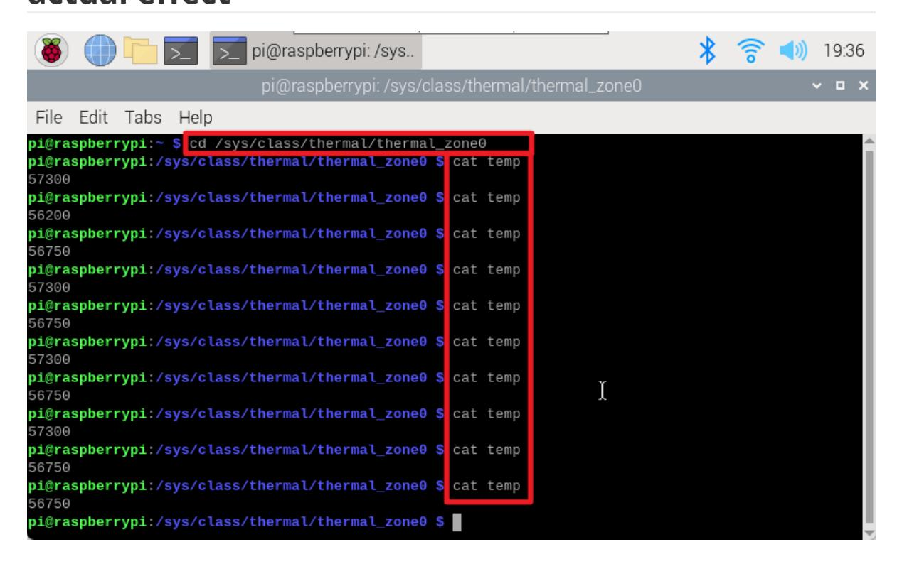

# Get real-time temperature of Raspberry Pi

#### Get real-time temperature of Raspberry Pi

environment Ideas Get temperature parameters actual effect

Enter the command through the terminal to check the current CPU temperature of the Raspberry Pi.

## environment

System: Raspberry Pi OS

Raspbian is the old name of Raspberry Pi's official Debian-based operating system, and Raspberry Pi OS is its new name after its name change in 2020.

### Ideas

The CPU temperature information of the Raspberry Pi is located in the file /sys/class/thermal/thermal_zone0/temp, which is a read-only file; we can read the value and convert it to the actual temperature.

### Get temperature parameters

Open the terminal and run the following two commands to obtain the temperature parameters:

cd /sys/class/thermal/thermal_zone0 cat temp

$$T_{actual temperature} = \frac{temperature parameter}{1000}$$

# actual effect

