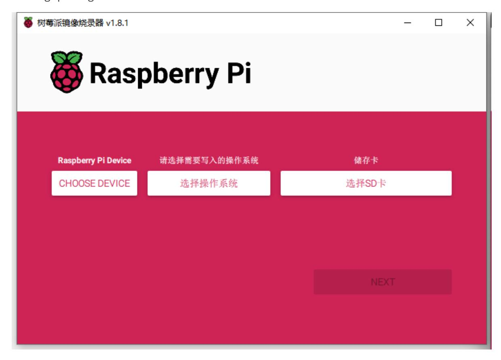
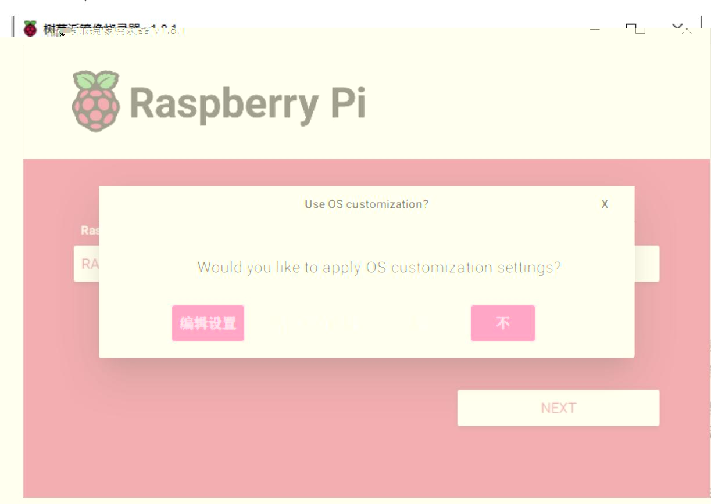
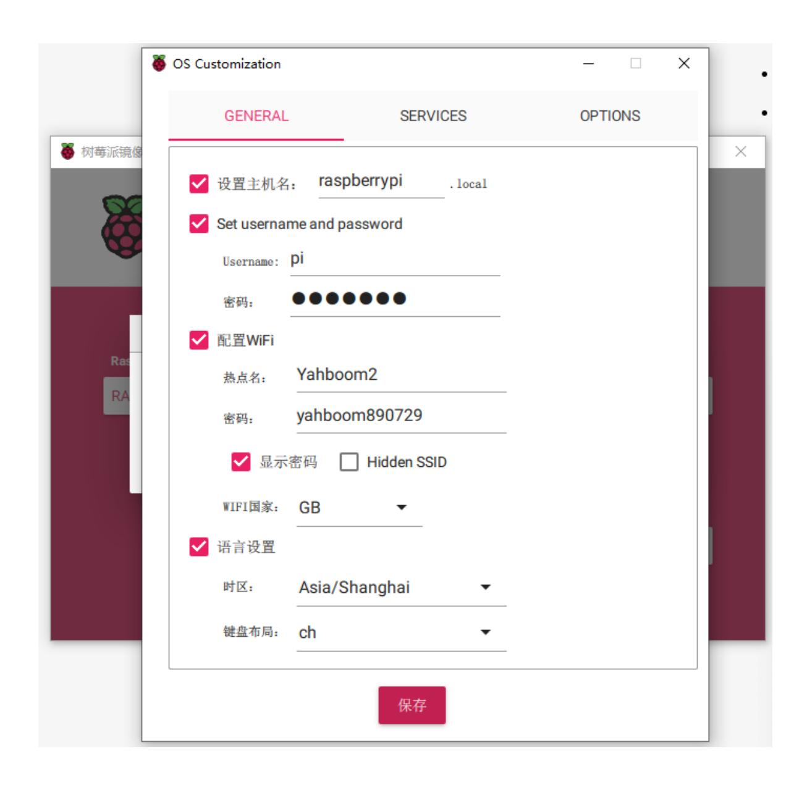
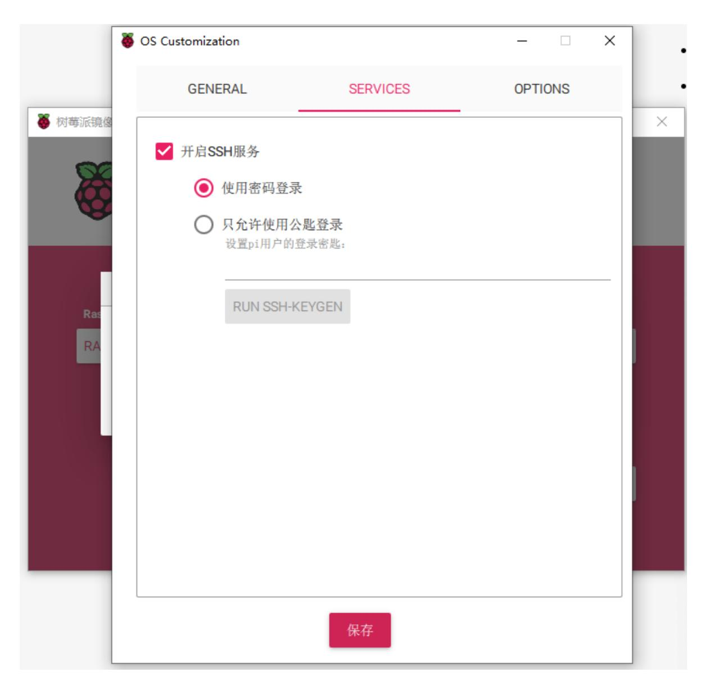
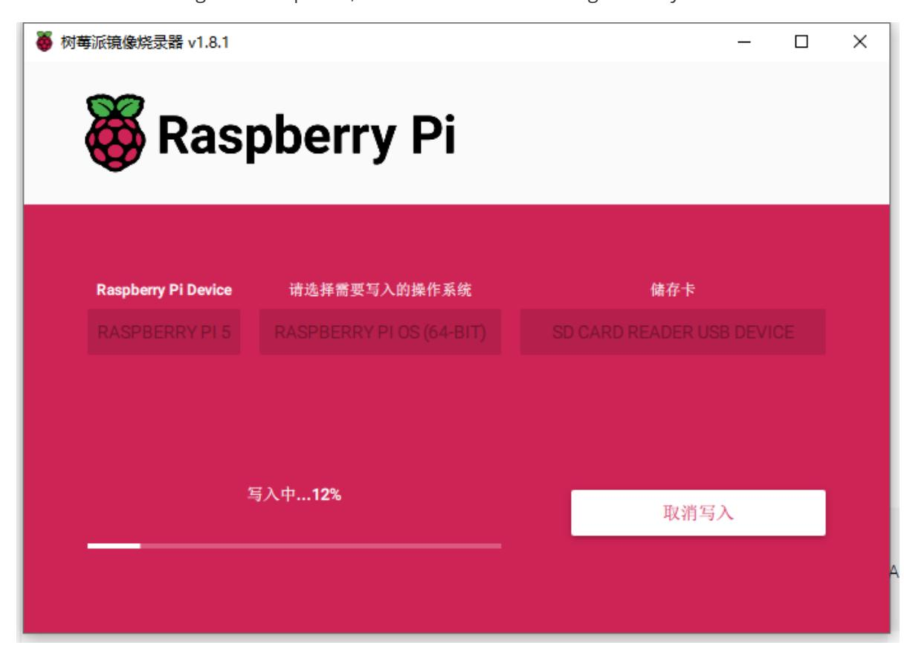
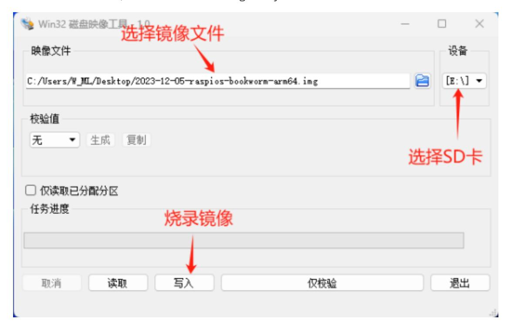
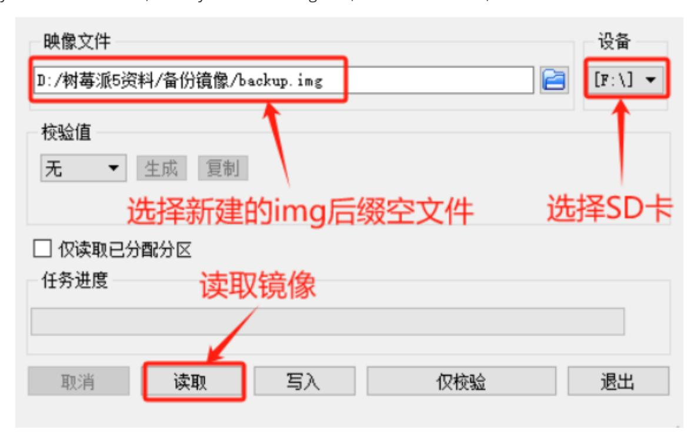

# 2. Raspberry Pi system installation and backup

To use Raspberry Pi, we need an operating system. By default, the Raspberry Pi will look for the operating system on the inserted SD card. This requires a computer to image the storage device as a boot device and plug the storage device into that computer. Most Raspberry Pi users choose a microSD card as the boot device.

## 2.1. Installation through Imgaer

Install the operating system using Raspberry Pi Imager. This tool can download and write images on macOS, Windows and Linux. It supports many popular Raspberry Pi operating system images and supports direct installation from Raspberry Pi or third-party vendors such as Ubuntu. Downloaded images can be pre-configured with credentials and remote access settings using Imager.

You can install Imager via:

˙macOS, Windows: Download the latest version from <https://www.raspberrypi.com/software/> and run the installer.

˙Linux: Run sudo apt install rpi-imager in the terminal to install.

After installing Imager, launch the application by clicking on the Raspberry Pi Imager icon or running rpi-imager.

1. Click "CHOOSE DEVICE" and select your Raspberry Pi model from the list. Here we choose Raspberry Pi 5;

- 2. Click Select Operating System and select the operating system you want to install. Imager will always display the recommended version of Raspberry Pi OS for your model at the top of the list;
- 3. Insert the SD card into the computer using a card reader, and then click "Select SD Card". Be sure to select the correct SD card;
- 4. Click "NEXT", you can select "Edit Settings" to customize the operating system, or select "No" to skip;

5. Edit Settings allows you to set up your Raspberry Pi before booting it for the first time. You can pre-configure: username and password, Wi-Fi credentials, device hostname, time zone, your keyboard layout, remote connection. As shown below:

6. After the settings are completed, click "Save" to start writing to the system.

### 2.2. Installation through Win32DiskImager

#### Prepare:

- 1. An SD card and card reader of 2G or above, preferably a high-speed card. Cards of Class 4 or above are recommended. The speed of the card directly affects the running speed of the Raspberry Pi. The author recommends that it is preferably 4G or above, otherwise the subsequent development space will be limited. not enough.
- 2. Use the special formatting tool SDFormatter to format the memory card.
- 3. Install the tool for burning images under Windows system: Win32DiskImager.

#### Burning system:

- 1. Unzip the downloaded system compressed file to obtain the img image file;
- 2. Use the SD card tray or card reader and connect it to the computer;
- 3. Unzip and run the win32diskimager tool;
- 4. Select the img (image) file in the software, select the drive letter of the SD under "Device", then select "Write", and then start burning the system.

5. After the programming is completed, a completion dialog box will pop up, indicating that the programming is completed. If it is not successful, please close the firewall and other software and re-insert the SD card for programming. Please note that after burning, you will see that the SD card is only 74MB under the Windows system. This is a normal phenomenon, because the disk partition under Linux cannot be seen under the Windows system!

Note: After successful burning, the system may prompt you to format the memory card. Please do not format the burned memory card at this time.

## 2.3. Backup (restore) Raspberry Pi under Windows

The Raspberry Pi uses an SD card to load the system. If the SD card is lost or damaged, the data on the Raspberry Pi will be lost, so the backup of the Raspberry Pi system is very important.

Preparation work: a. Raspberry Pi SD card; b. Card reader; c. Install Win32DiskImager software

If you do not have a Linux operating system, you can also back up under Windows, but the size of the backed up file is actually the size of the SD card.

First create a blank file with the.img suffix, open Win32DiskImager, then select the SD card as shown below, select the newly created blank.img file, and read it directly to back up the system. If you need to reinstall, directly select the image file, select the SD card, and click Write to restore.

Advantages: Simple operation, backup and restore are implemented in the same software.

Disadvantages: It takes up too much space. The backup is for the entire card. The IMG obtained is the size of the card. It can only be restored to the original card or a card larger than the original card.
