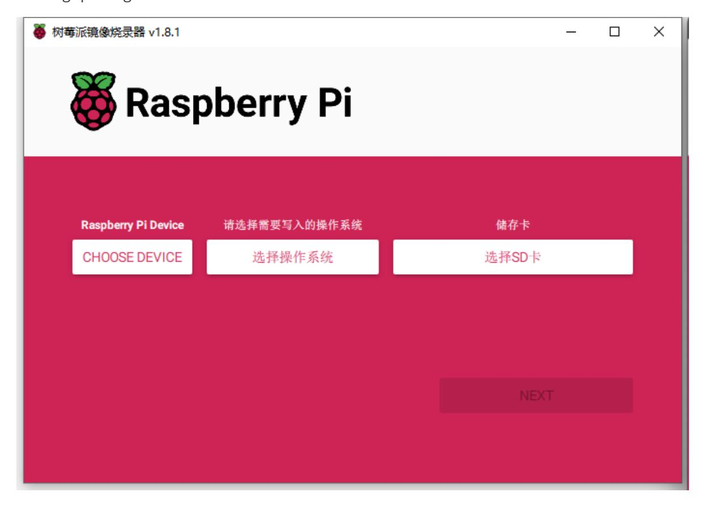
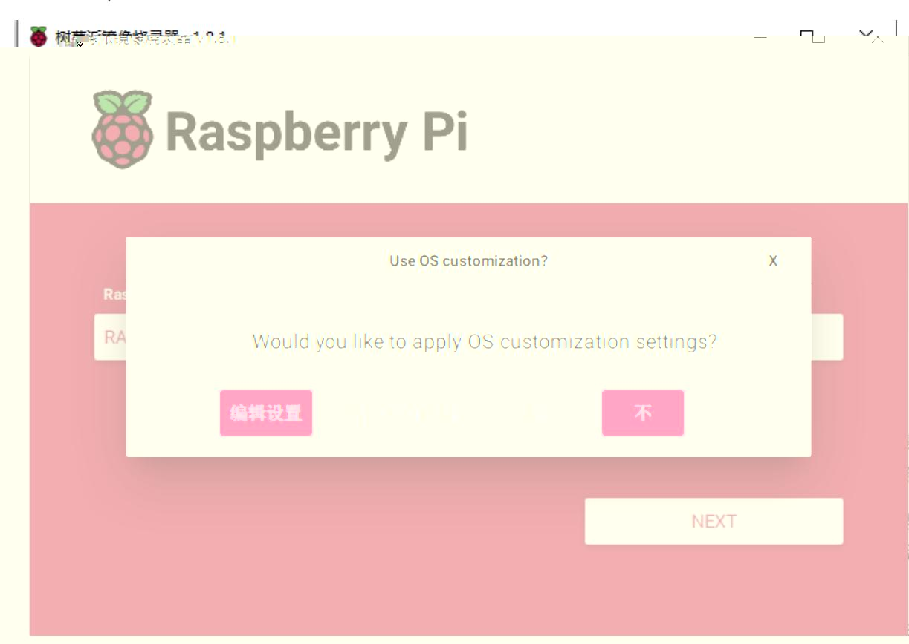
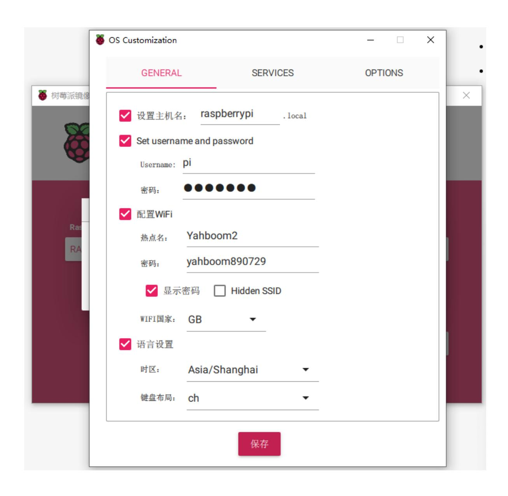
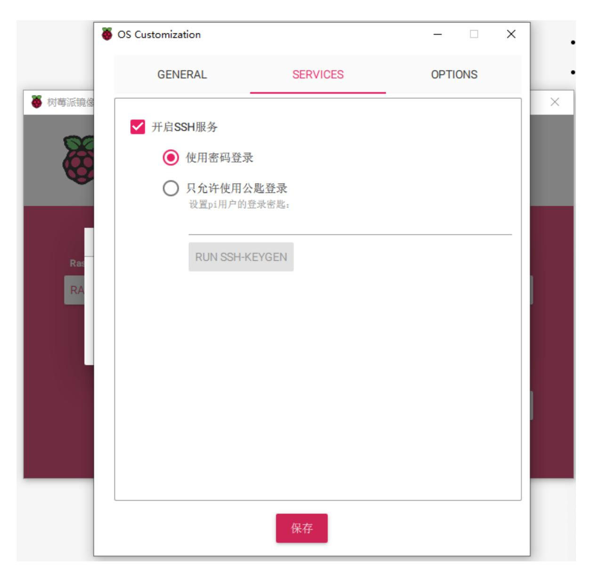
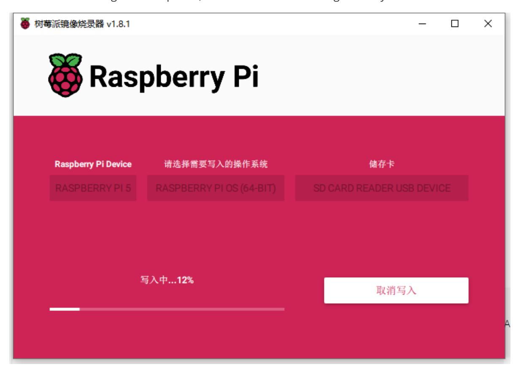
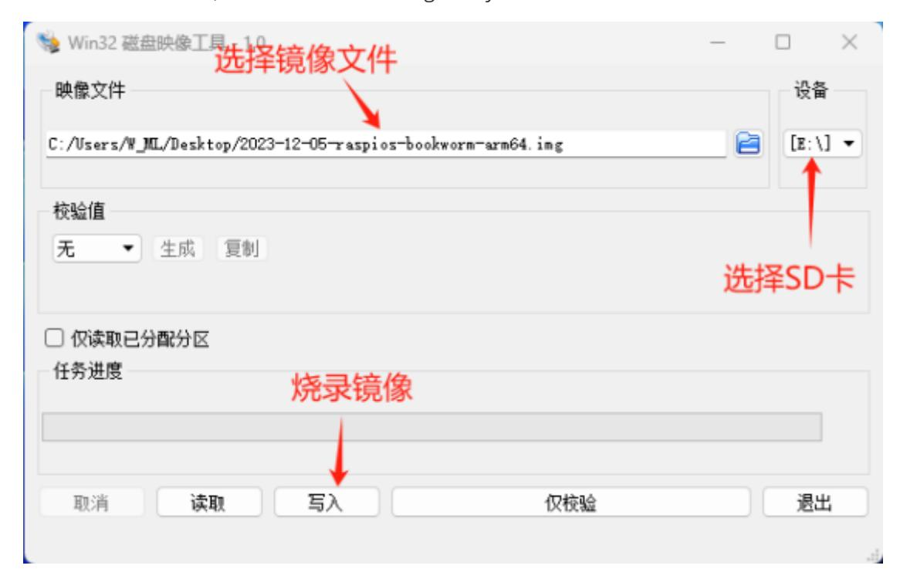
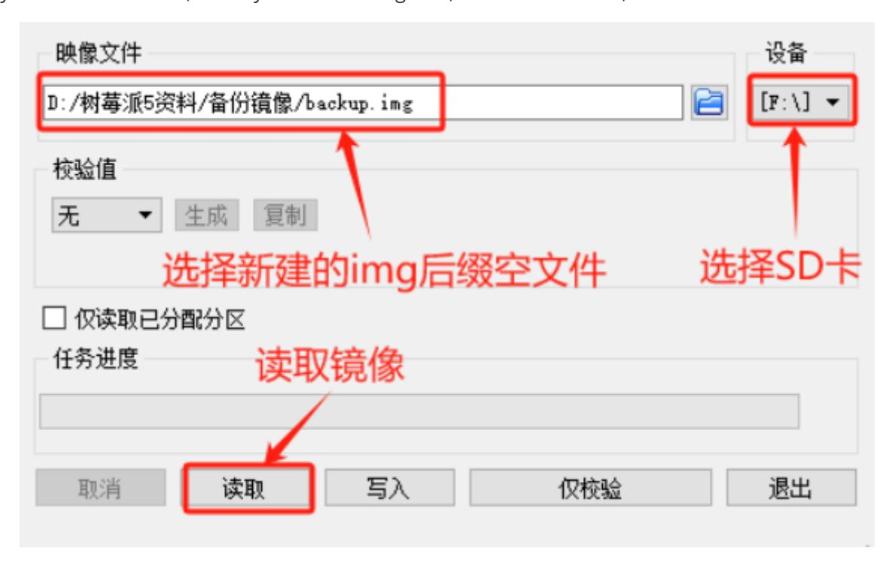

# Raspberry Pi System Installation and Backup

To use a Raspberry Pi, you need an operating system on a bootable storage device. By default, Raspberry Pi boots from the inserted SD card. Most Raspberry Pi users choose a microSD card as the boot device.

## 1. Install with Raspberry Pi Imager

Raspberry Pi Imager can download and write images on macOS, Windows, and Linux. It supports Raspberry Pi OS and third-party images such as Ubuntu. It can also preconfigure credentials and remote-access settings before first boot.

Install Imager as follows:

- macOS or Windows: download the latest version from <https://www.raspberrypi.com/software/> and run the installer.
- Linux: run `sudo apt install rpi-imager` in a terminal.

After installing Imager, launch it from the Raspberry Pi Imager icon or by running `rpi-imager`.

1. Click `CHOOSE DEVICE` and select your Raspberry Pi model. This example uses Raspberry Pi 5.

2. Click `Select Operating System` and choose the OS to install. Imager displays the recommended Raspberry Pi OS version for your model at the top of the list.
3. Insert the SD card into the computer with a card reader, then click `Select SD Card`. Be sure to select the correct SD card.
4. Click `NEXT`. Select `Edit Settings` to customize the OS, or select `No` to skip.

5. `Edit Settings` lets you configure the Raspberry Pi before first boot, including username and password, Wi-Fi credentials, hostname, time zone, keyboard layout, and remote access.

6. After the settings are complete, click `Save` to start writing the system image.

## 2. Install with Win32DiskImager

### 2.1 Prepare

1. Prepare an SD card and card reader. A 2G or larger card is required, but a 4G or larger high-speed card is recommended. Class 4 or above is recommended because card speed directly affects Raspberry Pi performance.
2. Use SD Formatter to format the memory card.
3. Install Win32DiskImager on Windows.

### 2.2 Write the System Image

1. Extract the downloaded system archive to obtain the `.img` image file.
2. Insert the SD card into the computer with an SD card adapter or card reader.
3. Extract and run Win32DiskImager.
4. Select the `.img` file, select the SD card drive letter under `Device`, then click `Write`.

5. When writing is complete, a completion dialog appears. If writing fails, close firewall or security software, reinsert the SD card, and write the image again. After writing, Windows may show the SD card as only 74MB. This is normal because Windows cannot read the Linux partitions.

After the image is written successfully, Windows may prompt you to format the memory card. Do not format it.

## 3. Back Up or Restore Raspberry Pi Under Windows

Raspberry Pi loads the system from the SD card. If the SD card is lost or damaged, the system data is lost, so backing up the Raspberry Pi system is important.

Prepare the Raspberry Pi SD card, a card reader, and Win32DiskImager.

If you do not have a Linux operating system, you can also back up under Windows, but the size of the backed up file is actually the size of the SD card.

Create a blank file with the `.img` suffix, open Win32DiskImager, select the SD card, select the blank `.img` file, then click `Read` to back up the system. To restore later, select the image file, select the SD card, and click `Write`.

Advantages: Simple operation, backup and restore are implemented in the same software.

Disadvantages: It takes up too much space. The backup is for the entire card. The IMG obtained is the size of the card. It can only be restored to the original card or a card larger than the original card.
