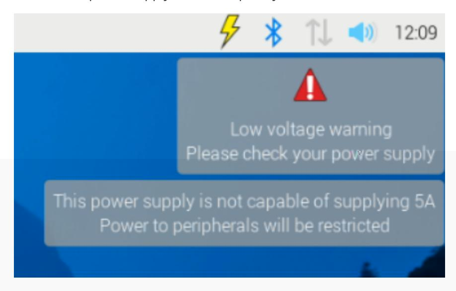

## 3. Powering the Raspberry Pi 5

## This section mainly introduces the power supply related content of Raspberry Pi 5

Raspberry Pi makes two different USB-C power supplies. The first is the Raspberry Pi 15W USB-C Power Supply, which is the recommended power supply for the Raspberry Pi 4 and Raspberry Pi 400. The second is the Raspberry Pi 27W USB-C power supply, which provides up to 5A at +5.1V and is the recommended power supply for the Raspberry Pi 5.

Although mobile phone chargers that support USB-PD have a nominal power of more than 15W, they actually achieve this by increasing the voltage, rather than providing more current at +5V voltage. If you use a power supply that cannot deliver 5A at +5V when first booted, the operating system will warn you that the peripheral's current draw will be limited to 600mA.

The table below shows the USB-PD power modes required to power various Raspberry Pi models.

| 模型                   | 推荐电源 (电压/电流)               | 树莓派电源              |
|----------------------|----------------------------|--------------------|
| 树莓派5                 | 5V/5A、5V/3A 将外设电流限制为 600mA | 27W USB-C 电源       |
| 树莓派 4 B 型            | 5V/3A                      | 15W USB-C 电源       |
| 树莓派 3(所有型号)          | 5V/2.5A                    | 12.5W Micro USB 电源 |
| 树莓派 2(所有型号)          | 5V/2.5A                    | 12.5W Micro USB 电源 |
| 树莓派 1(所有型号)          | 5V/2.5A                    | 12.5W Micro USB 电源 |
| Raspberry Pi 零(所有型号) | 5V/2.5A                    | 12.5W Micro USB 电源 |

- 1. Use the official power supply 5V/5A DC for power supply. 5V/3A will limit the current of peripheral devices to 600mA;
- 2. Powered through the GPIO interface, the Raspberry Pi's GPIO interface can also accept DC input;
- 3. Through the POE function interface, you only need to add a POE Ethernet module and use an Ethernet cable to power the Raspberry Pi.
