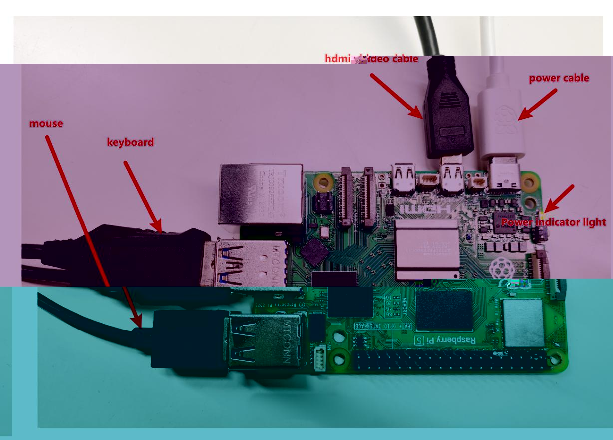
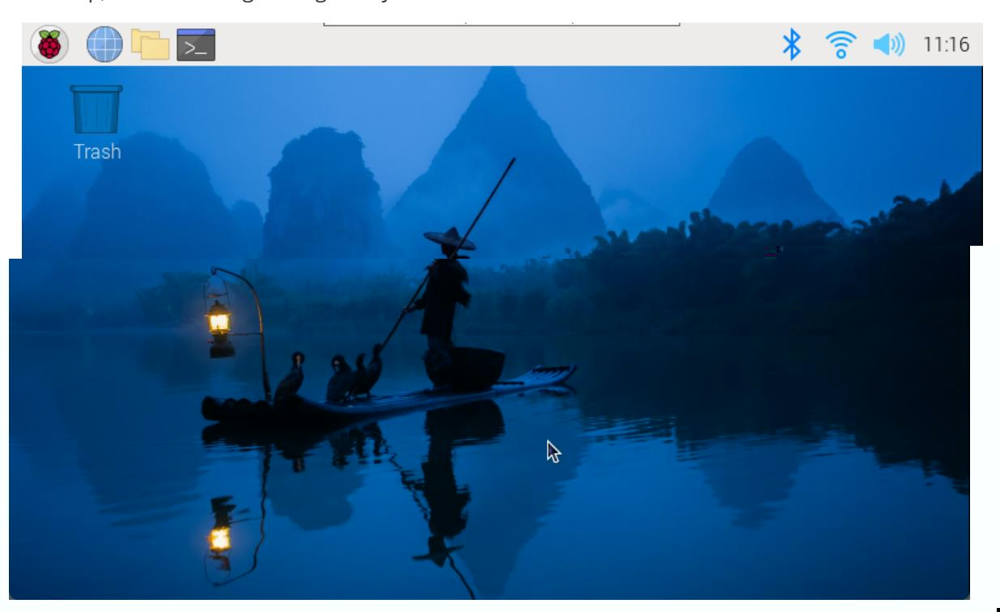

# Raspberry Pi 5 Startup

After writing the image, insert the SD card into the Raspberry Pi. Connect the monitor, power supply, mouse, and keyboard, then power on the board to enter the Raspberry Pi system.

Under normal circumstances, the signal light lights up red when the computer is turned on, and then turns green. Wait for a few seconds before the green light flashes irregularly, enter the desktop, and then the green light stays on.

