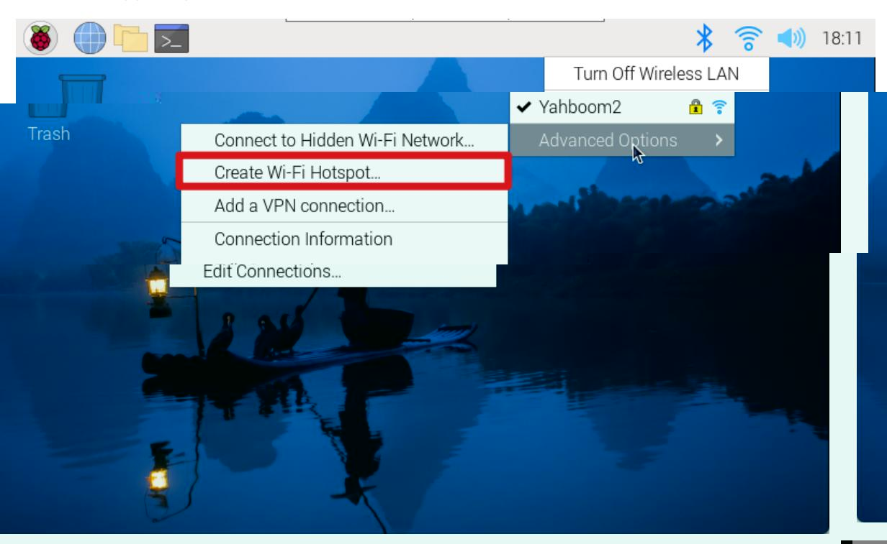
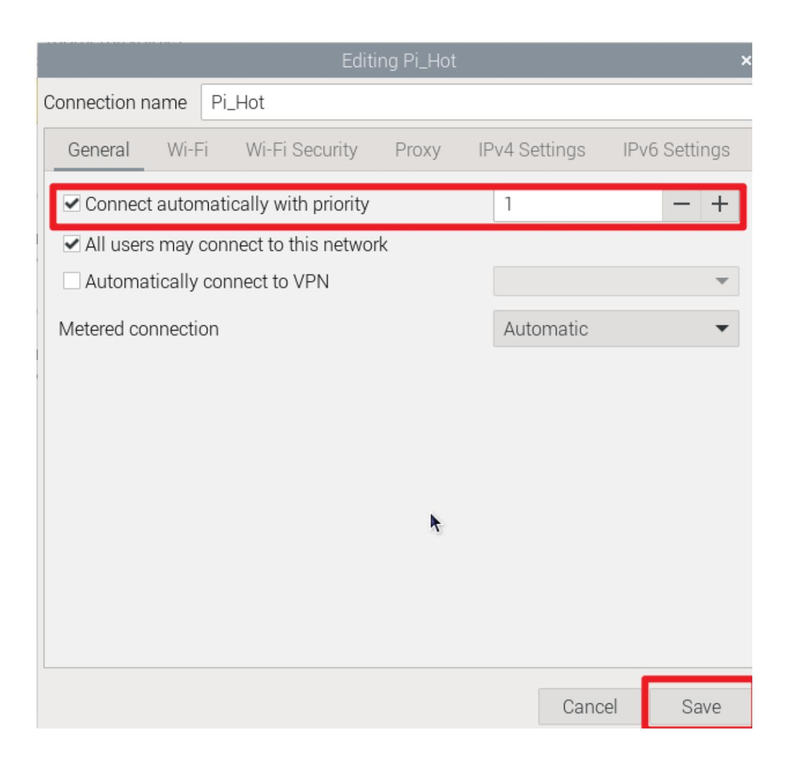

# Network Configuration

## 1. Wi-Fi connection

### Graphical interface

Using the Raspberry Pi graphical desktop system, we can connect to the corresponding Wi-Fi by clicking the network icon in the upper right corner of the menu bar.

Note: If the region is not set, you need to set the region before connecting to the network for the first time before you can configure the network.

#### Command Line

For systems without a graphical interface, you can configure the network through the command line.

Note: You need to use the raspi-config tool to set the WLAN country/region first, and then use the command line to configure the network.

Use the raspi-config tool: enter sudo raspi-config in the terminal

Set WLAN country:

Localization Options -> WLAN Country -> CN China -> OK

After completing the above option settings, select Finish to exit the raspi-config tool.

View Wi-Fi enabled status command: nmcli radio Wi-Fi

Turn on Wi-Fi status command: nmcli radio Wi-Fi on

Turn off Wi-Fi status command: nmcli radio Wi-Fi off

Find network command: sudo nmcli dev Wi-Fi list

Connect to the network command: sudo nmcli --ask dev Wi-Fi connect <example_ssid>

Note: If it is displayed that you do not have permission to operate, please add sudo in front of all commands.

The above information prompt appears indicating that the Wi-Fi connection is successful!

## 2. Turn on hotspot

Using the Raspberry Pi graphical desktop system, we can create a hotspot by clicking the network icon in the upper right corner of the menu bar.

After the creation is successful, you can use your mobile phone to view the hotspot!

## 3. Hotspot/Wi-Fi starts automatically after booting

We can set up the Raspberry Pi system to connect to Wi-Fi or turn on a hotspot by modifying the priority of the network settings.

The higher the priority number, the better the connection method will be!

