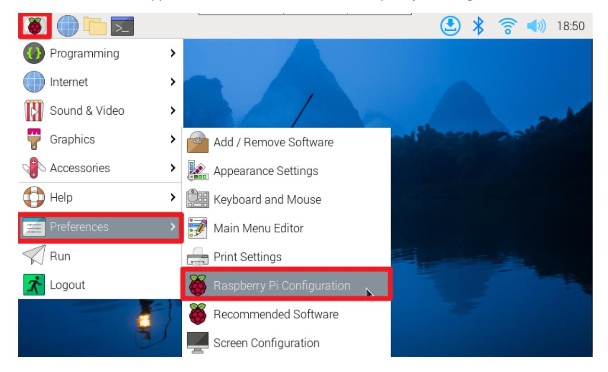
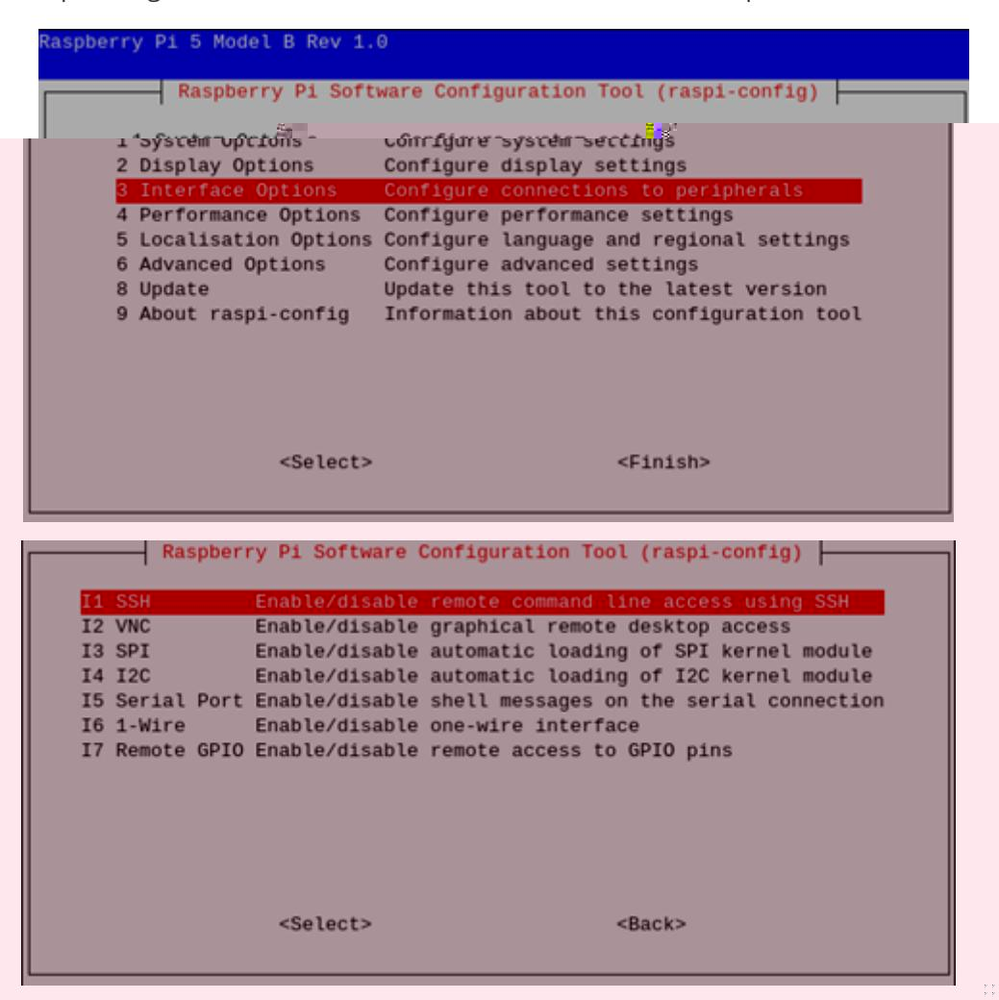
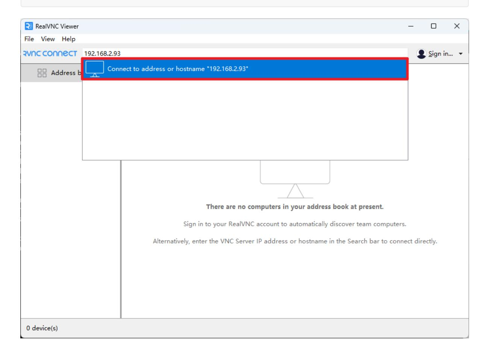
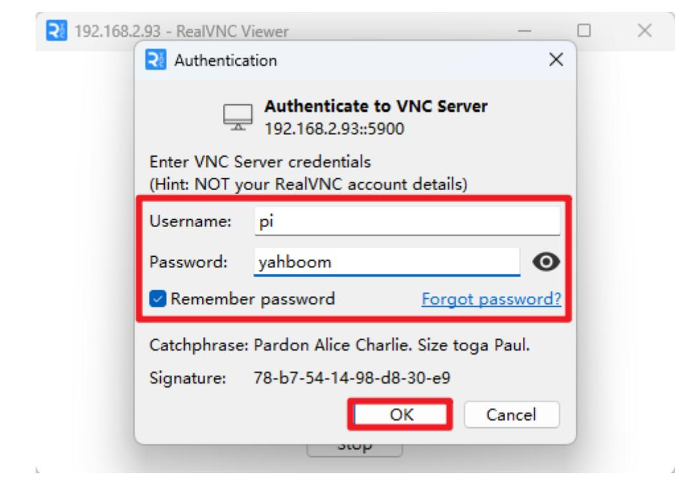

# remote access

## 1. Preliminary preparation

Before performing SSH or VNC remote login, you need to enable SSH and VNC functions in the Raspberry Pi system settings or use the raspi-config tool.

### 1.1. Enable SSH and VNC

### Graphical interface

Enable SSH and VNC: applications menu -> Preferences -> Raspberry Pi Configuration




#### Command Line

Use the raspi-config tool to enable SSH and VNC functions: Interface Options -> SSH/VNC: enable




The steps to enable the VNC function are the same, just follow the steps above! Note: If opening the VNC service fails, check whether the system has been updated; update the software and restart the system before reopening the VNC service.

### 1.2. Obtain IP

After enabling SSH and VNC functions, you can remotely control the Raspberry Pi based on its IP!

#### Graphical interface

After the system is connected to Wi-Fi, hover the mouse on the Wi-Fi icon to see the corresponding IP address.


Use the command to view the IP address: hostname -I or ifconfig


## 2. SSH remote control

After obtaining the IP address of the Raspberry Pi motherboard, you can perform SSH remote login on the terminal based on the user name and password of the Raspberry Pi system.

SSH remote login command: ssh username@IP address

```
My current login user name is pi, the password is yahboom, and the IP address is
192.168.2.93
sshpi@192.168.2.93
```

## 3. VNC remote login

After obtaining the IP address of the Raspberry Pi motherboard, you can use the RealVNC Viewer software to log in remotely.

My current login user name is pi, the password is yahboom, and the IP address is 192.168.2.93





After successful remote login, the Raspberry Pi system desktop will be displayed!


