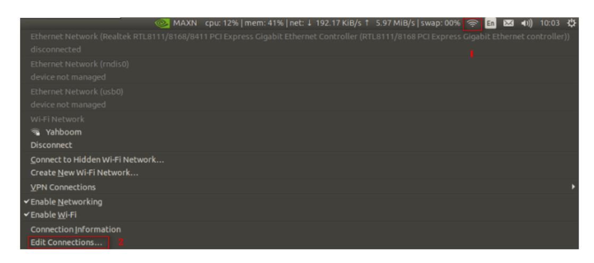
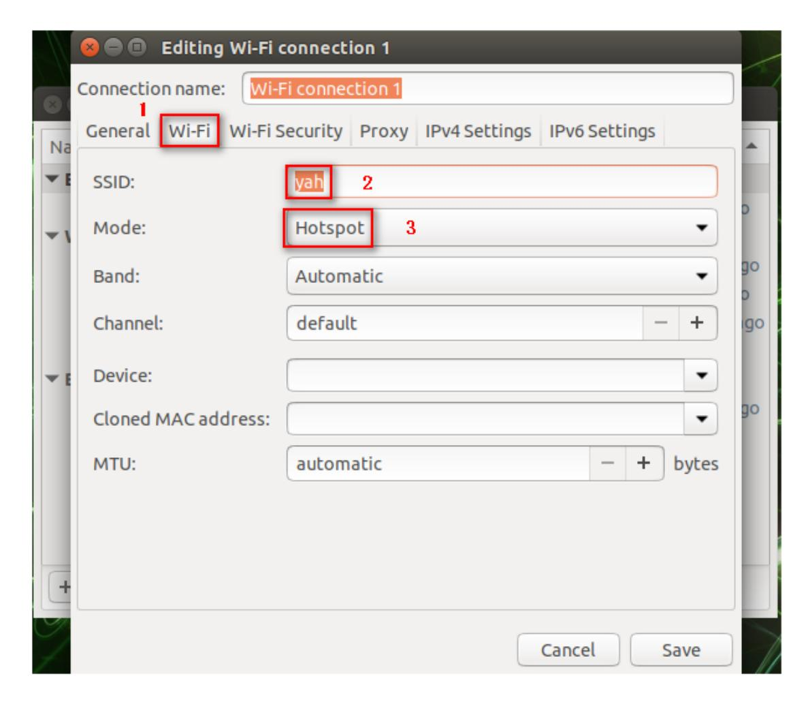
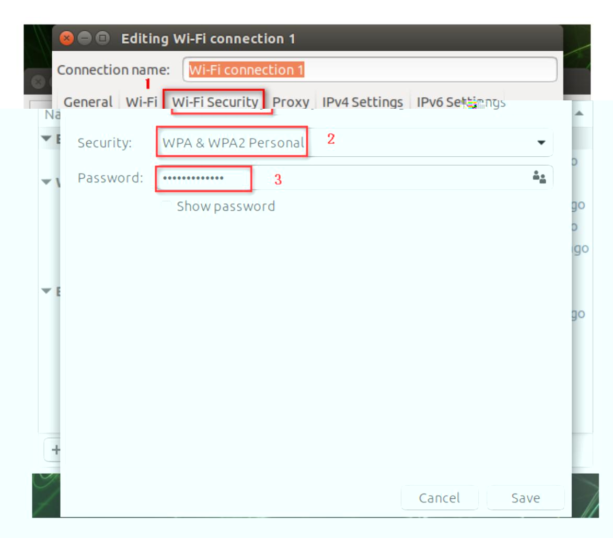
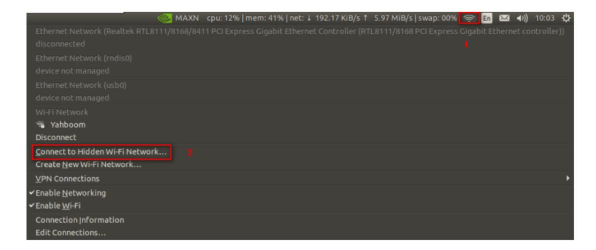
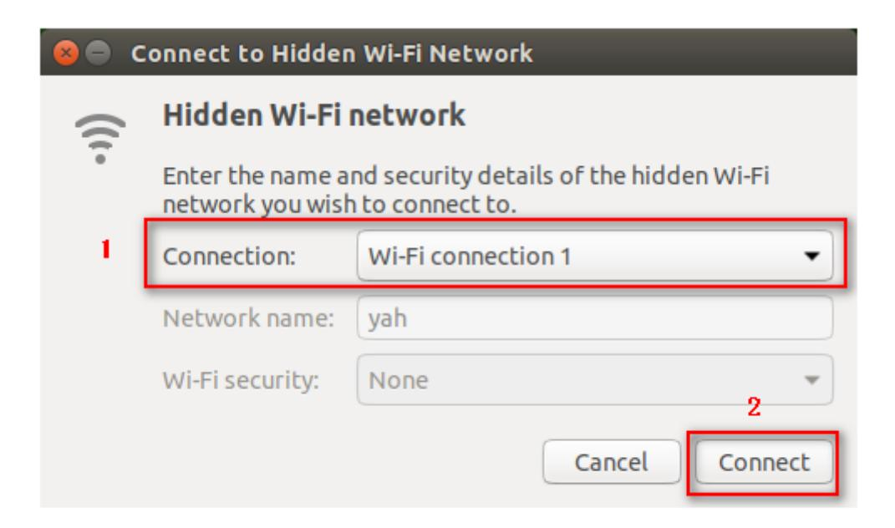

## 11.Static IP and hotspot mode

## 1. Static IP

Click the Wi-Fi icon in the upper right corner of the system interface, and a frame as shown below will appear.

Click [Edit Connections...] at the bottom.


Double-click the connected Wi-Fi, here is [Yahboom].


In the [Wi-Fi] directory, select [Mode]-->[Client].


In the [IPv4 Settings] directory, click the [Add] icon, enter the IP as shown below, and finally click [save] to save.


Input following command to modify the.bashrc file,

```
sudo vim ~/.bashrc
```

Set ROS_IP to the IP modified in the previous step, as shown in the figure below.

Note: If you do not connect to this Wi-Fi, be sure to comment out the modified line (just add # in front).

When we newly open the terminal, 【binary operator expected】 appears.

Don't pay attention to it. It does not affect use.

## 2. Hotspot mode

Click the Wi-Fi icon in the upper right corner of the system interface, and a frame as shown below will appear.

Click [Edit Connections...] at the bottom.



The frame as shown below will pop up, click [+] to select [Wi-Fi] mode, and click [Create...].


In the [Wi-Fi] directory, add [yah] in the [SSID] column and select [Hotspot] in the [Mode] column.



In the [Wi-Fi Security] directory, select [WPA & WPA2 Personal] in the [Security] column, and enter the password in the [Password] column.



In the [IPv4 Settings] directory, click the [Add] icon and enter the IP as shown in the figure below.


In the [IPv4 Settings] directory, select [Ignore] in the [Method] column, and finally click [Save] to save.


In [Wi-Fi] mode, our newly created Wi-Fi appears.


At this point, the new Wi-Fi has been successfully created. Next, connect to the new Wi-Fi. Follow the steps below.



Select the newly created Wi-Fi [Wi-Fi connections 1] in the [Connections] column of the pop-up dialog box, and click [Connect].


