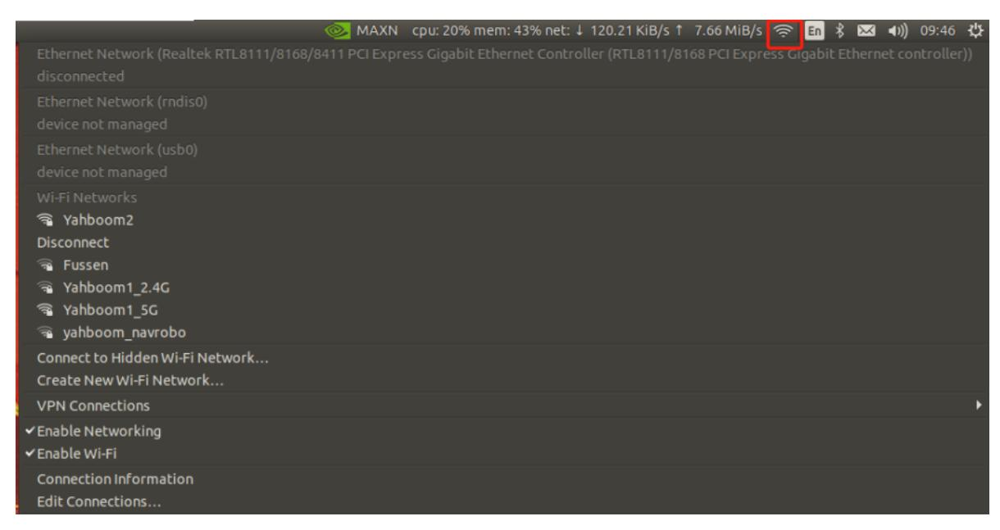
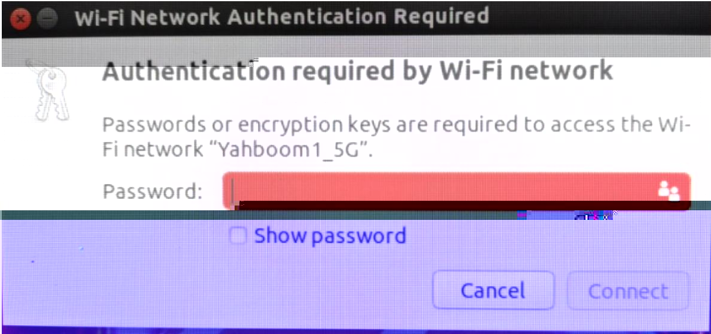

# 17.Connect to Wi-Fi network

## 1. Connect the desktop to Wi-Fi network

When connecting to a Wi-Fi network, the desktop connection method is preferred, making the operation simpler and more convenient.

Click the Wi-Fi logo in the upper right corner of the desktop, then select the Wi-Fi signal you want to connect to, and then enter the Wi-Fi password to confirm to connect to Wi-Fi.





## 2. Connect to Wi-Fi network via command line

Enter the following command to scan and list nearby Wi-Fi signals

```
sudo iwlist scan
sudo nmcli device wifi list
```

Start connecting to the Wi-Fi signal according to the Wi-Fi name and password you need to connect.

```
sudo nmcli device wifi connect [WiFi name] password [WiFi password]
```

Example: If Wi-Fi name is Yahboom1_5G and password is 12345678, please enter the following command:

sudo nmcli device Wi-Fi connect Yahboom1_5G password 12345678
