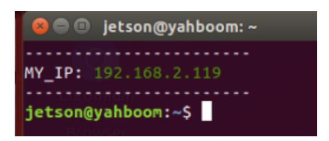
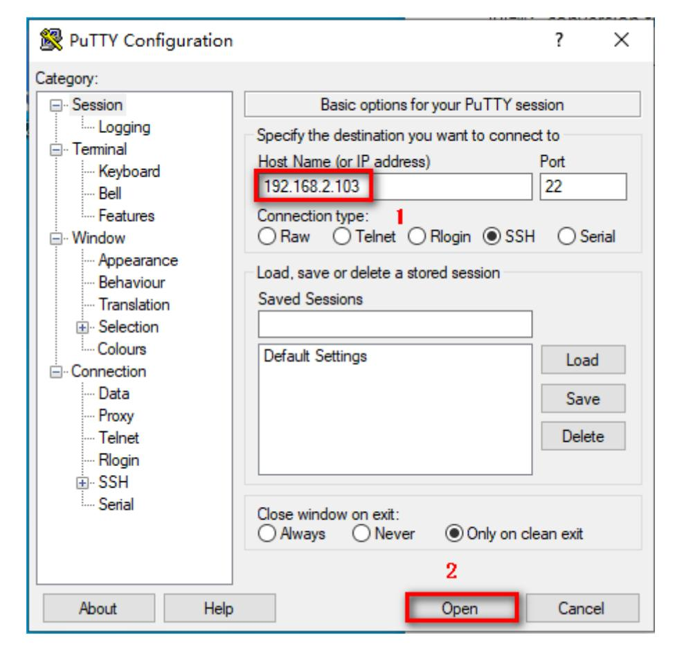
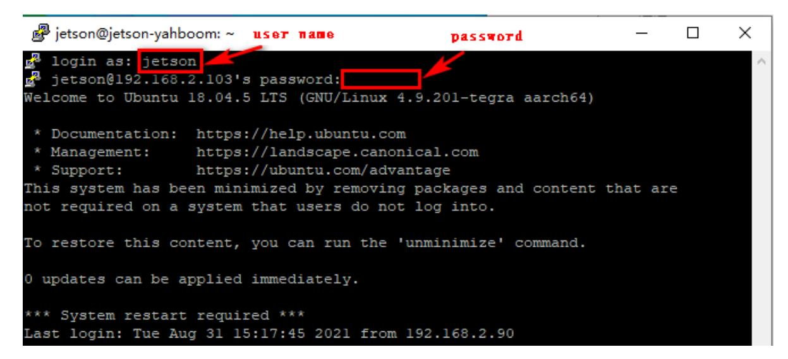

# 7.SSH remote control

7.SSH remote control 1. PuTTY log into 2.SSH

PuTTY download link:<https://www.chiark.greenend.org.uk/~sgtatham/putty/latest.html>

Note: You must know the robot's username, password and IP address before logging in remotely.

For example, in the picture below: IP address [192.168.2.119], user name [jetson], host name [yahboom].



## Note:

Yahboom Raspberry Pi version Muto RS image, username: pi, password: yahboom Yahboom Jetson Nano version Muto RS image, username: jetson, password: yahboom

### 1. PuTTY log into

Download the PuTTY installation file and double-click the [.exe] file to install it.



Enter the robot IP address and click [open].



Enter the username [jetson] and password [yahboom], and press Enter to confirm.

After successful login, the following figure will appear.


### 2.SSH

Log in

Operate under ubuntu system

1)Enter the following command

```bash
ssh jetson@192.168.2.103
```

- 2. Then enter [yes]
- 3. Enter password [yahboom]
- Copy files

If jetson's IP is 192.168.2.103, username: jetson; virtual machine username: yahboom

```python
scp jetson@192.168.2.103:/home/jetson/xxx.tar.gz /home/yahboom/ # Copy files
from remote to local (file)
scp /home/yahboom/xxx.png jetson@192.168.2.103:/home/jetson/ # Copy files
from local to remote (file)
scp -r jetson@192.168.2.103:/home/jetson/test /home/yahboom/ # Copy directory
from remote to local -r (folder)
scp -r /home/yahboom/test jetson@192.168.2.103:/home/jetson/ # Copy directory
from local to remote -r (folder)
```
