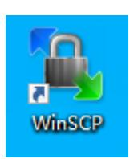
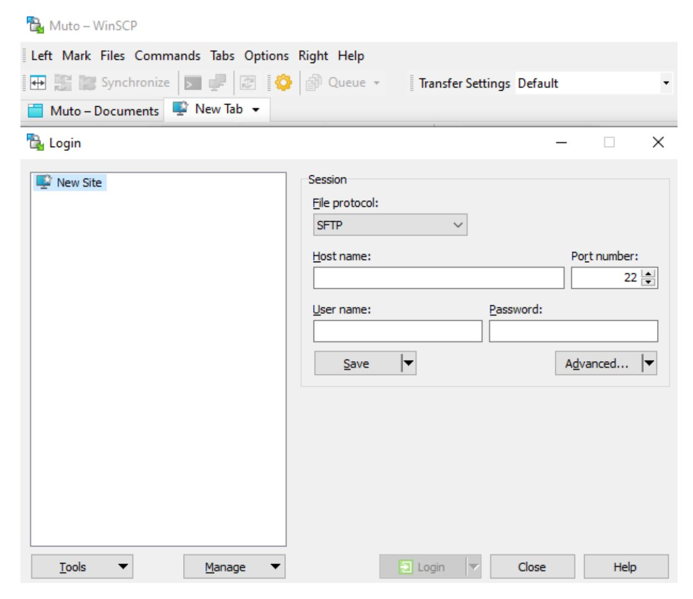
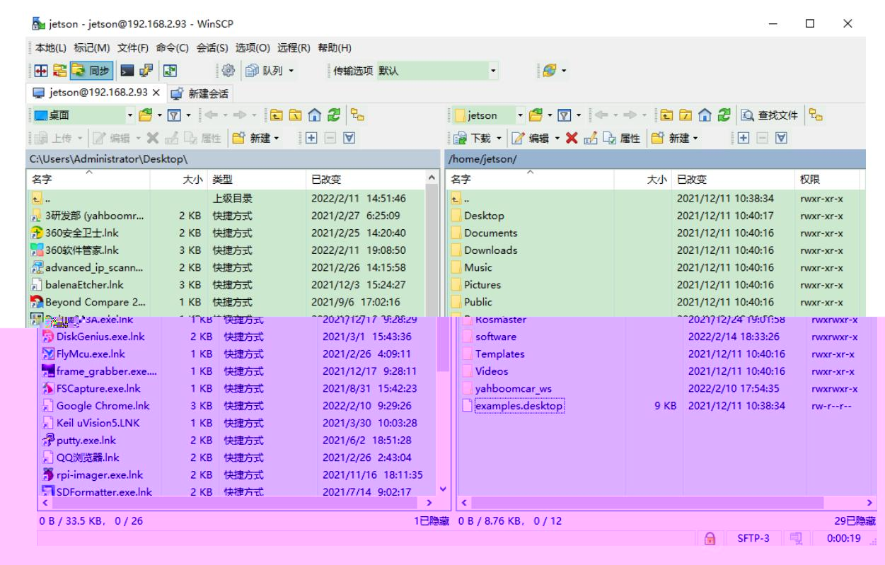

# 9.Transfer files remotely

WinSCP download link:<https://winscp.net/eng/download.php>

Enter the relevant link above, download the installation file, and double-click the [.exe] file to install.

Double-click the icon below to open the WinSCP software

This time the robot IP [192.168.2.93], username [jetson], password [yahboom].

If the login dialog box does not pop up, click [New Session] in the upper left part, enter the host name (IP address), user name, and password in order, and click to log in.

An example of successful login is as follows

Transfer files from computer to robot [Jetson Nano]

Just select the files (folders) that need to be transferred and drag them to the right, [/home/jetson] column.

The robot [Jetson Nano] transfers files to the computer

Just select the files (folders) that need to be transferred and drag them to the left, [C:] column, or you can drag them directly to the desktop.
