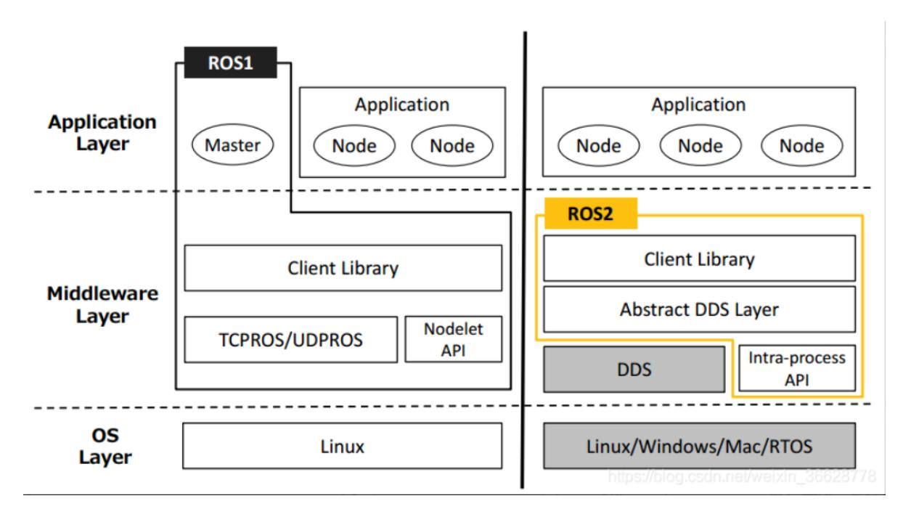

# 1.Introduction to ROS2

## 1. Overview of ROS2

ROS2 is the second-generation Robot Operating System, an upgrade to ROS1 that addresses some of its issues. The first ROS2 version, Arden, was released in 2017. With continuous updates and optimizations, it now has a stable version. As with ROS1, the choice of Linux version is also relevant to the ROS2 version. The corresponding versions are listed below.

| ROS2 version        | Release date | Maintenance deadline | Ubuntu version                                            |
|---------------------|--------------|-------------------------|-----------------------------------------------------------|
| Ardent Apalone      | 2017.12      | 2018.12                 | Ubuntu 16.04 (Xenial Xerus)                               |
| Bouncy Bolson       | 2018.7       | 2019.7                  | Ubuntu 16.04 (Xenial Xerus), Ubuntu 18.04 (Bionic Beaver) |
| Crystal Clemmys     | 2018.12      | 2019.12                 | Ubuntu 18.04 (Bionic Beaver)                              |
| Dashing Diademata   | 2019.5       | 2021.5                  | Ubuntu 18.04 (Bionic Beaver)                              |
| Eloquent Elusor     | 2019.11      | 2020.11                 | Ubuntu 18.04 (Bionic Beaver)                              |
| Foxy Fitzroy        | 2020.6       | 2023.5                  | Ubuntu 20.04 (Focal Fossa)                                |
| Galactic Geochelone | 2021.5       | 2022.11                 | Ubuntu 20.04 (Focal Fossa)                                |
| Humble Hawksbill    | 2022.5       | 2027.5                  | Ubuntu 22.04 (Jammy Jellyfish)                            |
| Iron Irwini         | 2023.5       | 2024.11                 | Ubuntu 22.04 (Jammy Jellyfish)                            |
| Jazzy Jalisco       | 2024.5       | 2029.5                  | Ubuntu 24.04 (Noble Numbat)                               |

**Note**: Download the appropriate ROS2 version for your Linux distribution. This series of courses uses the **Humble** version as an example. The **programs** and **examples** presented in the course are applicable to all ROS2 versions.

## 2. Features of ROS2

### 2.1. **ROS2 Fully Supports Three Platforms**

- Ubuntu
- Mac OS X
- Windows 10

### 2.2. Implemented a Distributed Architecture

The master node is eliminated, enabling distributed node discovery, publish/subscribe, and request/response communication.

### 2.3. **Real-time Support**

- 2.4. New Programming Language
  - C++11
  - Python 3.5+
- 2.5. **Using the new build system Ament (Catkin for ROS)**
- 2.6. **ROS1 can communicate with ROS 2 via rosbridge**

## 3. Differences between ROS2 and ROS1

### 3.1. Platform

ROS1 currently only supports Linux, and is commonly built and used in Ubuntu. ROS2, on the other hand, can be built and used in Ubuntu, Windows, and even on embedded development boards, making it a more widely used platform.

### 3.2. Language

C++

ROS1's core is C++03, while ROS2 makes extensive use of C++11.

Python

ROS1 uses Python 2, while ROS2 requires at least Python 3.5. Foxy uses Python 3.8.

### 3.3 Middleware

ROS 1 requires starting roscore before starting. This master controls all inter-node communication. ROS 2, however, does not have this. Instead, it uses an abstract middleware interface for data transmission. Currently, all implementations of this interface are based on the DDS standard. This enables ROS 2 to provide various high-quality QoS policies, improving communication across different networks.

### 3.4 Compilation Commands

ROS 1 compiles using the catkin_make command, while ROS 2 compiles using the colcon build command.
