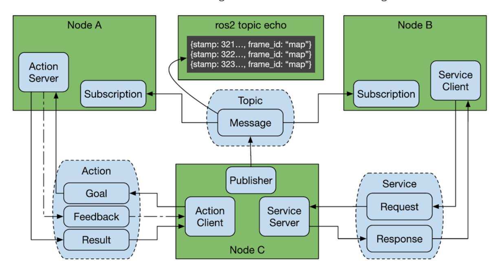
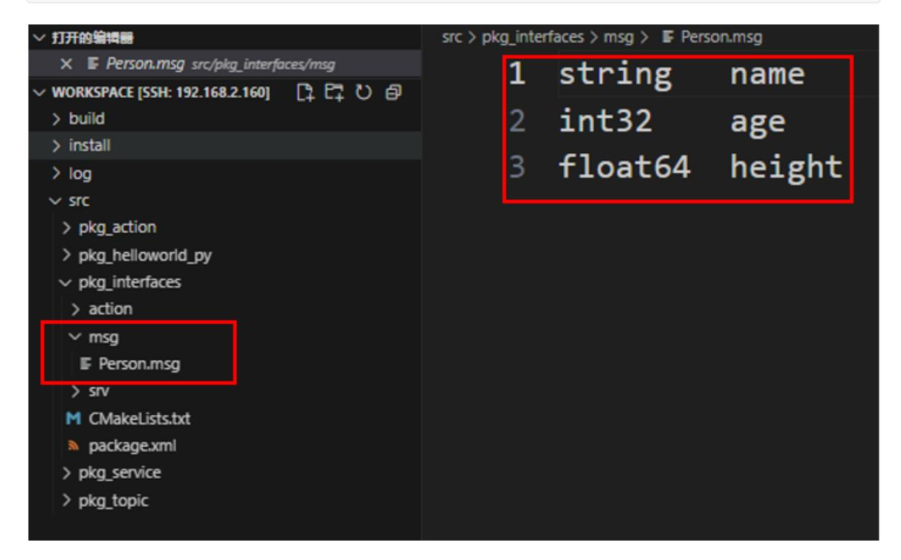
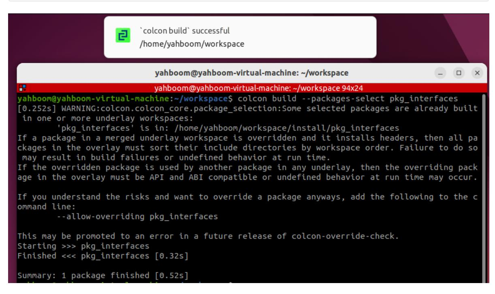
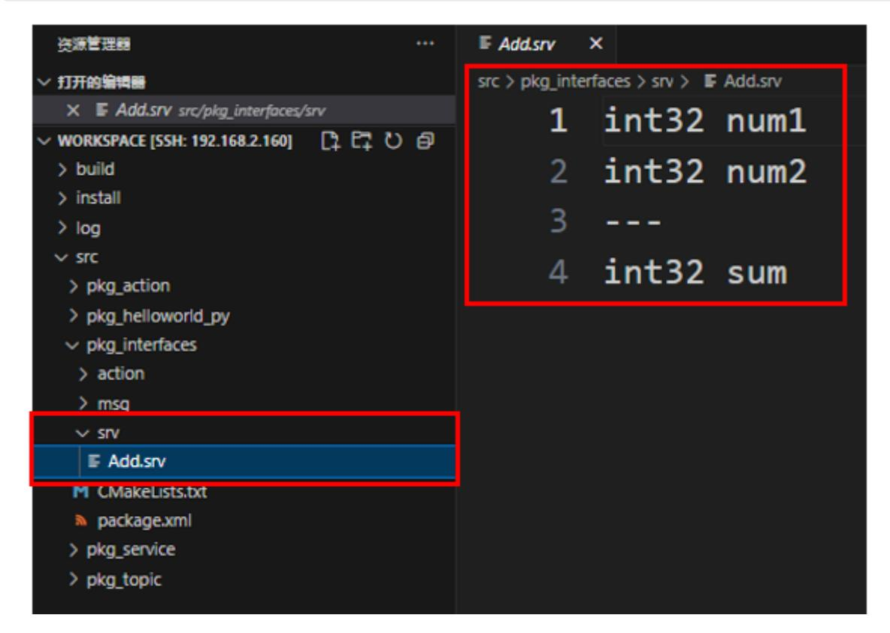

# 10. ROS2 Custom Interface Messages

#### 1. Introduction to Communication Interfaces

In the ROS system, whether it's topics, services, or actions, a key concept is used: the communication interface.

Communication isn't just one person talking to themselves; it's an exchange between two or more people. What's the content of this communication? To make it easier for everyone to understand, we can define a standard structure for the data being passed. This is the communication interface.

Interfaces reduce dependencies between programs, making it easier for us to use others' code and for others to use ours. This is the core goal of ROS: to reduce reinventing the wheel.



ROS has three common communication mechanisms: topics, services, and actions. Through the interfaces defined for each communication type, various nodes are organically connected.

#### 2. Creating a Custom Interface Process

The process for creating custom interface messages is similar to writing an executable program in a function package. The main steps are as follows:

- 1. Create the interface function package;
- 2. Create and edit the.msg file,.srv file, and.action file;
- 3. Edit the configuration file;
- 4. Compile;
- 5. Test.

## 3. Creating a Custom Action Communication Interface

In the [11. ROS2 Action Communication Server Implementation] example, we demonstrated the complete process for creating an action communication interface. You can review it first; we will not repeat it here.

## 4. Create a custom interface for topic communication

1. In the [ROS2 Action Communication Server Implementation] course, we created a custom interface package. Create a folder called msg in the package pkg_interfaces and a file called **Person.msg** in the msg folder. Enter the following content in the file:

```
string name
int32 age
float64 height
```



- 2. Add the following configuration to package.xml and CMakeLists.txt:
- CMakeLists.txt

```
rosidl_generate_interfaces(${PROJECT_NAME}
"action/Progress.action"
"msg/Person.msg"
)
```

package.xml

```
<buildtool_depend>rosidl_default_generators</buildtool_depend>
<exec_depend>rosidl_default_runtime</exec_depend>
<depend>action_msgs</depend>
<member_of_group>rosidl_interface_packages</member_of_group>
```

3. Enter the current workspace in the terminal and compile the function package:

colcon build --packages-select pkg_interfaces



- 4. Test whether the interface is functioning properly.
- First, refresh the environment variables.

```
source install/setup.bash
```

Check the interface type

```
ros2 interface show pkg_interfaces/msg/Person
```

Under normal circumstances, the terminal output will be consistent with the Person.msg file.

#### 5. Create a custom service communication interface

1. In the [ROS2 Action Communication Server Implementation] course, we created a custom interface function package. Create a new folder called srv under the function package pkg_interfaces. Create a new file called Add.srv within the srv folder and enter the following content in the file:

```
int32 num1
int32 num2
---
int32 sum
```



- 2. Add the following configuration to package.xml and CMakeLists.txt:
- CMakeLists.txt

```
rosidl_generate_interfaces(${PROJECT_NAME}
  "action/Progress.action"
  "msg/Person.msg"
  "srv/Add.srv"
)
```

package.xml

```
<buildtool_depend>rosidl_default_generators</buildtool_depend>
<exec_depend>rosidl_default_runtime</exec_depend>
<depend>action_msgs</depend>
<member_of_group>rosidl_interface_packages</member_of_group>
```

3. Enter the current workspace in the terminal and compile the feature package:

```
cd ~/yahboomcar_ros2_ws/yahboomcar_ws
colcon build --packages-select pkg_interfaces
source install/setup.bash
```

4. Testing

```
ros2 interface show pkg_interfaces/srv/Add
```

Under normal circumstances, the terminal will output the same content as the Person.msg file.
