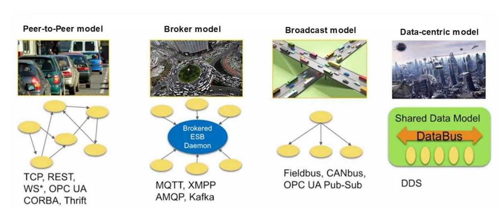
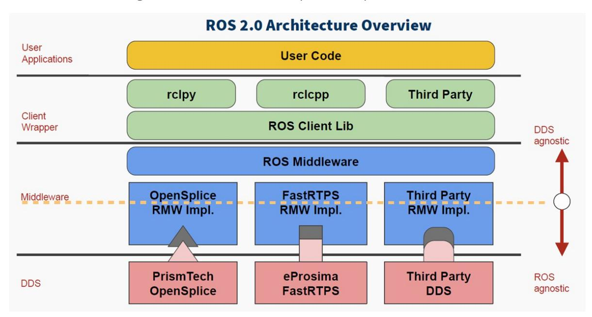
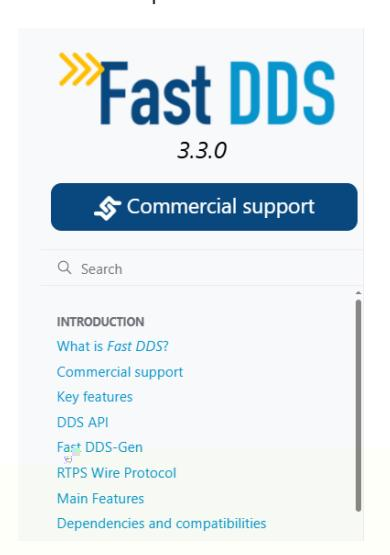

# 14. ROS2 DDS

## 1. Introduction to DDS

DDS stands for Data Distribution Service. Published and maintained by the Object Management Group (OMG) in 2004, it is a data distribution/subscription standard designed specifically for realtime systems. It was first adopted by the US Navy to address compatibility issues with large-scale software upgrades within the complex network environments of ships. It has now become a mandatory standard.

DDS emphasizes data-centricity and provides a rich set of quality-of-service policies to ensure real-time, efficient, and flexible data distribution, meeting the needs of various distributed realtime communication applications.

## References

- Fast DDS Official Documentation: [3.3.0](https://fast-dds.docs.eprosima.com/en/latest/)
- [ROS2 official document DDS advanced functions: Using Fast DDS Discovery Server as](https://docs.ros.org/en/humble/Tutorials/Advanced/Discovery-Server/Discovery-Server.html) discovery protocol community-contributed] — ROS 2 Documentation: Humble documentation

## 2. Communication Model

The topics, services, and actions we learned about in the previous course all rely on DDS for their underlying communication implementation. DDS is equivalent to the neural network in the ROS robot system.

The core of DDS is communication. Numerous models and software frameworks exist to implement this communication. Here we list four commonly used models.



- The first, the **Peer-to-Peer model**, involves many clients connecting to a single server. Each communication requires a connection between the two parties. As the number of communicating nodes increases, the number of connections also increases. Furthermore, each client needs to know the server's specific address and the services it provides. If the server's address changes, all clients are affected.
- The second, the **Broker model**, optimizes the peer-to-peer model. The broker centrally processes all requests and then identifies the roles that can truly respond to the service. This eliminates the need for clients to worry about the server's specific address. However, the problem is obvious: as the core, the broker's processing speed affects the efficiency of all

- nodes. Once the system scales to a certain level, the broker can become a performance bottleneck for the entire system. Furthermore, if the broker fails, the entire system can cease to function properly. The previous ROS1 system used a similar architecture.
- The third model is the **Broadcast model**, in which all nodes can broadcast messages on a channel and receive them. This model solves the server address problem and eliminates the need for separate connections between communicating parties. However, the sheer number of messages on the broadcast channel forces all nodes to pay attention to every message, many of which are irrelevant to them.
- The fourth model is the data-centric **DDS model**. This model is somewhat similar to the broadcast model, in which all nodes can publish and subscribe to messages on the DataBus. However, its advantage lies in the fact that communication involves multiple parallel pathways, allowing each node to focus only on messages of interest and ignore those it doesn't. It's a bit like a rotating hot pot, with all the delicious food being transferred across the DataBus. Each node only needs to take what it wants; the rest is irrelevant to it.

Of these communication models, DDS has a clear advantage.

# 3. Application of DDS in ROS2

DDS plays a crucial role in the ROS2 system. All upper-layer infrastructure is built on DDS. In this ROS2 architecture diagram, the blue and red components represent DDS.



Among the four major components of ROS, the addition of DDS greatly enhances the comprehensive capabilities of the distributed communication system. This allows us to avoid worrying about communication issues during robot development and focus more time on other application development components.

## 4. Quality of Service (QoS)

The basic structure in DDS is the domain. A domain binds applications together for communication. Recall that when we configured communication between the Raspberry Pi and the computer, the domain ID we configured earlier defines the grouping of the global data space. Only nodes within the same domain group can communicate with each other. This prevents useless data from occupying resources.

Another important feature of DDS is the quality of service (QoS).

QoS is a network transmission policy. Applications specify the desired network transmission quality behavior, and the QoS service implements this behavior to meet the client's communication quality requirements as much as possible. It can be thought of as a contract between data providers and receivers.

The policies are as follows:

- **DEADLINE** policy: This policy requires data to be transmitted within a certain deadline.
- **HISTORY** policy: This policy specifies the cache size for historical data.
- **RELIABILITY** policy: This policy specifies the data communication mode. Configuring BEST_EFFORT ensures smooth data transmission even when network conditions are poor, which may result in data loss. Configuring RELIABLE ensures reliable communication and maximizes image integrity. We can choose the appropriate communication mode based on the application scenario.
- **DURABILITY** policy: This policy ensures that a certain amount of historical data is sent to late-joining nodes, allowing new nodes to quickly adapt to the system.

# 5. Test Cases

## 5.1 Case 1—Configuring DDS via the Command Line

Open the first terminal and publish the topic using the following command:

```
ros2 topic pub /chatter std_msgs/msg/Int32 "data: 66" --qos-reliability
best_effort
```

Open another terminal and print the topic using a different QoS. If the QoS policy used differs from the publisher's, a warning message will appear indicating that the topic data cannot be received properly:

```
ros2 topic echo /chatter --qos-reliability reliable
```

We can receive topic data using the same QoS policy as the topic publisher.

```
ros2 topic echo /chatter --qos-reliability best_effort
```

## 5.2 Example 2—Configuring QoS Service Policies for Topic Nodes

Create a new function package using the following command

```
ros2 pkg create learning_dds --build-type ament_python --dependencies rclpy
std_msgs
```

Create a new file, dds_controller_pub.py, as the publisher for topic communication. Fill in the following content:

```
import rclpy
from rclpy.node import Node
from std_msgs.msg import String
# Import QoS related classes
from rclpy.qos import QoSProfile, QoSReliabilityPolicy, QoSHistoryPolicy
class ControllerPublisher(Node):
   def __init__(self, name):
       super().__init__(name)
       #1. Configure QoS policy: reliable transmission, retain the last
historical data
       self.qos_profile = QoSProfile(
           reliability=QoSReliabilityPolicy.RELIABLE, # Reliable transmission
(retransmission of lost data)
           history=QoSHistoryPolicy.KEEP_LAST, # Keep the last N pieces
of data
           depth=1 # Keep 1 historical data
       )
       # 2. Create a publisher: topic name /robot_cmd, message type String, QoS
policy
       self.publisher = self.create_publisher(
           String,
           "/robot_cmd",
           self.qos_profile
       )
       # 3. Create a timer: send a command once per second
       self.timer = self.create_timer(1.0, self.timer_callback)
       self.cmd_list = ["forward", "backward", "stop"] # Instruction List
       self.cmd_index = 0 #Instruction index, loop switching
   def timer_callback(self):
       # Cycle switching instructions (forward → backward → stop → forward...)
       current_cmd = self.cmd_list[self.cmd_index % 3]
       # Create a message and fill it with data
       msg = String()
       msg.data = current_cmd
       # Publish a message
       self.publisher.publish(msg)
       # Print log (shows issued commands)
       self.get_logger().info(f"发布控制指令:{msg.data}")
       # Update command index
       self.cmd_index += 1
```

```
def main(args=None):
    # Initializing ROS2
    rclpy.init(args=args)
    # Create a publisher node
    node = ControllerPublisher("robot_controller_pub")
    # Looping nodes
    rclpy.spin(node)
    # Destroy the node and shut down ROS2
    node.destroy_node()
    rclpy.shutdown()
if __name__ == "__main__":
    main()
```

To implement the subscriber code, create a new dds_robot_sub.py file and fill in the following subscriber implementation code

```
import rclpy
from rclpy.node import Node
from std_msgs.msg import String
from rclpy.qos import QoSProfile, QoSReliabilityPolicy, QoSHistoryPolicy
class RobotSubscriber(Node):
    def __init__(self, name):
        super().__init__(name)
        # 1. Configure a QoS policy compatible with the publisher
        self.qos_profile = QoSProfile(
            reliability=QoSReliabilityPolicy.BEST_EFFORT,
            history=QoSHistoryPolicy.KEEP_LAST,
            depth=1
        )
        # 2. Create a subscriber: topic name/robot_cmd, callback function, QoS
policy
        self.subscription = self.create_subscription(
            String,
            "/robot_cmd",
            self.cmd_callback, # Callback function executed after receiving
data
            self.qos_profile
        )
    def cmd_callback(self, msg):
        # Callback function: Processes received instructions
        self.get_logger().info(f"接收控制指令:{msg.data} → 执行对应动作")
def main(args=None):
    rclpy.init(args=args)
    node = RobotSubscriber("robot_subscriber")
    rclpy.spin(node)
    node.destroy_node()
    rclpy.shutdown()
```

```
if __name__ == "__main__":
    main()
```

Configure the compilation file (setup.py)

```
entry_points={
    'console_scripts': [
        # Publisher node: command name = package name. file name: main function
        'dds_controller_pub = learning_dds.dds_controller_pub:main',
        # Subscriber Node
        'dds_robot_sub = learning_dds.dds_robot_sub:main',
    ],
},
```

Open the terminal in the workspace directory and compile the function package

colcon build --packages-select learning_dds

Set environment variables. You need to set environment variables every time you recompile.

```
source install/setup.bash
```

Running publisher and subscriber nodes

```
ros2 run learning_dds dds_controller_pub
```

## Advanced Robot Development:

- Typically, publishers and subscribers of topic communications should maintain the same QoS communication strategy to avoid potential communication layer issues.
- QoS communication strategy settings should be selected based on the specific application scenario.
- If the application scenario involves drone communication, encrypted communication, realtime communication, or other scenarios with special communication layer requirements, the official Fast-DDS manual is included in the tutorial introduction for a more detailed description of DDS features.




