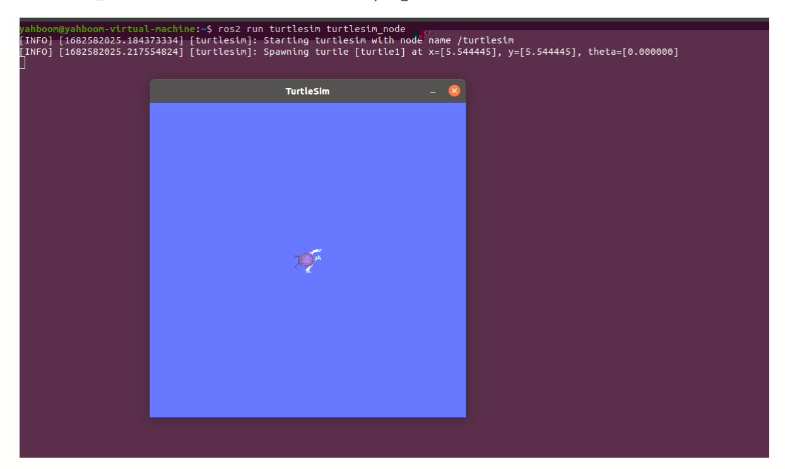

# 16. ROS2 Common Command Tools

### 1. Package Management Tool ros2 pkg

#### 1.1. ros2 pkg create

Function: Creates a package. When creating a package, you must specify the package name, compilation method, dependencies, etc.

Format:

```
ros2 pkg create <package_name> --build-type <build-type> --dependencies
<dependencies>
```

In the ros2 command:

- **pkg**: Indicates the functions associated with the package;
- **create**: Indicates the creation of a package;
- **package_name**: Required: The name of the new package;
- **build-type**: Required: Indicates whether the newly created package is C++ or Python. If using C++ or C, follow ament_cmake; if using Python, follow ament_python;
- **dependencies**: Optional: Indicates the package's dependencies. C++ packages must include rclcpp; Python packages must include rclpy, as well as other required dependencies.

#### 1.2, ros2 pkg list

Function: View the list of packages in the system

Format:

```
ros2 pkg list
```

#### 1.3. ros2 pkg executables

Function: View all executable files in a package

Format:

ros2 pkg executables pkg_name

### 2. Node Run ros2 run

Function: Run the node program in the package

Format:

ros2 run pkg_name node_name

- pkg_name: Package name
- node_name: The name of the executable program



## 3. Node-Related Tools: ros2 node

#### 3.1. ros2 node list

Function: Lists all node names in the current domain

Format:

ros2 node list

#### 3.2. ros2 node info

Function: View detailed node information, including subscriptions, published messages, enabled services, and actions.

Format:

```
ros2 node info node_name
```

node_name: The name of the node to be viewed.

### 4. Topic-Related Tools: ros2 topic

#### 4.1. ros2 topic list

Function: List all topics in the current domain

Format:

```
ros2 topic list
```

### 4.2. ros2 topic info

Function: Display topic message type and number of subscribers/publishers

Format:

```
ros2 topic info topic_name
```

topic_name: The name of the topic to be queried.

#### 4.3, ros2 topic type

Function: View the message type of a topic

Format:

```
ros2 topic type topic_name
```

topic_name: The name of the topic type to be queried.

#### 4.4, ros2 topic hz

Function: Display the average publishing frequency of a topic.

Format:

```
ros2 topic hz topic_name
```

topic_name: The name of the topic whose frequency you want to query.

### 4.5, ros2 topic echo

Function: Print topic messages on the terminal, similar to a subscriber.

Format: ros2 topic echo topic_name

topic_name: The name of the topic whose messages you want to print.

#### 4.5, ros2 topic pub

Function: Publish a message on a specified topic on the terminal.

Format:

```
ros2 topic pub topic_name message_type message_content
```

- topic_name: The name of the topic whose messages you want to publish.
- message_type: The data type of the topic.
- message_content: Message content

The default is to publish at a 1Hz frequency. The following parameters can be set:

- Parameter -1 to publish only once, ros2 topic pub -1 topic_name message_type message_content
- Parameter -t count to publish count times, ros2 topic pub -t count topic_name message_type message_content
- Parameter -r count to publish at a count Hz frequency, ros2 topic pub -r count topic_name message_type message_content

#### Example:

- Publish velocity commands via the command line
- Note that there is a space after each colon; otherwise, a format error will be displayed.

```
ros2 topic pub turtle1/cmd_vel geometry_msgs/msg/Twist "{linear: {x: 0.5, y: 0.0,
z: 0.0}, angular: {x: 0.0, y: 0.0, z: 0.2}}"
```

### 5. Interface-Related Tools: ros2 interface

### 5.1. ros2 interface list

Function: Lists all interfaces in the current system, including topics, services, and actions.

Format:

ros2 interface list

#### 5.2. ros2 interface show

Function: Displays the detailed information of a specified interface

Format:

```
ros2 interface show interface_name
```

interface_name: The name of the interface to be displayed

### 6. Service-Related Tools ros2 service

#### 6.1. ros2 service list

Function: Lists all services in the current domain

Format:

ros2 interface show interface_name

#### 6.2, ros2 service call

Function: Call a specified service

Format:

ros2 interface call service_name service_Type arguments

- service_name: The service to be called
- service_type: The service data type
- arguments: The parameters required to provide the service

For example, to call the turtle spawn service

ros2 service call /spawn turtlesim/srv/Spawn " $\{x: 2, y: 2, theta: 0.2, name: 'turtle10'\}$ "

```
yahboom@yahboom-virtual-machine:-$ ros2 service call /spawn turtlesim/srv/Spawn "{x: 2, y: 2, theta: 0.2, name: ''}"
requester: making request: turtlesim.srv.Spawn_Request(x=2.0, y=2.0, theta=0.2, name='')
response:
turtlesim.srv.Spawn_Response(name='turtle2')
yahboom@yahboom-virtual-machine:-$
yahboom@yahboom-virtual-machine:-$

Turtlesim - S
```
