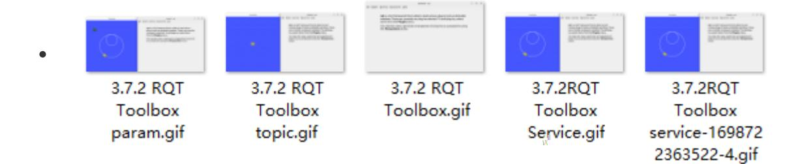
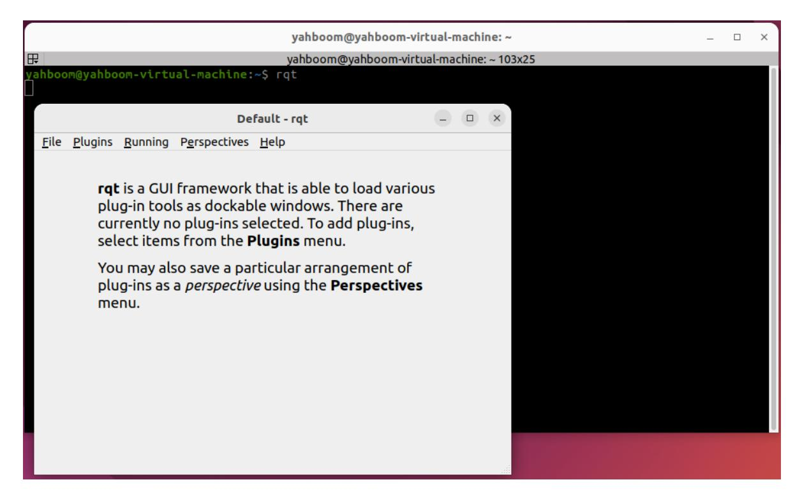
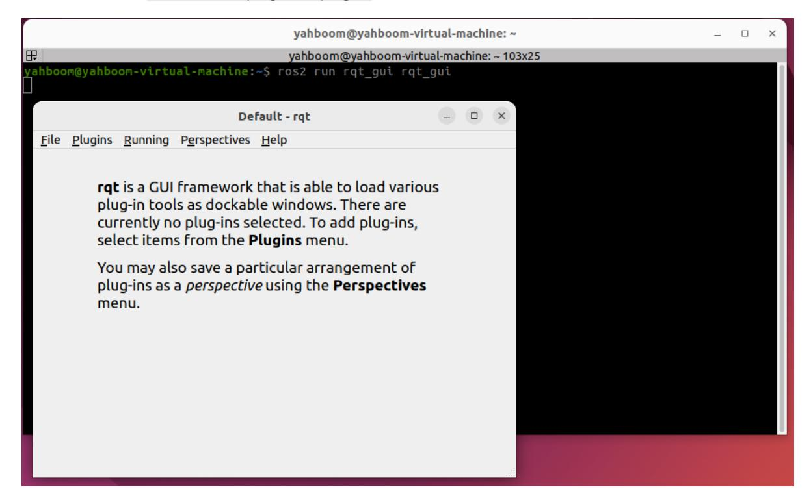
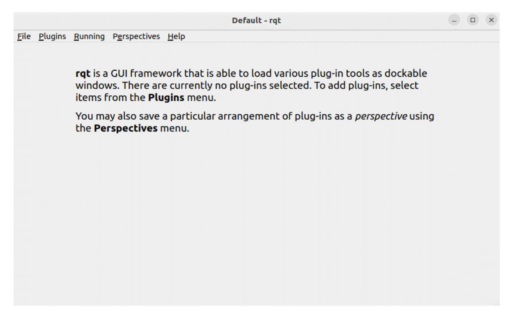
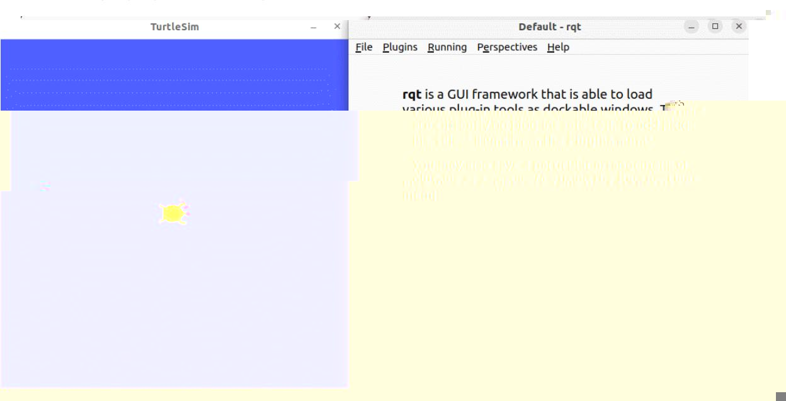
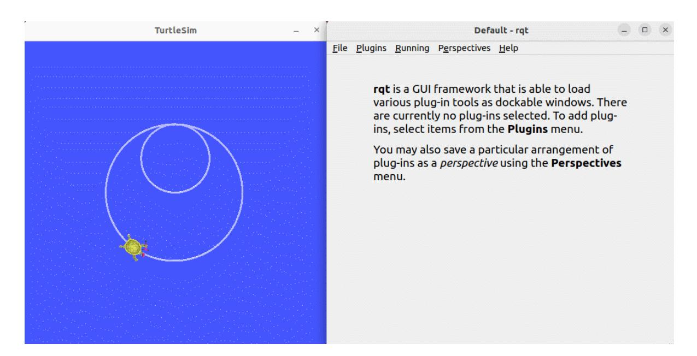
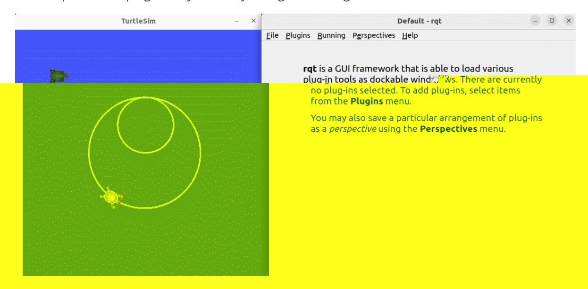

# 18. ROS2 Rqt Toolbox

This tutorial folder contains a demo animation git file, which provides a visual guide to the process of implementing the examples in this section.

## 1. Introduction to Rqt

Rqt is another modular visualization tool provided by ROS. Like RViz, it is based on the QT visualization tool. Before using it, you need to install it using the following command. Then, you can start it with the command rqt.

## 2. Installation

- Generally, the RQT toolbox is installed by default if you install the desktop version.
- If you do not install the full version when installing ROS and need to install it, you can install it as follows:

sudo apt install ros-\${ROS_DISTRO}-rqt\*

## 3. Startup

Common RQT startup commands include:

Method 1: rqt

Method 2: ros2 run rqt_gui rqt_gui

## 4. Plugin Usage

After starting RQT, you can add the required plugins through the plugins section:

The plugins section includes plugins related to topics, services, actions, parameters, logging, and more. You can select plugins as needed to facilitate debugging of ROS2 programs. An example usage is shown below.

#### 4.1. Topic Plugin

Add the topic plugin and send speed commands to control the turtle's movement.

#### 4.2. Service Plugin

Add the service plugin and send a request to spawn a turtle at a specified location.

#### 4.3. Parameter Plugin

Use the parameter plugin to dynamically change the background color of the turtle window.

