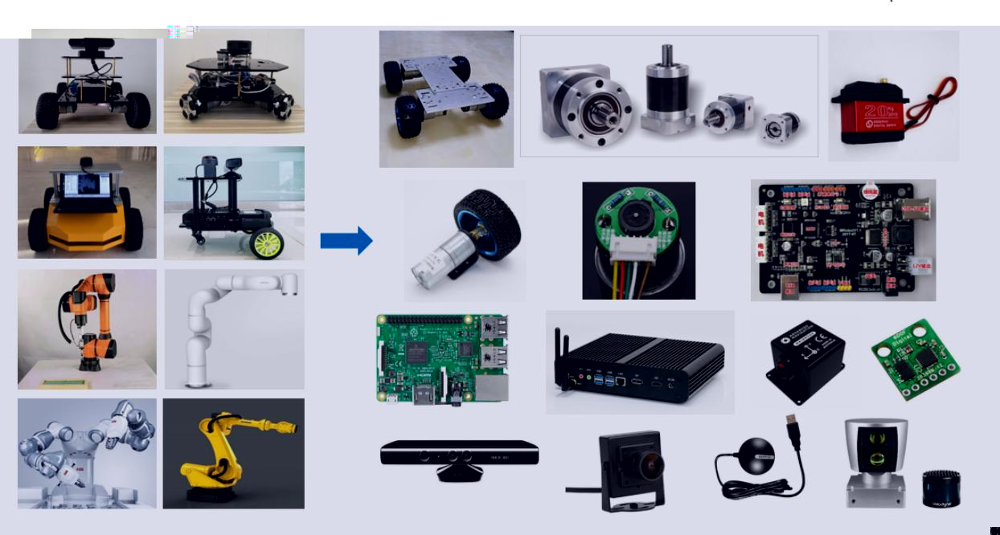
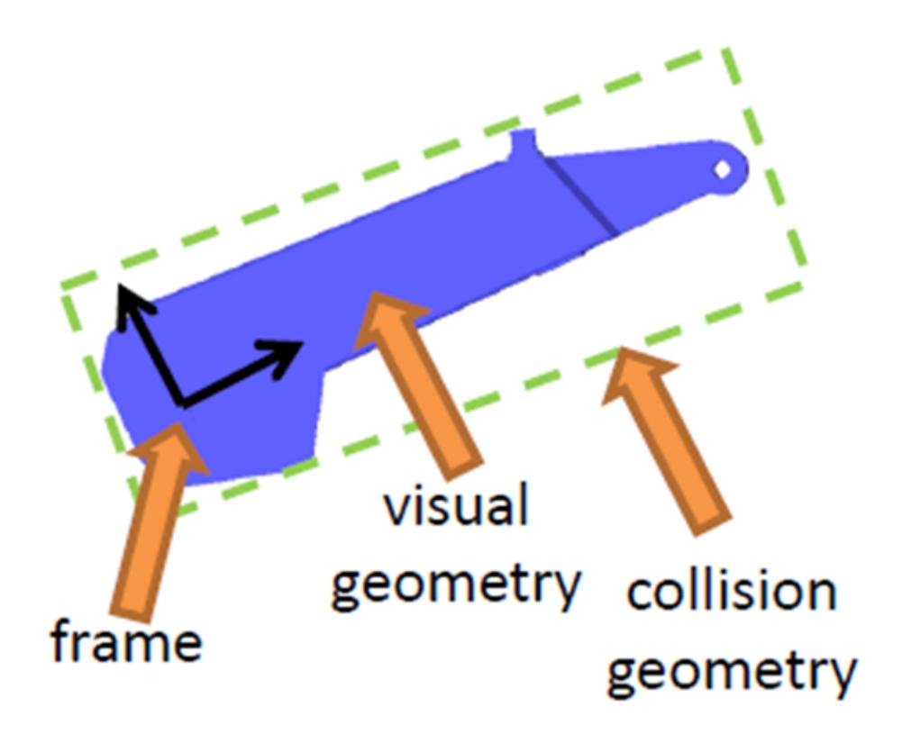
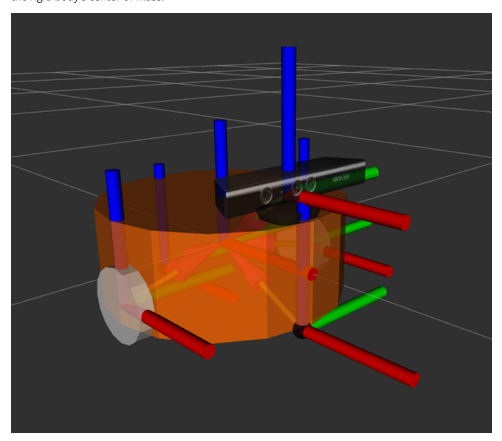
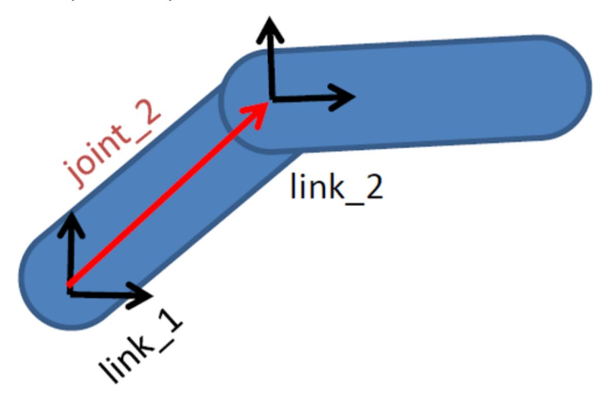
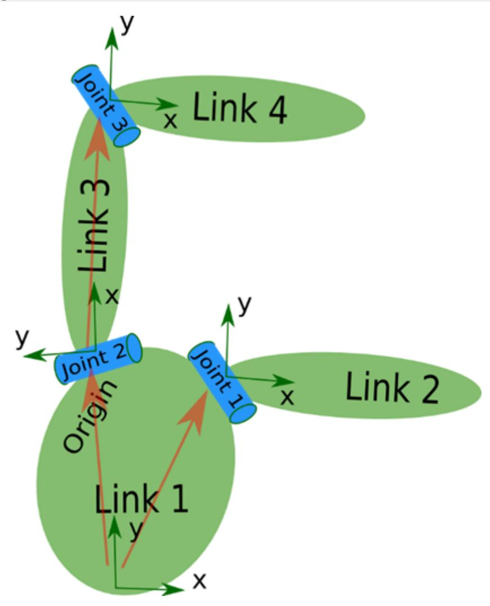
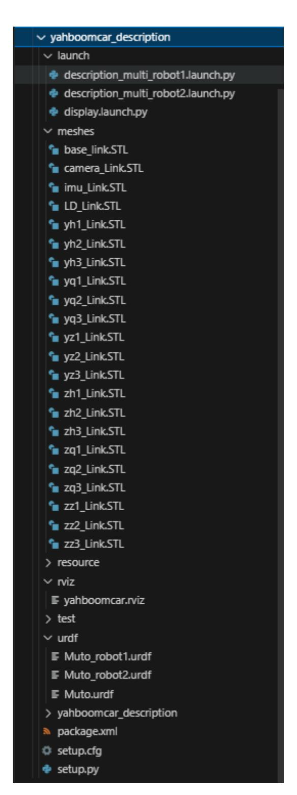
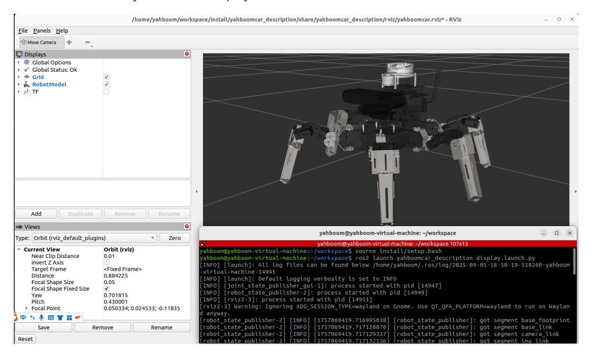

# 21. ROS2 URDF Model

# 1. Introduction to URDF

The modeling method in ROS is called URDF, which stands for Unified Robot Description Format. It not only clearly describes the robot model itself, but also describes the robot's external environment. URDF model files use the XML format.

SolidWorks model to URDF plugin: [sw_urdf_exporter - ROS Wiki](https://wiki.ros.org/sw_urdf_exporter)

## 2. Robot Components

When modeling and describing a robot, we first need to be familiar with the robot's components and parameters. For example, a robot is generally composed of four major components: hardware structure, drive system, sensor system, and control system. Common robots on the market, whether mobile robots or robotic arms, can be broken down into these four components.

- The hardware structure refers to the tangible components, such as the chassis, housing, and motors.
- The drive system is the equipment that enables these components to function properly, such as the motor driver and power management system.
- The sensor system includes encoders on the motor, an onboard IMU, installed cameras, radar, and more, enabling the robot to sense its own state and external environment.
- The control system is the primary vehicle for our development process, typically a computing platform like a Raspberry Pi or a computer, along with its operating system and application software.

The robot modeling process follows a similar approach, using a modeling language to clearly describe each component of the robot and then assemble them.

## 3. URDF Syntax

#### 3.1. Link Description

The tag is used to describe the appearance and physical properties of a robot's rigid body. Appearance includes size, color, and shape, while physical properties include mass, inertia matrix, collision parameters, and so on.

Taking this robotic arm link as an example, its link description is as follows:

The name in the link tag represents the name of the link. We can customize it, and this name will be used when connecting joints to links in the future.

The section of the link describes the robot's appearance. For example:

 represents the geometric shape. is used to call a pre-designed blue appearance in 3D software. This is the STL file, which looks identical to the real robot.

 represents the offset of the coordinate system relative to the initial position, including translation in the x, y, and z directions, and roll, pitch, and raw rotations. If no offset is required, all values are 0.

The second section,, describes the collision parameters. While the content appears to be the same as, including and, there are actually significant differences.

- focuses on describing the robot's appearance, that is, its visual effects.
- describes the robot's state during motion, such as how contact with the outside world is considered a collision.

In this robot model, the blue part is described using. In actual control, such a complex appearance requires high computational power for collision detection. To simplify the calculations, we've simplified the collision detection model to a cylinder outlined in green, which is the shape described by in. The coordinate system offset is similar and can describe the offset of the rigid body's center of mass.

For mobile robots, links can also be used to describe the body, wheels, and other components of the robot.

### 3.2 Joint Description

Rigid bodies in a robot model must ultimately be connected through joints to generate relative motion.

Joints in URDF have six types of motion.

| Joint Type | Description                                                                      |
|------------|----------------------------------------------------------------------------------|
| continuous | Revolute joints allow infinite rotation around a single axis.                    |
| revolute   | Revolute joints are similar to continuous joints, but have angular limits.       |
| prismatic  | Sliding joints move along a specific axis with position limits.                  |
| fixed      | Fixed joints are special joints that do not allow motion.                        |
| floating   | Floating joints allow translation and rotation.                                  |
| planar     | Planar joints allow translation or rotation in directions orthogonal to a plane. |

- 1. Continuous: This describes rotational motion. It can rotate infinitely around a specific axis. For example, the wheels of a cart fall into this category.
- 2. Revolute: This is also a revolute joint. Unlike the continuous type, it cannot rotate infinitely but has angle limits. For example, the two links in a robotic arm fall into this category.
- 3. Prismatic: This is a sliding joint. It can translate along a specific axis and also has position limits. Linear motors typically use this type of motion.
- 4. Fixed: This is the only type of joint that doesn't allow for movement, but it's still quite commonly used. For example, a camera link mounted on a robot doesn't change its relative position. In this case, the connection type used is Fixed.
- 5. Floating: This is a floating joint. The sixth type, Planar, is a planar joint. These two are relatively less commonly used.

In a URDF model, each link is described using an XML file, such as the name of the joint and the type of motion.

- parent tag: describes the parent link;
- child tag: describes the child link, which moves relative to the parent link;
- origin: indicates the relationship between the two link coordinate systems, represented by the red vector in the image, which can be understood as how the two links are mounted together;
- axis: indicates the unit vector of the joint's motion axis. For example, if z is equal to 1, the rotation is about the positive z-axis;
- limit: indicates any limitations on the motion, such as minimum position, maximum position, and maximum speed.

# 4. Complete Robot Model

Finally, all the link and joint tags describe and combine each part of the robot. Placed within a single robot tag, this forms the complete robot model.

So, when looking at a URDF model, don't rush to delve into the details of each block of code. First, look for links and joints to understand the robot's components. Once you understand the overall picture, then delve into the details.

### 4.1. Creating a Robot Model

Using the muto model as an example, copy the yahboomcar_description package from this tutorial's folder to the src directory of your workspace:

- urdf: Stores the robot model's URDF or XACR file
- meshes: Stores the model rendering files referenced in the URDF
- launch: Stores the relevant startup files
- RViz: Stores the RViz configuration file

Then compile the package.

colcon build --packages-select yahboomcar_description

### 4.2. Model Visualization

Refresh the environment variables and run the launch command.

ros2 launch yahboomcar_description display.launch.py

RViz will automatically launch and display the robot model:

