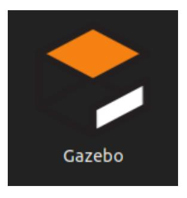
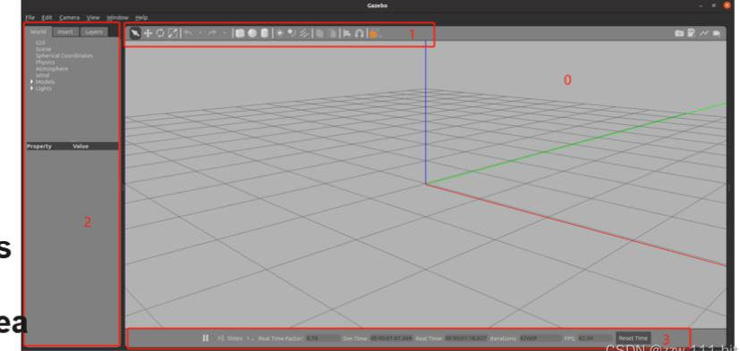
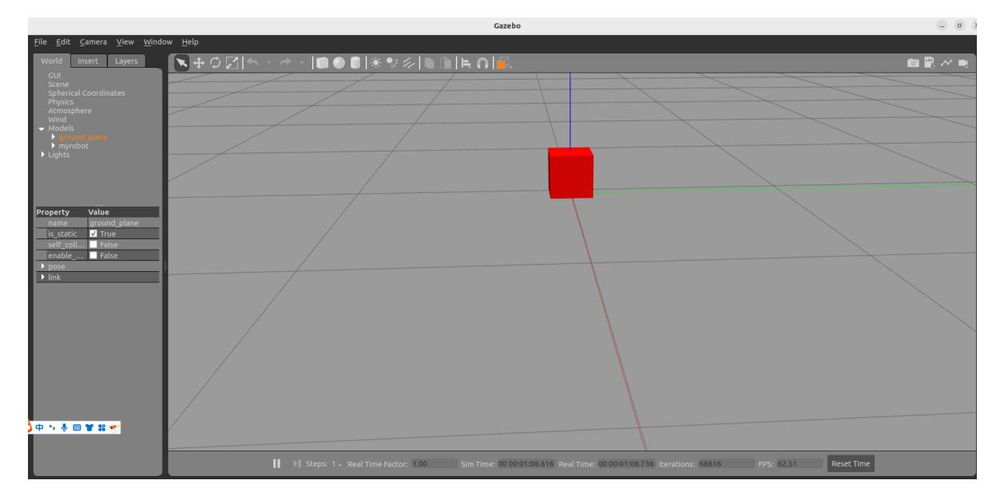

# 22. ROS2 Gazebo Simulation Platform

## 1. Introduction to Gazebo

Gazebo is the most commonly used 3D physics simulation platform in the ROS system. It supports a dynamics engine and enables high-quality graphics rendering. It not only simulates the robot and its surrounding environment, but also incorporates physical properties such as friction and elasticity.

For example, if we want to develop a Mars rover, we can simulate the Martian surface environment in Gazebo. Or, if we're developing a drone, battery life and flight restrictions prevent us from frequently experimenting with the actual drone. In these cases, we can use Gazebo to simulate first, then deploy to the actual drone once the algorithm is fully developed.

Simulation platforms like Gazebo can help us verify robotic algorithms, optimize robot designs, and test robot applications, providing more possibilities for robotics development.

**Note: This section is for learning purposes only. The tutorial does not configure the environment because we are using real-device debugging**

#### 2. Installation and Operation

Install gazebo using the apt command

sudo apt install ros-\${ROS_DISTRO}-gazebo-\*

- Run gazebo
- Launch gazebo using the following command or directly from the desktop icon

gazebo --verbose -s libgazebo_ros_init.so -s libgazebo_ros_factory.so



After running, you should see the following page:



Optional: To ensure smooth model loading, you can download the offline model and place it [in the ~/.gazebo/models directory. The download link is as follows: https://github.com/osrf/g](https://github.com/osrf/gazebo_models) azebo_models

## 3. Start the Gazebo Node and Service

1. View the Node

ros2 node list

Correct return: /gazebo

2. View the external services provided by the node:

```
ros2 service list
```

You can see the following results:

Excluding the last few regular services, we will only focus on the first three special services:

- /spawn_entity, used to load models into gazebo
- /get_model_list, used to obtain a model list
- /delete_entity, used to delete loaded models in gazebo

## 4. Create a function package

Create a myrobot package to store our URDF model and launch files.

```
ros2 pkg create myrobot --build-type ament_cmake
```

Go to the myrobot directory and create folders launch and urdf. Within the urdf folder, create a file called demo01_base.urdf. This file is a simple demonstration file containing only a basic cube.

```
<robot name="myrobot">
    <link name="base_link">
        <visual>
            <geometry>
                <box size="0.2 0.2 0.2"/>
            </geometry>
            <origin xyz="0.0 0.0 0.0"/>
        </visual>
        <collision>
            <geometry>
                <box size="0.2 0.2 0.2"/>
            </geometry>
            <origin xyz="0.0 0.0 0.0"/>
        </collision>
        <inertial>
            <mass value="0.1"/>
            <inertia ixx="0.000190416666667" ixy="0" ixz="0" iyy="0.0001904"
iyz="0" izz="0.00036"/>
        </inertial>
    </link>
    <gazebo reference="base_link">
        <material>Gazebo/Red</material>
    </gazebo>
</robot>
```

## 5. Writing the launch file

Writing a launch file consists of two main parts: launching the Gazebo file and then loading the robot model into Gazebo.

```
start_gazebo_cmd = ExecuteProcess(
        cmd=['gazebo', '--verbose','-s', 'libgazebo_ros_init.so', '-s',
'libgazebo_ros_factory.so'],
        output='screen')
```

This command starts Gazebo. It is a simple startup command and is not particularly complicated. Here is the command to load the model:

```
spawn_entity_cmd = Node(
        package='gazebo_ros',
        executable='spawn_entity.py',
        arguments=['-entity', robot_name_in_model, '-file', urdf_model_path ],
output='screen')
```

Note the following two parameters in this command: -entity is the name of the model file, and file is the parameter loaded through the urdf file. Later we can also see how the model is loaded through the topic. Create a bringup_model.launch.py file in the launch directory. The complete startup file is as follows:

```
import os
from launch import LaunchDescription
from launch.actions import ExecuteProcess
from launch_ros.actions import Node
from launch_ros.substitutions import FindPackageShare
from launch_ros.parameter_descriptions import ParameterValue
from launch.substitutions import Command
def generate_launch_description():
    robot_name_in_model = 'myrobot'
    package_name = 'myrobot'
    urdf_name = "demo01_base.urdf"
    ld = LaunchDescription()
    pkg_share = FindPackageShare(package=package_name).find(package_name)
    urdf_model_path = os.path.join(pkg_share, f'urdf/{urdf_name}')
    # Start Gazebo server
    start_gazebo_cmd = ExecuteProcess(
        cmd=['gazebo', '--verbose','-s', 'libgazebo_ros_init.so', '-s',
'libgazebo_ros_factory.so'],
        output='screen')
    # Launch the robot
    spawn_entity_cmd = Node(
        package='gazebo_ros',
        executable='spawn_entity.py',
        arguments=['-entity', robot_name_in_model, '-file', urdf_model_path ],
output='screen')
    ld.add_action(start_gazebo_cmd)
```

```
ld.add_action(spawn_entity_cmd)
return ld
```

Fill in the following content in Cmakelist to install our urdf and launch folders into the install directory

```
install(
    DIRECTORY urdf launch
    DESTINATION share/${PROJECT_NAME}
)
```

Then compile and run the function package

```
colcon build --packages-select myrobot
```

Refresh the environment variables and run the launch startup file

ros2 launch myrobot bringup_model.launch.py



You can see the red model because you added the Gazebo tag settings.
