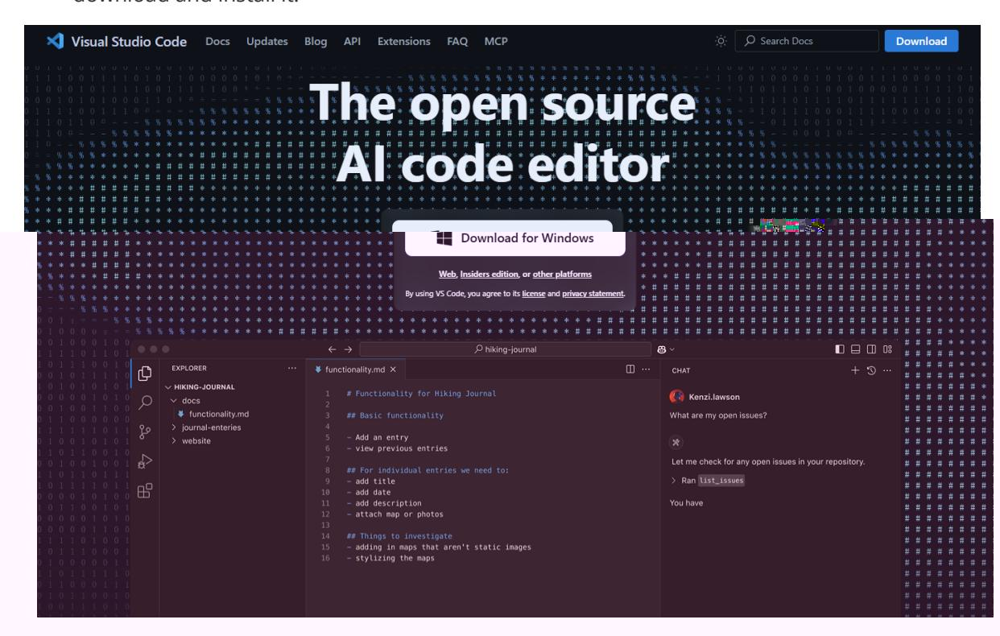
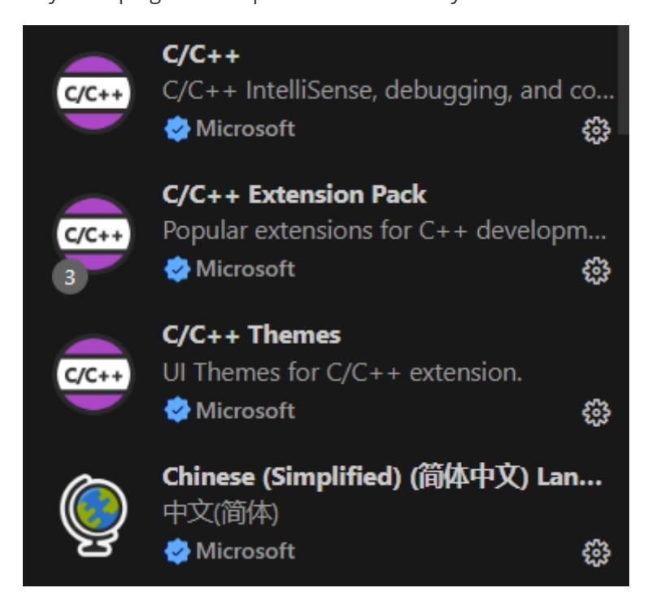
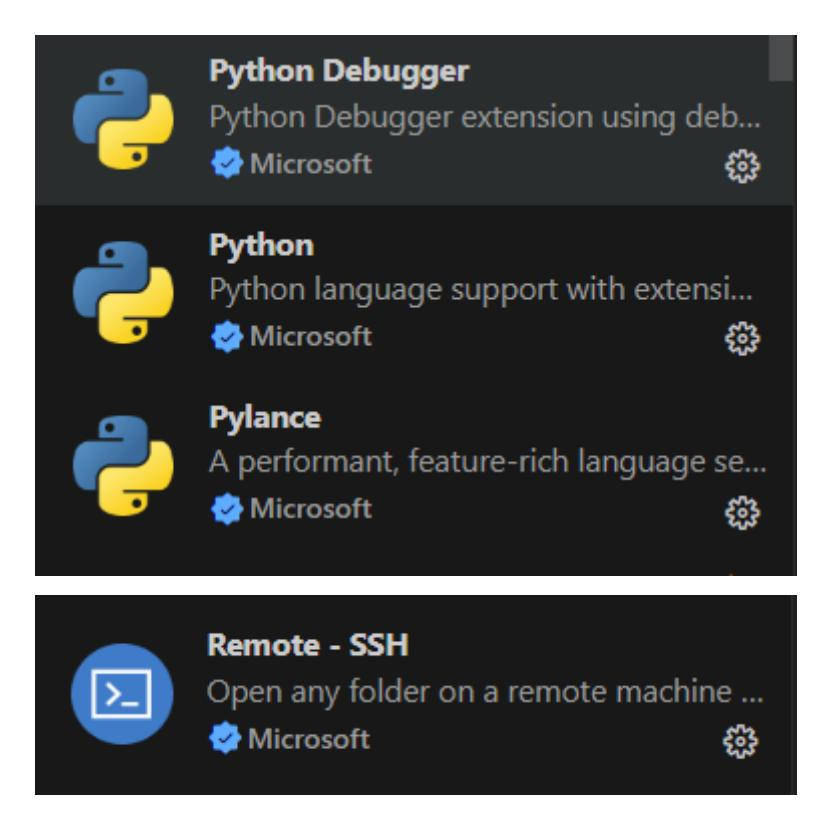
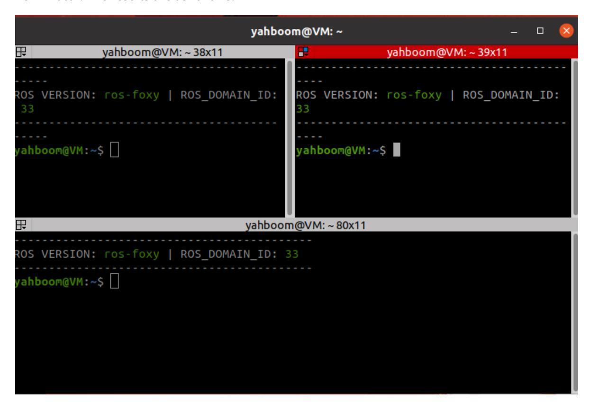
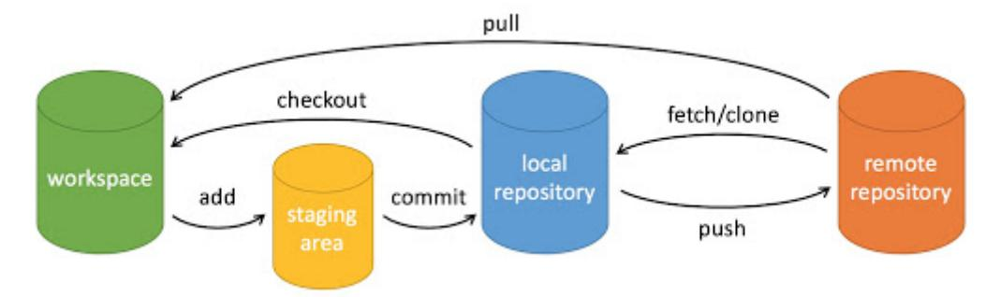

# 3. ROS2 development environment

In theory, you can write basic ROS2 programs in Notepad, but to improve development efficiency, you can install the integrated development environment (VSCode).

## 1. Using the VSCode development environment

Search for "VSCode" in your browser, select the installation package for your platform, download and install it.



Install commonly used plug-ins to improve work efficiency.





## 2. Using the Terminal

In ROS2, you'll frequently use the terminal. We recommend a relatively easy-to-use terminal: Terminator. The results are as follows:



#### 2.1. Installation

sudo apt install terminator

### 2.2. Launching

```
Shortcut `Ctrl+Alt+T` to launch
```

### 2.3. Common Terminator Shortcuts

About operations within the same tab:

```
Alt+Up // Move to the upper terminal
Alt+Down // Move to the lower terminal
Alt+Left // Move to the left terminal
Alt+Right // Move to the right terminal
Ctrl+Shift+O // Split terminal horizontally
Ctrl+Shift+E // Split terminal vertically
Ctrl+Shift+Right // Move the splitter bar to the right in a
vertically split terminal
Ctrl+Shift+Left // Move the splitter bar to the left in a
vertically split terminal
Ctrl+Shift+Up // Move the splitter bar up in a horizontally
split terminal
Ctrl+Shift+Down // Move the splitter bar down in a horizontally
split terminal
Ctrl+Shift+S // Hide/Show scroll bars
Ctrl+Shift+F //Search
Ctrl+Shift+C //Copy the selected content to the clipboard
Ctrl+Shift+V //Paste the clipboard content here
Ctrl+Shift+W //Close the current terminal
Ctrl+Shift+Q //Exit the current window, all terminals in the
current window will be closed
Ctrl+Shift+X //Maximize the current terminal
Ctrl+Shift+Z //Maximize the current terminal and enlarge the
font
Ctrl+Shift+N or Ctrl+Tab //Move to the next terminal
Ctrl+Shift+P or Ctrl+Shift+Tab //Crtl+Shift+Tab moves to the previous terminal
```

About operations between tabs:

```
F11 //Full screen switch
Ctrl+Shift+T //Open a new tab
Ctrl+PageDown //Move to the next tab
Ctrl+PageUp //Move to the previous tab
Ctrl+Shift+PageDown //Exchange the current tab with the tab after it
Ctrl+Shift+PageUp //Exchange the current tab with the tab before
it
Ctrl+Plus (+) //Increase the font
Ctrl+Minus (-) //Decrease the font
Ctrl+Zero (0) // Restore the font to its original size
Ctrl+Shift+R // Reset the terminal state
Ctrl+Shift+G // Reset the terminal state and clear the screen
Super+g // Bind all terminals so that input into one
terminal is automatically input into all terminals
Super+Shift+G // Unbind
Super+t // Bind all terminals in the current tab so that
input into one terminal is automatically input into the other terminals
Super+Shift+T // Unbind
```

```
Ctrl+Shift+I // Open a new window; the new window will use
the same process as the original window
Super+i // Open a new window; the new window will use a
different process than the original window
```

### 3. Using Git

#### 3.1. Installation

Since daily work involves teamwork and version management, Git is an essential skill. Git is a free and open source distributed version control system. To install Git in Ubuntu:

```
sudo apt install git
```

#### 3.2. Basic Git Operations

Git's job is to create and save snapshots of your project and compare them with subsequent snapshots.

This chapter introduces commands for creating and committing your project snapshots.

Git uses the following six commands: **git clone**, **git push**, **git add**, **git commit**, **git checkout**, and **git pull**. We'll explain them in detail later.



#### Description:

- workspace: Workspace
- staging area: Staging area
- local repository: Repository or local repository
- remote repository: Remote repository

A simple step-by-step guide:

```
$ git init
$ git add .
$ git commit
```

- git init Initializes the repository.
- git add. Adds files to the staging area.
- git commit Adds the contents of the staging area to the repository.

#### 3.2.1. Repository Creation Commands

The following table lists the Git commands for creating repositories:

| Command   | Description                                                             |
|-----------|-------------------------------------------------------------------------|
| git init  | Initializes a repository                                                |
| git clone | Makes a copy of a remote repository, essentially downloading a project. |

#### 3.2.2. Committing and Modifying

Git's job is to create and save snapshots of your project and compare them with subsequent snapshots.

The following table lists the commands for creating and committing snapshots of your project:

| Command                                    | Description                                                                                                |
|--------------------------------------------|------------------------------------------------------------------------------------------------------------|
| git add                                    | Adds files to the staging area                                                                             |
| git status                                 | Views the current status of the repository, showing modified files.                                     |
| git diff                                   | Compares file differences, that is, the differences between the staging area and the working directory. |
| git commit                                 | Commits the staging area to the local repository.                                                          |
| git reset                                  | Roll back a revision.                                                                                      |
| git rm                                     | Remove a file from the staging area and the working directory.                                             |
| git mv                                     | Move or rename a file in the working directory.                                                            |
| git checkout                               | Switch branches.                                                                                           |
| git switch (introduced in Git 2.23)  | Switch branches more cleanly.                                                                              |
| git restore (introduced in Git 2.23) | Revert or undo changes to a file.                                                                          |

#### 3.2.3. Commit Log

| Command                 | Description                                                    |
|-------------------------|----------------------------------------------------------------|
| git log                 | View historical commits                                        |
| git blame <file></file> | View the modification history of a specified file in list form |

#### 3.2.4. Remote Operations

| Command    | Description                            |
|------------|----------------------------------------|
| git remote | Remote repository operations           |
| git fetch  | Retrieve code from a remote repository |
| git pull   | Download and merge remote code         |
| git push   | Upload and merge remote code           |

For more information on using the Git tool, enter git --help in the terminal to view the help documentation.
